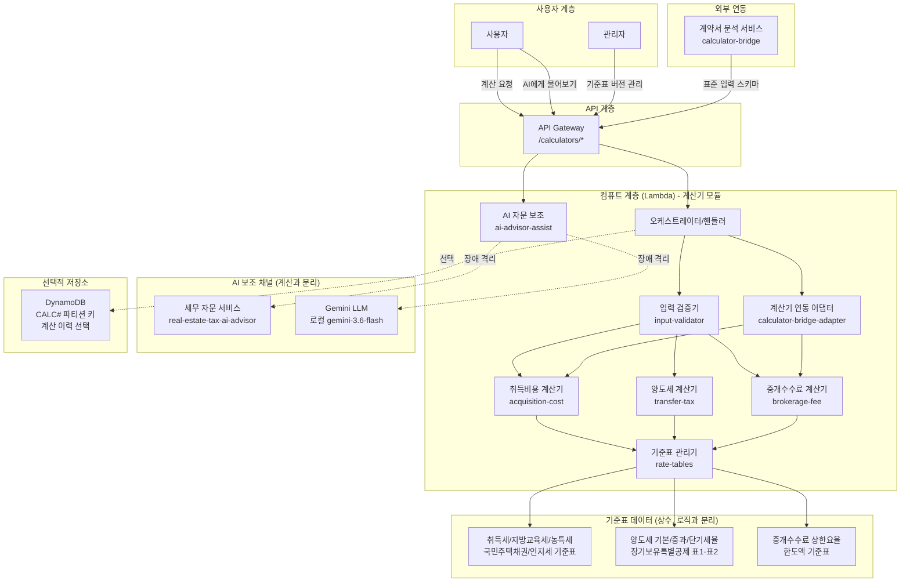
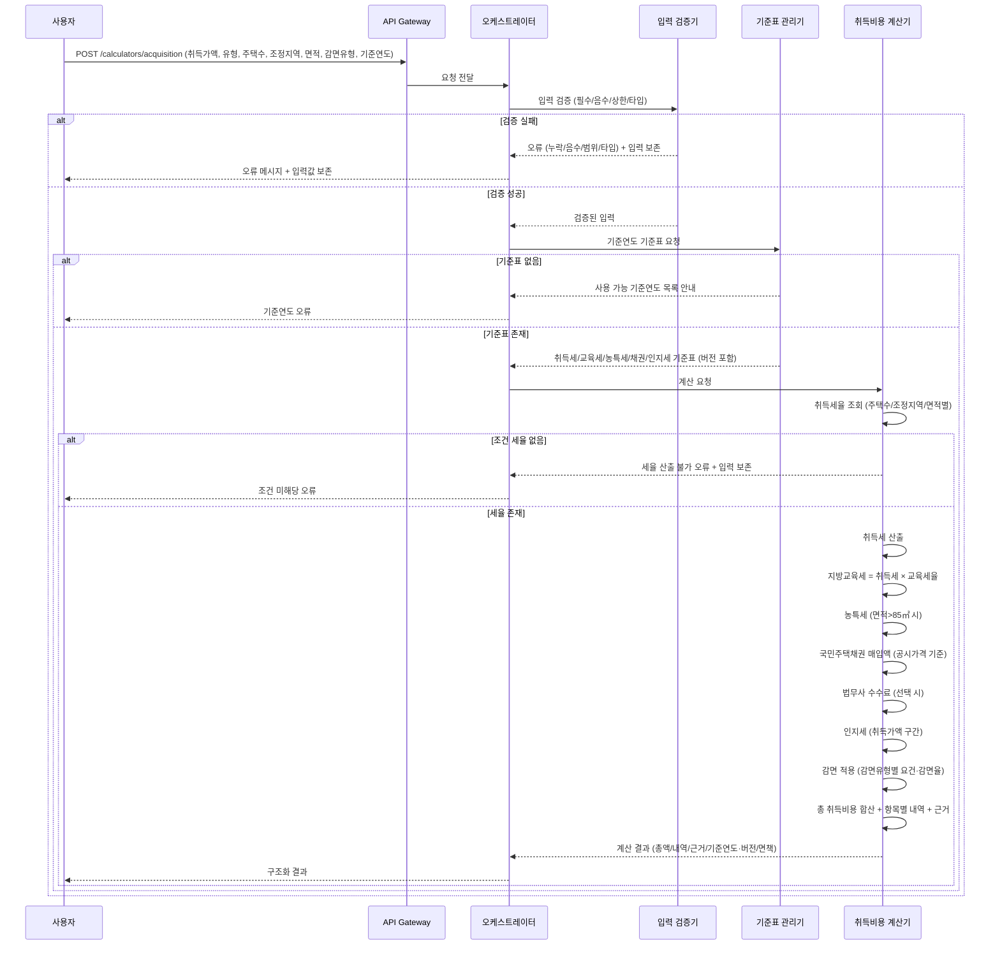
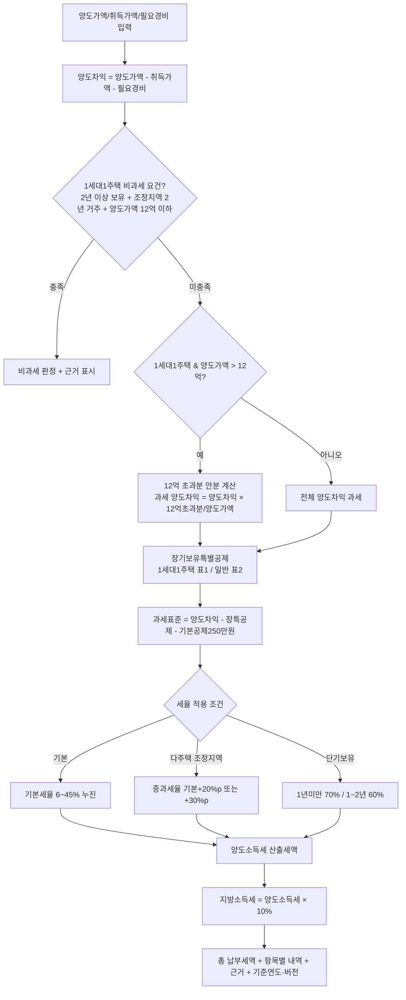
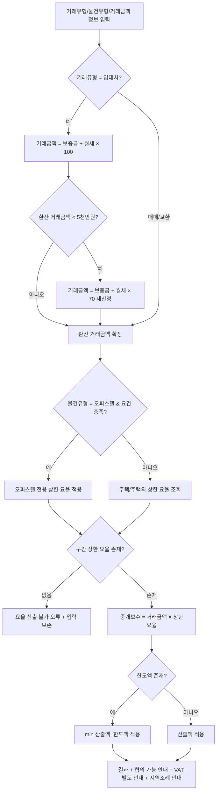
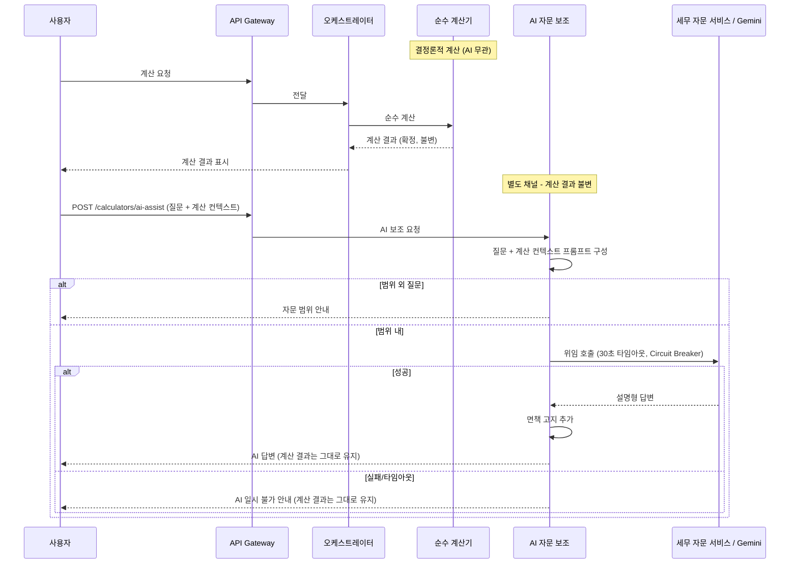
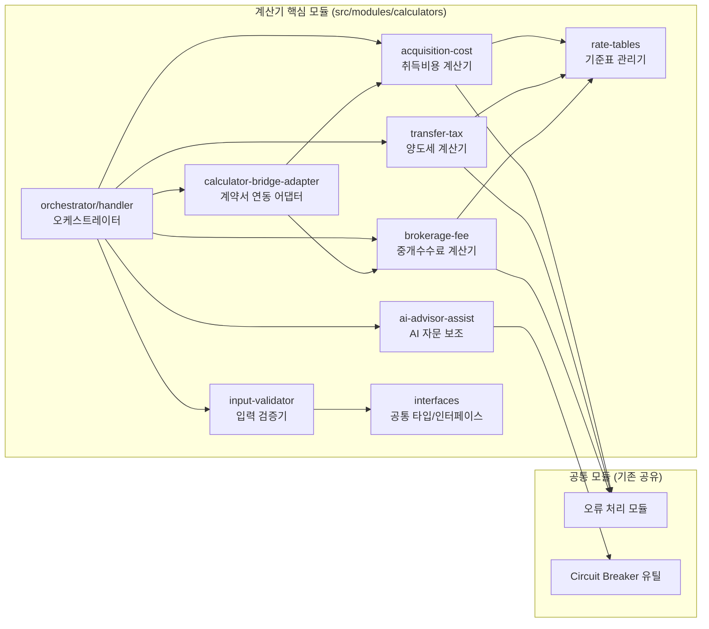
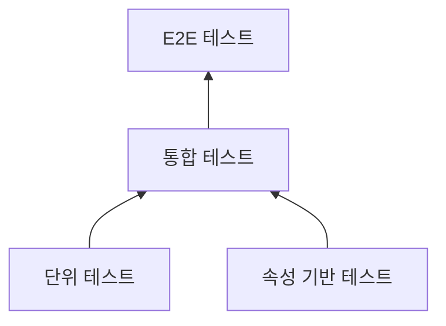

# Design Document: 부동산 계산기 통합 시스템

## Overview

부동산 계산기 통합 시스템은 부동산 취득비용, 양도소득세, 중개수수료를 법정 요율·세율 기준표에 근거하여 정확하게 산출하는 서비스이다. 사용자가 금액·조건을 입력하면 총액과 항목별 세부 내역, 적용 요율/세율/공제 근거, 면책 고지를 구조화하여 제공한다. 종합부동산 플랫폼(멀티서비스 UI)에 3개 계산기 메뉴(🏠 취득비용 계산, 💸 양도세 계산, 📑 중개수수료 계산)로 통합된다.

기존 AI 자문 서비스(법률/세무/판례/계약서 분석)와 달리, 본 서비스는 **LLM/RAG/벡터 검색을 사용하지 않고** 법정 요율·세율 기준표에 기반한 **결정론적(deterministic) 순수 계산 함수**로 동작한다. 동일한 입력에 대해서는 항상 동일한 출력을 산출하며(참조 투명성), 계산 경로에 외부 AI 호출을 포함하지 않는다. 세율·요율 기준표는 상수 테이블로 분리하여 세법·요율 개정 시 계산 로직과 독립적으로 업데이트할 수 있도록 한다.

단, 요구사항 10의 "AI에게 물어보기" 기능은 계산과 **완전히 분리된 별도의 설명 보조 채널**로 동작한다. 결정론적 계산 값은 순수 함수가 산출하고, AI(기존 세무 자문 서비스 또는 LLM 경로)는 계산 결과를 컨텍스트로 삼아 예외·감면 요건·절세 팁 등을 설명·보완할 뿐 세율·세액을 재계산하지 않는다. AI 채널 장애는 계산 기능에 영향을 주지 않도록 장애 격리한다.

### 핵심 설계 원칙

1. **결정론적 순수 계산**: 모든 계산은 외부 의존 없는 순수 함수로 수행하며, 동일 입력에 대해 항상 동일 출력을 보장한다
2. **기준표-로직 분리**: 세율·요율·공제·상한액을 기준연도·버전 메타데이터를 포함한 상수 테이블로 분리하여 세법 개정 시 로직 변경 없이 기준표만 교체한다
3. **AI 보조 채널 격리**: AI 자문 보조는 계산과 분리된 별도 채널이며, AI 응답과 무관하게 결정론적 계산 결과는 그대로 유지된다
4. **경량 서버리스**: LLM/RAG/OpenSearch/벡터 저장소 없이 순수 계산만 수행하여 콜드스타트가 빠르고 운영 부담이 낮다
5. **모듈 독립성**: 각 계산기를 독립 배포 가능한 모듈로 분리하여 기존 AI 자문 서비스와 장애 격리 및 독립 배포/롤백을 보장한다
6. **계산 근거 투명성**: 모든 계산 결과에 산식·적용 기준표 항목·기준연도·버전을 명시하여 사용자가 근거를 검증할 수 있도록 한다
7. **로컬/배포 이중화**: 로컬은 외부 의존 없는 순수 함수 직접 실행, 배포는 AWS Lambda로 동작하는 이중화 실행 구조

### 기술 스택 요약

| 계층 | 기술 | 역할 |
|------|------|------|
| API | Amazon API Gateway | REST API 엔드포인트 (`/calculators/*`) |
| 컴퓨트 | AWS Lambda (TypeScript/Node.js) | 순수 계산 함수 실행 (경량, 빠른 콜드스타트) |
| 계산 로직 | 순수 함수 (외부 의존 없음) | 취득비용/양도세/중개수수료 결정론적 산출 |
| 기준표 | 상수 테이블 (기준연도·버전 메타데이터) | 세율·요율·공제·상한액 데이터 (로직과 분리) |
| AI 보조 (선택) | 세무 자문 서비스(real-estate-tax-ai-advisor) / Gemini(로컬, gemini-3.6-flash) | "AI에게 물어보기" 설명 보조 (계산과 분리된 채널) |
| 계산 이력 (선택) | Amazon DynamoDB (`CALC#` 파티션 키, 선택 사항) | 계산 이력 저장 (필수 아님) |
| 모니터링 | Amazon CloudWatch | 로그, 메트릭 |

### 기존 서비스와의 관계

| 항목 | AI 자문 서비스 (법률/세무/판례/계약서) | 계산기 서비스 (calculators) |
|------|----------------------------------------|------------------------------|
| 계산/응답 방식 | LLM + RAG (비결정론적) | 순수 함수 (결정론적) |
| 벡터 저장소 | OpenSearch Serverless | 없음 |
| 외부 AI 호출 | 계산/응답 경로에 포함 | 계산 경로에 없음 (AI 보조만 별도 채널) |
| 데이터 소스 | 법령/판례/세법/예규 벡터 | 법정 기준표 상수 |
| API 경로 | /legal-advisor/*, /tax-advisor/* 등 | /calculators/* |
| 외부 서비스 연동 | - | 계약서 분석(calculator-bridge 입력 소비), 세무 자문(AI 보조 위임) |

### 로컬/배포 환경 이중화 전략

| 구분 | 로컬 개발 | 배포 (AWS) |
|------|-----------|------------|
| 계산 실행 | 순수 함수 직접 실행 (외부 의존 없음) | AWS Lambda (순수 함수, 경량) |
| 기준표 | 로컬 상수 테이블 (JSON/TS 상수) | 로컬 상수 테이블 (동일, 번들 포함) |
| AI 보조 | 로컬 서버의 Gemini 경로 재사용 (gemini-3.6-flash) | 세무 자문 서비스 호출 / Bedrock 경로 |
| 계산 이력 (선택) | 메모리/로컬 스텁 | DynamoDB (선택) |

계산 로직은 어떤 환경에서도 외부 의존 없이 동일하게 동작하며, AI 보조 채널만 환경 변수(`AI_ADVISOR_PROVIDER`)로 교체 가능하도록 한다.

## Architecture

### 전체 시스템 아키텍처



계산 경로(실선)와 AI 보조 채널(점선)은 완전히 분리되어 있으며, AI 보조 채널의 장애가 계산 경로에 전파되지 않는다.

### 취득비용 계산 흐름



### 양도소득세 계산 흐름



### 중개수수료 계산 흐름



### AI 자문 보조 분리 흐름 (계산과 격리)



### 설계 결정 사항

| 결정 | 선택 | 근거 |
|------|------|------|
| 계산 방식 | 순수 함수 (결정론적) | 동일 입력 동일 출력 보장, 검증 용이, 외부 AI 비용/비결정성 배제 |
| 기준표 관리 | 로직과 분리된 상수 테이블 (기준연도·버전) | 세법 개정 시 로직 변경 없이 기준표만 교체 |
| AI 보조 채널 | 계산과 완전 분리 + Circuit Breaker | 계산 결과 불변성 보장, AI 장애 격리 |
| 벡터 저장소 | 사용 안 함 | 결정론적 계산은 RAG 불필요, 인프라 경량화 |
| 저장소 | 상태 비저장 기본 (계산 이력 선택) | 순수 계산은 저장 불필요, 콜드스타트 최소화 |
| 계약서 연동 | calculator-bridge 표준 스키마 어댑터 | 정보 재입력 없이 계약서 추출값 소비 |
| 배포 | 기존 서비스와 독립 Lambda 스택 | 독립 배포/업데이트/롤백, 장애 격리 |
| AI 보조 제공자 | 로컬 Gemini / 배포 세무 자문 서비스 | 환경별 유연성, 세무 도메인 응답 재사용 |

## Components and Interfaces

### 모듈 구조



모든 계산기 모듈은 `src/common/interfaces/service-module.ts`의 표준 `ServiceModule` 인터페이스(`initialize`, `execute`, `healthCheck`, `getName`, `getVersion`)와 공통 `ModuleInput`/`ModuleOutput`/`ErrorResponse` 타입을 준수한다. 각 모듈은 입력 스키마, 출력 스키마, 표준 오류 응답 형식을 정의하며, 입력이 스키마와 불일치하면 스키마 불일치 표준 오류 응답을 반환한다. 각 모듈은 서비스 등록/발견 메커니즘에 독립 모듈로 등록 가능하다.

### 공통 타입

```typescript
// 계산기 유형
type CalculatorType = 'acquisition' | 'transfer_tax' | 'brokerage';
// 취득비용 | 양도소득세 | 중개수수료

// 부동산 유형
type PropertyType = 'house' | 'non_house';       // 주택 | 비주택
type BrokeragePropertyType = 'house' | 'officetel' | 'other'; // 주택 | 오피스텔 | 주택 외

// 주택 수
type HousingCount = 'one' | 'two' | 'three_or_more'; // 1주택 | 2주택 | 3주택 이상

// 거래 유형 (중개수수료)
type TransactionType = 'sale_exchange' | 'lease'; // 매매/교환 | 임대차

// 취득세 감면 유형
type AcquisitionReductionType =
  | 'first_time_buyer'          // 생애최초 주택 구입
  | 'newlywed'                  // 신혼부부
  | 'long_term_rental_business' // 장기임대사업자 등록 임대주택
  | 'none';

// 금액 단위 (원 기준)
type CurrencyUnit = 'KRW';

// 계산 근거 (모든 계산 결과에 포함)
interface CalculationBasis {
  formula: string;              // 적용 산식
  rateTableItem: string;        // 참조한 기준표 항목
  appliedRate?: number;         // 적용 요율/세율 (해당 시)
  taxBase?: number;             // 과세표준 (해당 시)
  baseYear: number;             // 적용 기준연도
  rateTableVersion: string;     // 기준표 버전 식별자
}

// 항목별 세부 내역
interface LineItem {
  name: string;                 // 항목명 (취득세, 지방교육세 등)
  amount: number;               // 금액 (원)
  basis: CalculationBasis;      // 산출 근거
}

// 공통 계산 결과 봉투
interface CalculationResult<TDetail> {
  calculatorType: CalculatorType;
  total: number;                // 총액 (원)
  lineItems: LineItem[];        // 항목별 세부 내역
  detail: TDetail;              // 계산기별 상세
  baseYear: number;             // 적용 기준연도
  rateTableVersion: string;     // 적용 기준표 버전
  disclaimer: string;           // 면책 고지 (비어있지 않음)
}
```

### 컴포넌트별 인터페이스

#### 1. 입력 검증기 (input-validator)

```typescript
interface ValidationInput {
  calculatorType: CalculatorType;
  payload: Record<string, unknown>;   // 계산기별 원시 입력
  rateTableConstraints: RateTableConstraints; // 기준표 정의 상한/열거값
}

interface RateTableConstraints {
  maxAmount: number;                   // 금액 유효 상한
  maxArea: number;                     // 면적 유효 상한
  maxHoldingPeriod: number;            // 보유기간 유효 상한 (년)
}

interface ValidationResult {
  isValid: boolean;
  errors: ValidationError[];           // 실패 시 1개 이상
  validatedPayload?: Record<string, unknown>; // 성공 시 검증된 입력
  preservedInput: Record<string, unknown>;    // 원본 입력 보존
}

interface ValidationError {
  type: 'missing' | 'negative' | 'exceeds_max' | 'type_mismatch';
  field: string;                       // 대상 항목명
  message: string;                     // 사용자 안내 (기대 형식/범위)
  expected?: string;                   // 기대 형식/범위 설명
}
```

검증 규칙: 필수 항목 존재 → 타입 일치 → 음수 아님(0 이상) → 기준표 유효 상한 이하. 하나라도 실패하면 계산을 수행하지 않고 입력값을 보존한다.

#### 2. 취득비용 계산기 (acquisition-cost)

```typescript
interface AcquisitionCostInput {
  purchasePrice: number;               // 취득가액 (원)
  officialPrice?: number;              // 공시가격(시가표준액, 국민주택채권 기준, 원). 신축 등 미정 시 생략 가능(선택)
  propertyType: PropertyType;          // 주택/비주택
  nonHouseType?: NonHouseType;         // 비주택 세부 유형(일반/농지/원시취득). non_house일 때 사용(기본 general)
  housingCount: HousingCount;          // 주택 수
  isAdjustmentArea: boolean;           // 조정대상지역 여부
  exclusiveArea: number;               // 전용면적 (㎡)
  reductionType: AcquisitionReductionType; // 감면 유형
  useJudicialScrivener: boolean;       // 법무사 등기 대행 선택
  brokerageFee?: number;               // 중개수수료 연동값 (선택, 원)
  baseYear: number;                    // 적용 기준연도
  // 장기임대사업자 감면 세부 조건 (reductionType=long_term_rental_business 시)
  rentalCondition?: RentalReductionCondition;
}

interface RentalReductionCondition {
  areaBracket: 'le_60' | 'gt_60_le_85'; // 60㎡ 이하 | 60㎡ 초과 85㎡ 이하
  acquisitionRequirement: 'new_build' | 'first_sale'; // 신축 | 최초 분양
}

interface AcquisitionCostDetail {
  acquisitionTax: number;              // 취득세 (감면 후)
  acquisitionTaxBeforeReduction: number; // 감면 전 취득세
  localEducationTax: number;           // 지방교육세
  ruralSpecialTax: number;             // 농어촌특별세 (면적>85㎡)
  housingBondPurchase: number;         // 국민주택채권 매입액
  judicialScrivenerFee: number;        // 법무사 수수료
  stampTax: number;                    // 인지세
  reduction?: ReductionDetail;         // 감면 내역 (별도 표시)
  notices?: string[];                  // 안내 문구 (공시가격 미정 채권 미산출, 1억 이하 중과 제외 특례 등)
}

interface ReductionDetail {
  reductionType: AcquisitionReductionType;
  reductionRate: number;               // 감면율 (0~1)
  reducedAmount: number;               // 최종 감면세액 (원, 최소납부세제 반영 후)
  grossReductionAmount: number;        // 최소납부세제 반영 전 감면대상세액 (= 감면 전 취득세 × 감면율)
  minimumPaymentApplied: boolean;      // 최소납부세제(제177조의2) 적용 여부
  postManagementNotice?: string;       // 장기임대: 사후관리 요건/추징 안내
}

type AcquisitionCostResult = CalculationResult<AcquisitionCostDetail>;
```

감면 후 취득세 규칙: 감면대상세액 = 감면 전 취득세 × 감면율. 감면 유형이 장기임대사업자이면 면적 구간·취득 요건별 차등 감면율을 적용하고 사후관리 요건 안내를 결과에 포함한다.

최소납부세제 규칙(요구사항 1.16, 지방세특례제한법 제177조의2): 감면 유형이 최소납부세제 적용 대상(`subjectToMinimumPayment=true`)이고 감면율>0이면, 감면대상세액이 기준표의 `minimumPaymentThreshold`(예: 2000000원)를 초과하는지 판정한다. 초과 시 최종 감면액 = `minimumPaymentThreshold + (감면대상세액 − minimumPaymentThreshold) × minimumPaymentReductionRate`(예: 0.85)로 조정하고, 임계값 이하이면 감면대상세액 전액을 감면한다. 감면 후 취득세 = 감면 전 취득세 − 최종 감면액. 최소납부세제가 적용되면 `minimumPaymentApplied=true`, 감면대상세액은 `grossReductionAmount`로 별도 표시하고 안내를 `notices`에 포함한다. 임계값과 감면율은 하드코딩하지 않고 기준표 상수를 참조한다. 예: 감면 전 3,680만원·감면율 100% → 감면대상세액 3,680만원 > 200만원 → 최종 감면액 = 200만 + (3,680만−200만)×0.85 = 3,158만 → 감면 후 취득세 = 522만원.

공시가격(시가표준액) 미정 처리 규칙(요구사항 1.13): `officialPrice`는 선택 입력이다. 신축 등으로 공시가격이 정해지지 않아 미입력이면 취득세 과세표준은 사실상 취득가격(취득가액)을 사용하므로 취득세·지방교육세·농특세·인지세·법무사수수료는 정상 산출하고, 국민주택채권 매입액은 시가표준액 기준이므로 0으로 처리한 뒤 "신축 등 공시가격 미정으로 별도 시가표준액 확인 필요" 안내를 `notices`에 포함한다. `total == sum(lineItems)` 불변식은 채권 항목을 0으로 포함하여 유지된다.

공시가격 1억원 이하 다주택 중과 제외 특례 규칙(요구사항 1.14/1.15): 주택이면서 다주택(2주택/3주택 이상)이고 공시가격(시가표준액)이 기준표의 `lowValueExemptionThreshold`(예: 100000000원) 이하이면, 세율 조회 시 주택 수를 1주택으로 간주하여 중과세율(8%/12%) 대신 기본세율을 적용하고 특례 적용 안내를 `notices`에 포함한다. 임계값은 하드코딩하지 않고 기준표 상수를 참조한다. 다주택인데 공시가격이 미입력이면 특례 판정이 불가하므로 통상(중과) 세율을 적용하되 "공시가격 확인 시 1억 이하이면 중과 제외 가능" 안내를 포함한다.

#### 3. 양도세 계산기 (transfer-tax)

```typescript
interface TransferTaxInput {
  transferPrice: number;               // 양도가액 (원)
  acquisitionPrice: number;            // 취득가액 (원)
  necessaryExpense: number;            // 필요경비 (원)
  holdingPeriod: number;               // 보유기간 (년, 소수 허용)
  residencePeriod: number;             // 거주기간 (년)
  isSingleHouseholdOneHouse: boolean;  // 1세대1주택 여부
  housingCount: HousingCount;          // 주택 수
  isAdjustmentArea: boolean;           // 조정대상지역 여부
  baseYear: number;                    // 적용 기준연도
}

interface TransferTaxDetail {
  transferGain: number;                // 양도차익
  taxableTransferGain: number;         // 과세 대상 양도차익 (12억 안분 반영)
  longTermDeduction: number;           // 장기보유특별공제액
  longTermDeductionTable: 'table1' | 'table2' | 'none'; // 표1(1세대1주택)/표2(일반)
  basicDeduction: number;              // 기본공제 (연 250만원)
  taxBase: number;                     // 과세표준
  appliedRateType: 'basic' | 'heavy_multi' | 'short_term'; // 기본/중과/단기
  appliedRate: number;                 // 적용 세율
  progressiveDeduction: number;        // 누진공제액
  transferIncomeTax: number;           // 양도소득세 산출세액
  localIncomeTax: number;              // 지방소득세 (양도세 × 10%)
  isExempt: boolean;                   // 비과세 판정
  exemptionBasis?: string;             // 비과세 근거
}

type TransferTaxResult = CalculationResult<TransferTaxDetail>;
```

계산 순서: 양도차익 산출 → 비과세 요건 판정 → (1세대1주택 & 12억 초과 시) 안분 계산 → 장기보유특별공제(표1/표2) → 과세표준 = 과세 양도차익 − 장특공제 − 기본공제 → 세율 적용(기본/중과/단기) → 지방소득세 = 양도소득세 × 10%.

#### 4. 중개수수료 계산기 (brokerage-fee)

```typescript
interface BrokerageFeeInput {
  transactionType: TransactionType;    // 매매/교환 | 임대차
  propertyType: BrokeragePropertyType; // 주택/오피스텔/주택 외
  salePrice?: number;                  // 매매가액 (매매/교환 시)
  deposit?: number;                    // 보증금 (임대차 시)
  monthlyRent?: number;                // 월세 (임대차 시)
  officetelQualified?: boolean;        // 오피스텔 전용 요율 요건 충족 여부
  baseYear: number;                    // 적용 기준연도
}

interface BrokerageFeeDetail {
  transactionAmount: number;           // 산정된 거래금액 (임대차 환산 반영)
  conversionMultiplier?: 100 | 70;     // 임대차 환산 배수 (100배 또는 70배)
  appliedBracket: string;              // 적용 거래금액 구간
  upperRate: number;                   // 적용 상한 요율
  capAmount?: number;                  // 구간 한도액 (있으면)
  brokerageFeeUpperLimit: number;      // 중개보수 상한액 (min(산출액, 한도액))
  usedOfficetelRate: boolean;          // 오피스텔 전용 요율 적용 여부
}

type BrokerageFeeResult = CalculationResult<BrokerageFeeDetail>;
```

거래금액 산정(임대차): 거래금액 = 보증금 + 월세 × 100. 단, 환산액이 5천만원 미만이면 거래금액 = 보증금 + 월세 × 70으로 재산정한다. 중개보수 = min(거래금액 × 상한요율, 한도액). 결과에 협의 가능·VAT 별도·지역 조례 안내를 포함한다.

#### 5. 기준표 관리기 (rate-tables)

```typescript
interface RateTableRequest {
  calculatorType: CalculatorType;
  baseYear: number;                    // 요청 기준연도
}

interface RateTableResponse {
  found: boolean;
  rateTable?: RateTable;
  availableBaseYears?: number[];       // 미존재 시 사용 가능 기준연도 목록
}

interface RateTable {
  calculatorType: CalculatorType;
  baseYear: number;                    // 적용 기준연도
  version: string;                     // 버전 식별자
  data: AcquisitionRateData | TransferRateData | BrokerageRateData;
  constraints: RateTableConstraints;   // 입력 검증용 상한/열거값
}
```

기준표 관리기는 지정 기준연도에 해당하는 기준표 버전을 제공하며, 존재하지 않으면 사용 가능한 기준연도 목록을 안내한다. 세법·요율 개정 시 계산 로직 변경 없이 새 기준연도의 기준표 버전을 추가할 수 있다.

#### 6. 계산기 연동 어댑터 (calculator-bridge-adapter)

```typescript
// 계약서 분석 서비스 calculator-bridge가 전달하는 표준 입력 스키마
interface CalculatorInputSchema {
  contractType: 'sale' | 'jeonse' | 'wolse' | 'commercial_lease';
  deposit?: { value: number; unit: 'KRW' };
  monthlyRent?: { value: number; unit: 'KRW' };
  salePrice?: { value: number; unit: 'KRW' };
  managementFee?: { value: number; unit: 'KRW' };
  contractPeriod?: { value: number; unit: 'month' };
  area?: { value: number; unit: 'sqm' };
}

// 계약서 분석 서비스가 참조하는 출력 스키마
interface CalculatorOutputSchema {
  acquisitionTax?: { value: number; unit: 'KRW' };
  brokerageFee?: { value: number; unit: 'KRW' };
}

interface BridgeAdapterResult {
  mappedInputs: {
    acquisition?: Partial<AcquisitionCostInput>;
    brokerage?: Partial<BrokerageFeeInput>;
  };
  output?: CalculatorOutputSchema;
  missingFields: string[];             // 필수 항목 누락 시 (계산 미수행)
}
```

어댑터는 표준 입력 스키마의 단위(금액=원, 면적=제곱미터, 계약 기간=개월)를 계산기 내부 입력 형식으로 매핑하고, 취득세·중개수수료 결과를 `CalculatorOutputSchema`로 반환한다. 필수 항목 누락 시 누락 항목명을 반환하고 계산을 수행하지 않는다. 계약서 분석 서비스 장애는 사용자 직접 입력 계산에 영향을 주지 않는다.

#### 7. AI 자문 보조 (ai-advisor-assist)

```typescript
interface AiAssistInput {
  calculatorType: CalculatorType;
  question: string;                    // 사용자 자연어 질문
  calculationContext: AiCalculationContext; // 현재 입력·계산 결과 컨텍스트
}

interface AiCalculationContext {
  inputs: Record<string, unknown>;     // 현재 입력 조건
  result: {
    total: number;
    lineItems: LineItem[];
    appliedRates: Record<string, number>; // 적용 세율/요율
    taxBase?: number;
  };
}

interface AiAssistOutput {
  answer?: string;                     // AI 설명형 답변 (성공 시)
  isOutOfScope: boolean;               // 부동산 취득/양도/중개보수/세무 범위 외
  isAvailable: boolean;                // AI 채널 가용 여부 (실패/타임아웃 시 false)
  disclaimer: string;                  // 면책 고지 (참고용, 법적 효력 없음, 전문가 상담)
  // 계산 결과는 이 응답에 포함하지 않으며 절대 변경하지 않는다
}
```

AI 자문 보조는 질문과 계산 컨텍스트를 프롬프트로 구성해 세무 자문 서비스 또는 LLM 경로에 위임하며, 세율·세액을 재계산하지 않고 설명·보완만 수행한다. 30초 타임아웃과 Circuit Breaker로 장애를 격리하며, 실패 시 `isAvailable=false`로 AI 일시 불가를 안내하되 계산 결과는 그대로 유지한다. 범위 외 질문은 `isOutOfScope=true`로 자문 범위를 안내한다.

## Data Models

본 서비스의 핵심 데이터는 **로직과 분리된 상수 기준표**이다. 기준표는 계산기 코드 번들에 상수(TypeScript/JSON)로 포함되며, 각 기준표는 기준연도(`baseYear`)와 버전 식별자(`version`)를 메타데이터로 가진다. OpenSearch/벡터 저장소는 사용하지 않으며, DynamoDB는 계산 이력 저장이 필요한 경우에만 선택적으로 사용한다.

### 취득세 기준표 데이터 모델

```typescript
interface AcquisitionRateData {
  // 취득세율: 주택수/조정지역/면적 조건별 조회 테이블
  acquisitionTaxBrackets: AcquisitionTaxBracket[];
  localEducationTaxRate: number;       // 지방교육세율 (취득세 대비)
  ruralSpecialTaxRate: number;         // 농어촌특별세율 (면적>85㎡ 적용)
  ruralSpecialTaxAreaThreshold: number;// 농특세 면적 기준 (85㎡)
  housingBondRates: HousingBondBracket[]; // 국민주택채권 매입 요율 (공시가격 구간별)
  judicialScrivenerFeeTable: ScrivenerFeeBracket[]; // 법무사 수수료 기준
  stampTaxBrackets: StampTaxBracket[]; // 인지세 (취득가액 구간별 정액)
  reductions: AcquisitionReduction[];  // 감면 유형별 요건·감면율
  lowValueExemptionThreshold: number;  // 공시가격 1억원 이하 다주택 중과 제외 특례 임계값 (원, 예: 100000000)
  minimumPaymentThreshold: number;     // 최소납부세제 임계값 (원, 제177조의2, 예: 2000000)
  minimumPaymentReductionRate: number; // 최소납부세제 감면율 (초과분에 적용, 예: 0.85)
}

interface AcquisitionTaxBracket {
  propertyType: PropertyType;
  nonHouseType?: NonHouseType;         // 비주택 세부 유형 (일반/농지/원시취득). propertyType='non_house'에만 사용
  housingCount: HousingCount;
  isAdjustmentArea: boolean;
  minPrice: number;
  maxPrice?: number;                   // undefined = 초과
  areaMax?: number;                    // 면적 상한 조건 (해당 시)
  rate: number;                        // 취득세율 (0~1)
}

// 비주택 세부 유형: 일반(상가·건물·토지 등) 4% / 농지 3% / 원시취득(신축 보존등기) 2.8% (참고용 추정치)
// 취득세율 매칭 시 주택(house)은 주택수·조정지역·취득가액 구간으로, 비주택(non_house)은
// nonHouseType(기본 general)으로만 매칭한다(주택수·조정지역 무시).
type NonHouseType = 'general' | 'farmland' | 'original_acquisition';

interface HousingBondBracket {
  minOfficialPrice: number;
  maxOfficialPrice?: number;
  rate: number;                        // 채권 매입 요율
}

interface ScrivenerFeeBracket {
  minPrice: number;
  maxPrice?: number;
  fee: number;                         // 수수료 (정액 또는 기준)
}

interface StampTaxBracket {
  minPrice: number;
  maxPrice?: number;
  stampTax: number;                    // 인지세 정액
}

interface AcquisitionReduction {
  reductionType: AcquisitionReductionType;
  reductionRate: number;               // 기본 감면율 (0~1)
  // 장기임대사업자: 면적 구간·취득 요건별 차등 감면율
  rentalDifferentialRates?: RentalDifferentialRate[];
  requirements: string;                // 감면 요건 설명
  postManagement?: string;             // 사후관리 요건/추징 안내
  subjectToMinimumPayment?: boolean;   // 최소납부세제(제177조의2) 적용 대상 여부 (미지정 시 false)
}

interface RentalDifferentialRate {
  areaBracket: 'le_60' | 'gt_60_le_85';
  acquisitionRequirement: 'new_build' | 'first_sale';
  reductionRate: number;               // 차등 감면율 (0~1)
}
```

### 양도세 기준표 데이터 모델

```typescript
interface TransferRateData {
  basicRateBrackets: ProgressiveBracket[]; // 기본세율 6~45% 누진 구간
  heavyMultiSurcharge: {               // 다주택 조정지역 중과 가산
    twoHouse: number;                  // +20%p
    threeOrMoreHouse: number;          // +30%p
  };
  shortTermRates: {                    // 단기보유 중과세율
    under1Year: number;                // 1년 미만 70%
    from1To2Year: number;              // 1년 이상 2년 미만 60%
  };
  basicDeductionAmount: number;        // 양도소득 기본공제 (연 250만원)
  longTermDeductionTable1: LongTermDeductionRow[]; // 1세대1주택 (보유+거주)
  longTermDeductionTable2: LongTermDeductionRow[]; // 일반 (보유)
  oneHouseExemptionThreshold: number;  // 1세대1주택 비과세 양도가액 상한 (12억)
  localIncomeTaxRate: number;          // 지방소득세율 (양도세 대비 10%)
}

interface ProgressiveBracket {
  minTaxBase: number;
  maxTaxBase?: number;                 // undefined = 초과
  rate: number;                        // 세율 (0.06 = 6%)
  progressiveDeduction: number;        // 누진공제액
}

interface LongTermDeductionRow {
  minYears: number;                    // 보유(및 거주) 최소 연수
  maxYears?: number;
  deductionRate: number;               // 공제율 (0~1)
}
```

### 중개수수료 기준표 데이터 모델

```typescript
interface BrokerageRateData {
  leaseConversionMultiplier: number;   // 임대차 환산 배수 (기본 100)
  leaseConversionFallbackMultiplier: number; // 재산정 배수 (70)
  leaseConversionThreshold: number;    // 재산정 기준 금액 (5천만원)
  rateBrackets: BrokerageRateBracket[];// 거래유형/물건유형/금액 구간별 상한 요율·한도액
}

interface BrokerageRateBracket {
  transactionType: TransactionType;
  propertyType: BrokeragePropertyType;
  minAmount: number;
  maxAmount?: number;                  // undefined = 초과
  upperRate: number;                   // 상한 요율
  capAmount?: number;                  // 한도액 (있으면 min 적용)
}
```

### 기준표 메타데이터 및 버전 관리

```typescript
interface RateTableMetadata {
  calculatorType: CalculatorType;
  baseYear: number;                    // 적용 기준연도 (예: 2024, 2025)
  version: string;                     // 버전 식별자 (예: "v1", "2025.1")
  effectiveFrom: string;               // 적용 시작일 (YYYY-MM-DD)
  description: string;                 // 개정 내용 요약
}

// 기준표 레지스트리: 기준연도별 버전 조회
interface RateTableRegistry {
  getRateTable(type: CalculatorType, baseYear: number): RateTable | null;
  getAvailableBaseYears(type: CalculatorType): number[];
}
```

### (선택) 계산 이력 DynamoDB 레코드

계산 이력 저장이 필요한 경우에만 사용하는 선택적 모델. 기존 인프라 공유 시 `CALC#` 파티션 키 접두사로 격리한다. 순수 계산 자체는 저장 없이 동작한다.

| 속성 | 타입 | 키 | 설명 |
|------|------|-----|------|
| PK | String | PK | `CALC#{calculatorType}#{sessionId}` |
| SK | String | SK | `HISTORY#{timestamp}` |
| inputs | Map | - | 계산 입력 |
| result | Map | - | 계산 결과 (총액/내역) |
| baseYear | Number | - | 적용 기준연도 |
| rateTableVersion | String | - | 적용 기준표 버전 |
| ttl | Number | - | TTL (선택) |

### 기준표 데이터 파일 구조

기준표는 계산 로직과 분리된 데이터 파일로 관리한다.

```
src/modules/calculators/rate-tables/data/
├── acquisition/
│   ├── 2024.json          # 2024 기준연도 취득세 기준표 (version 메타 포함)
│   └── 2025.json          # 2025 기준연도 취득세 기준표
├── transfer-tax/
│   ├── 2024.json
│   └── 2025.json
└── brokerage/
    ├── 2024.json
    └── 2025.json
```

세법·요율 개정 시 새 기준연도 파일을 추가하며 계산 로직은 변경하지 않는다.

## Correctness Properties

*속성(Property)이란 시스템의 모든 유효한 실행에서 참이어야 하는 특성 또는 동작을 의미한다. 즉, 시스템이 무엇을 해야 하는지에 대한 형식적 선언이다. 속성은 사람이 읽을 수 있는 명세와 기계로 검증 가능한 정확성 보장 사이의 다리 역할을 한다.*

본 서비스는 결정론적 순수 계산 함수로 동작하므로 속성 기반 테스트(PBT)에 매우 적합하다. 아래 속성들은 계산의 참조 투명성, 세율 구간 경계, 산식 정확성, 계산 결과 불변성을 검증한다.

### Property 1: 계산 결정성 (참조 투명성)

*For any* 유효한 계산기 입력에 대해, 동일한 입력으로 계산을 N회(N≥2) 반복 실행하면 매 실행의 계산 결과(총액, 항목별 내역, 적용 세율/요율, 근거)가 모두 동일해야 한다.

**Validates: Requirements 5.1, 5.2**

### Property 2: 취득세율 구간 조회 및 산출 정확성

*For any* 주택 유형·주택 수·조정대상지역 여부·전용면적·취득가액 조합에 대해, 기준표에 해당 조건의 세율이 존재하면 조회된 세율은 해당 조건 구간에 속하는 세율이어야 하고, 산출된 취득세(감면 전)는 취득가액 × 조회 세율과 일치해야 한다.

**Validates: Requirements 1.1**

### Property 3: 지방교육세 산출 정확성

*For any* 산출된 취득세와 기준표 지방교육세율에 대해, 지방교육세는 취득세 × 지방교육세율과 일치해야 한다.

**Validates: Requirements 1.2**

### Property 4: 농어촌특별세 면적 경계 적용

*For any* 주택 전용면적에 대해, 전용면적이 85제곱미터를 초과하면 농어촌특별세가 기준표 농특세율에 따라 산출되고(>0), 85제곱미터 이하이면 농어촌특별세는 부과되지 않아야(=0) 한다.

**Validates: Requirements 1.3**

### Property 5: 국민주택채권 매입액 및 인지세 구간 조회

*For any* 공시가격과 취득가액에 대해, 국민주택채권 매입액은 공시가격이 속하는 채권 요율 구간의 요율을 적용한 값과 일치하고, 인지세는 취득가액이 속하는 인지세 구간의 정액과 일치해야 한다.

**Validates: Requirements 1.4, 1.6**

### Property 6: 법무사 수수료 조건부 산출

*For any* 법무사 등기 대행 선택 여부에 대해, 선택하면(true) 법무사 수수료는 기준표 기준에 따라 산출되고, 선택하지 않으면(false) 법무사 수수료는 0이어야 한다.

**Validates: Requirements 1.5**

### Property 7: 감면 후 취득세 산출 정확성

*For any* 감면 전 취득세와 감면율(0≤r≤1)에 대해, 감면 후 취득세는 감면 전 취득세 × (1 − 감면율)과 일치해야 하고, 감면세액은 감면 전 취득세 × 감면율과 일치해야 하며, 감면 내역이 별도로 표시되어야 한다.

**Validates: Requirements 1.7**

### Property 8: 장기임대사업자 차등 감면율 조회

*For any* 장기임대사업자 감면의 면적 구간(60㎡ 이하 / 60㎡ 초과 85㎡ 이하)과 취득 요건(신축 / 최초 분양) 조합에 대해, 적용된 감면율은 기준표의 해당 조합에 정의된 차등 감면율과 일치해야 하며, 산출 결과에 사후관리 요건 및 추징 가능 안내(postManagementNotice)가 비어있지 않게 포함되어야 한다.

**Validates: Requirements 1.8, 1.9**

### Property 9: 총 취득비용 합산 불변식

*For any* 취득비용 계산 결과에 대해, 총 취득비용(total)은 모든 항목별 세부 내역(lineItems)의 금액 합과 정확히 일치해야 한다.

**Validates: Requirements 1.10**

### Property 10: 취득비용 조건 세율 미존재 오류 및 입력 보존

*For any* 기준표에 세율이 정의되지 않은 조건 조합에 대해, 취득비용 계산기는 세율 산출 불가 오류를 반환하고 원본 입력값을 보존해야 한다.

**Validates: Requirements 1.12**

### Property 11: 양도차익 산출 정확성

*For any* 양도가액, 취득가액, 필요경비에 대해, 양도차익은 양도가액 − 취득가액 − 필요경비와 일치해야 한다.

**Validates: Requirements 2.1**

### Property 12: 장기보유특별공제 표 선택 및 공제 산출

*For any* 1세대1주택 여부와 보유·거주 기간에 대해, 1세대1주택이면 표1, 그 외에는 표2를 적용하고, 적용된 공제율은 해당 표에서 보유(거주) 연수 구간에 정의된 공제율과 일치하며, 장기보유특별공제액은 (과세 대상 양도차익 × 공제율)과 일치해야 한다.

**Validates: Requirements 2.2**

### Property 13: 과세표준 산출 정확성

*For any* 과세 대상 양도차익, 장기보유특별공제액, 기본공제(연 250만원)에 대해, 과세표준은 과세 대상 양도차익 − 장기보유특별공제액 − 기본공제와 일치해야 한다(0 미만이면 0).

**Validates: Requirements 2.3**

### Property 14: 기본세율 누진 적용 정확성

*For any* 과세표준에 대해, 적용된 세율과 누진공제액은 과세표준이 속하는 기본세율 구간(6~45%)의 값과 일치하고, 양도소득세 산출세액은 과세표준 × 세율 − 누진공제액과 일치해야 한다.

**Validates: Requirements 2.4**

### Property 15: 중과세율 및 단기보유 세율 적용

*For any* 주택 수·조정대상지역·보유기간 조합에 대해, 보유기간이 1년 미만이면 단기 70%, 1년 이상 2년 미만이면 단기 60% 세율이 적용되고, 단기 조건이 아니면서 다주택(2주택/3주택 이상)이 조정대상지역 주택을 양도하면 기본세율에 각각 20%p/30%p가 가산되어야 한다.

**Validates: Requirements 2.5, 2.6**

### Property 16: 1세대1주택 비과세 판정

*For any* 보유기간·조정지역 거주기간·양도가액 조합에 대해, 2년 이상 보유하고 (조정대상지역인 경우) 2년 이상 거주하며 양도가액이 12억원 이하인 경우에만 비과세로 판정되고 비과세 근거가 표시되어야 하며, 하나라도 미충족이면 비과세로 판정되지 않아야 한다.

**Validates: Requirements 2.7**

### Property 17: 12억원 초과분 안분 계산

*For any* 1세대1주택 요건 충족 & 양도가액이 12억원을 초과하는 경우에 대해, 과세 대상 양도차익은 양도차익 × (양도가액 − 12억원) ÷ 양도가액과 일치해야 한다.

**Validates: Requirements 2.8**

### Property 18: 지방소득세 산출 정확성

*For any* 양도소득세 산출세액에 대해, 지방소득세는 양도소득세 × 10%(0.1)와 일치해야 한다.

**Validates: Requirements 2.9**

### Property 19: 양도세 결과 구조 완전성 및 조건 미존재 오류

*For any* 양도세 계산에 대해, 정상 계산 시 결과는 양도차익, 장기보유특별공제액, 기본공제액, 과세표준, 적용 세율, 양도소득세, 지방소득세, 총 납부세액, 기준연도·버전을 모두 포함해야 하고, 기준표에 없는 세율 조건이면 산출 불가 오류를 반환하고 입력값을 보존해야 한다.

**Validates: Requirements 2.10, 2.11**

### Property 20: 임대차 환산 거래금액 전환 경계

*For any* 보증금과 월세에 대해, 1차 환산액(보증금 + 월세 × 100)이 5천만원 이상이면 거래금액은 1차 환산액(배수 100)이어야 하고, 1차 환산액이 5천만원 미만이면 거래금액은 보증금 + 월세 × 70(배수 70)으로 재산정되어야 한다.

**Validates: Requirements 3.2**

### Property 21: 중개보수 상한 요율 조회 및 한도액 min 적용

*For any* 거래유형·물건유형·거래금액 조합에 대해, 조회된 상한 요율은 해당 조건과 거래금액 구간의 요율이어야 하고, 중개보수 상한액은 (거래금액 × 상한요율)이되 구간 한도액이 존재하면 산출액과 한도액 중 작은 값(min)이어야 한다.

**Validates: Requirements 3.1, 3.3**

### Property 22: 오피스텔 전용 요율 적용

*For any* 물건 유형과 오피스텔 요건 충족 여부에 대해, 물건 유형이 오피스텔이고 전용 요율 요건을 충족하면 오피스텔 전용 상한 요율이 적용되고(usedOfficetelRate=true), 그렇지 않으면 주택/주택 외 요율이 적용되어야(usedOfficetelRate=false) 한다.

**Validates: Requirements 3.4**

### Property 23: 중개수수료 결과 완전성 및 조건 미존재 오류

*For any* 중개수수료 계산에 대해, 정상 계산 시 결과는 산정 거래금액, 적용 구간, 상한 요율, 한도액, 중개보수 상한액과 협의 가능·부가가치세 별도·지역 조례 안내를 포함해야 하고, 기준표에 없는 조건이면 요율 산출 불가 오류를 반환하고 입력값을 보존해야 한다.

**Validates: Requirements 3.5, 3.8**

### Property 24: 입력 검증 판정 정확성

*For any* 계산기 입력에 대해, 필수 항목 누락·음수 수치·기준표 유효 상한 초과·타입 불일치 중 하나 이상이 존재하면 검증은 실패(isValid=false)하고 해당 오류 유형과 대상 항목명을 포함하며 계산을 수행하지 않고 입력값을 보존해야 하고, 어떤 위반도 없으면 검증은 통과(isValid=true)하고 검증된 입력을 전달해야 한다.

**Validates: Requirements 4.1, 4.2, 4.3, 4.4, 4.5, 4.6**

### Property 25: 계산 근거 및 면책 고지 완전성

*For any* 계산 결과에 대해, 총액·항목별 내역·적용 세율/요율·과세표준·공제 내역이 구조화되어 존재하고, 각 항목별 내역의 근거(basis)에는 산식(formula)과 기준표 항목(rateTableItem)이 비어있지 않게 명시되며, 면책 고지(disclaimer)가 비어있지 않아야 한다.

**Validates: Requirements 5.3, 5.4, 5.5, 1.11**

### Property 26: 기준표 메타데이터 및 결과 반영

*For any* 기준표와 그것을 사용한 계산 결과에 대해, 기준표는 기준연도(baseYear)와 버전 식별자(version)를 메타데이터로 가져야 하고, 계산 결과에는 적용한 기준표의 기준연도와 버전이 포함되어야 한다.

**Validates: Requirements 6.2, 6.5**

### Property 27: 기준연도 기준표 조회 및 미존재 안내

*For any* 기준연도 요청에 대해, 해당 기준연도의 기준표가 존재하면 그 기준표(해당 baseYear)를 제공하고, 존재하지 않으면 사용 가능한 기준연도 목록을 안내하는 응답을 반환해야 한다.

**Validates: Requirements 6.3, 6.6**

### Property 28: 계약서 연동 단위 매핑 및 출력 스키마

*For any* 계약서 분석 서비스의 표준 입력 스키마에 대해, 각 항목의 단위(금액=원, 면적=제곱미터, 계약 기간=개월)가 계산기 내부 입력 형식으로 정확히 매핑되고, 계산 결과는 취득세(acquisitionTax)와 중개수수료(brokerageFee)를 CalculatorOutputSchema 형식으로 반환해야 한다.

**Validates: Requirements 7.2, 7.3**

### Property 29: 계약서 연동 필수 누락 오류

*For any* 계약서 연동 표준 입력 스키마에서 계산 필수 항목이 누락된 경우, 어댑터는 누락된 항목명을 반환하고 계산을 수행하지 않아야 한다.

**Validates: Requirements 7.4**

### Property 30: AI 자문 컨텍스트 전달

*For any* AI 자문 보조 요청(질문 + 계산 컨텍스트)에 대해, 구성된 프롬프트 컨텍스트에는 현재 입력 조건과 계산 결과(적용 세율/요율, 과세표준, 항목별 내역, 총액)가 포함되어야 한다.

**Validates: Requirements 10.2**

### Property 31: AI 응답 무관 계산 결과 불변성 (격리)

*For any* 계산 결과와 임의의 AI 자문 보조 결과(성공 답변, 범위 외 안내, 실패/타임아웃)에 대해, AI 자문 보조 실행 전후의 결정론적 계산 결과(총액, 항목별 내역, 적용 세율/요율)는 완전히 동일해야 한다.

**Validates: Requirements 10.4, 10.5, 10.10**

### Property 32: AI 응답 면책 고지 및 범위 판정

*For any* AI 자문 보조 응답에 대해, 면책 고지(disclaimer)가 비어있지 않아야 하며, 질문이 부동산 취득·양도·중개보수 및 관련 세무 범위를 벗어나면 isOutOfScope=true로 자문 범위를 안내해야 한다.

**Validates: Requirements 10.6, 10.7**

### Property 33: AI 실패/타임아웃 폴백

*For any* AI 자문 보조 호출 실패 또는 30초 초과 타임아웃 시나리오에 대해, AI 자문 보조는 isAvailable=false로 AI 일시 불가를 안내하고, 계산 결과는 변경 없이 그대로 유지되어야 한다.

**Validates: Requirements 10.8**

### Property 34: 모듈 입력 스키마 검증

*For any* 모듈에 전달된 입력에 대해, 입력이 해당 모듈의 정의된 입력 스키마와 일치하지 않으면 입력이 거부되고 스키마 불일치를 나타내는 표준 오류 응답(ErrorResponse)이 반환되어야 한다.

**Validates: Requirements 9.5**

## Error Handling

### 오류 분류 체계

| 등급 | 유형 | 처리 방식 | 예시 |
|------|------|-----------|------|
| Critical | 시스템 장애 | 즉시 알림 + 서비스 중단 방지 (오류 격리) | Lambda 실행 오류, 기준표 로드 불가 |
| High | 기준표/설정 오류 | 오류 반환 + 대안 안내 | 요청 기준연도 기준표 미존재, 조건 세율 미존재 |
| Medium | AI 보조 채널 실패 | 계산 결과 유지 + AI 불가 안내 | AI 자문 타임아웃/호출 실패 |
| Low | 입력 오류 | 사용자 안내 + 입력 보존 | 필수 누락, 음수, 상한 초과, 타입 불일치 |

본 서비스의 핵심 계산은 순수 함수이므로 재시도/외부 의존 실패가 없다. 외부 호출은 AI 자문 보조 채널에만 존재하며, 이 채널의 실패는 계산 경로와 격리된다.

### AI 자문 보조 채널 격리 (Circuit Breaker)

AI 자문 보조 채널은 계산 경로와 분리되어 있으며, Circuit Breaker와 타임아웃으로 장애를 격리한다. AI 채널 장애 시 계산 결과는 영향을 받지 않는다.

```typescript
interface CircuitBreakerConfig {
  failureThreshold: number;     // 실패 임계값 (기본 5)
  resetTimeoutMs: number;       // 리셋 대기 시간 (기본 60초)
  halfOpenMaxCalls: number;     // Half-Open 상태 최대 호출 수
}

const aiAdvisorCircuitBreaker: CircuitBreakerConfig = {
  failureThreshold: 5,
  resetTimeoutMs: 60000,
  halfOpenMaxCalls: 3,
};

// AI 자문 보조 타임아웃 (요구사항 10.8)
const aiAdvisorTimeoutMs = 30000; // 30초
```

### 처리 시간 제약 및 타임아웃

| 처리 | 제한 시간 | 초과 시 동작 |
|------|-----------|-------------|
| 순수 계산 (취득/양도/중개) | 즉시 (외부 의존 없음) | - (동기 순수 함수) |
| AI 자문 보조 호출 | 30초 | AI 일시 불가 안내 + 계산 결과 유지 (요구사항 10.8) |

### 부분 실패 대응 (Graceful Degradation)

```typescript
interface GracefulDegradation {
  calculation: 'required';        // 필수 - 순수 함수, 항상 동작
  rateTableLookup: 'required';    // 필수 - 기준표 로드
  aiAdvisorAssist: 'optional';    // 선택 - 실패 시 계산 결과 유지, AI 불가 안내
  contractBridge: 'optional';     // 선택 - 계약서 장애 시 직접 입력 계산 정상
}
```

### 사용자 대면 오류 처리

| 상황 | 사용자 메시지 | 동작 |
|------|-------------|------|
| 필수 항목 누락 | "다음 항목을 입력해 주세요: [누락 항목]" | 계산 미수행 + 입력 보존 |
| 음수 입력 | "[항목]은(는) 0 이상이어야 합니다." | 계산 미수행 + 입력 보존 |
| 상한 초과 | "[항목]은(는) [범위] 내로 입력해 주세요." | 계산 미수행 + 입력 보존 |
| 타입 불일치 | "[항목]은(는) [기대 형식]으로 입력해 주세요." | 계산 미수행 + 입력 보존 |
| 조건 세율/요율 미존재 | "입력하신 조건에 해당하는 세율(요율)을 찾을 수 없습니다." | 오류 반환 + 입력 보존 |
| 기준연도 기준표 미존재 | "해당 기준연도 기준표가 없습니다. 사용 가능 연도: [목록]" | 사용 가능 기준연도 안내 |
| 계약서 연동 필수 누락 | "연동 정보에 다음 항목이 필요합니다: [누락 항목]" | 계산 미수행 |
| AI 자문 범위 외 | "부동산 취득·양도·중개보수 및 관련 세무 질문만 지원합니다." | 자문 범위 안내 (계산 결과 유지) |
| AI 자문 실패/타임아웃 | "현재 AI 자문을 제공할 수 없습니다. 계산 결과는 그대로 확인하실 수 있습니다." | AI 불가 안내 + 계산 결과 유지 |

## Testing Strategy

### 테스트 계층 구조



본 서비스는 결정론적 순수 계산 함수 중심이므로 속성 기반 테스트가 핵심 검증 수단이다. 외부 서비스 연동(계약서 브리지, AI 자문 위임)과 인프라(Lambda, API Gateway)는 통합/스모크 테스트로 검증한다.

### 단위 테스트

각 모듈의 구체적 예시·경계·오류 조건을 검증하는 예시 기반 테스트.

| 대상 | 테스트 항목 | 도구 |
|------|-----------|------|
| 취득비용 계산기 | 세율 구간 조회, 농특세 85㎡ 경계, 감면 적용, 총액 합산 | Jest |
| 양도세 계산기 | 양도차익, 장특공제 표1/표2, 누진세율, 12억 안분, 지방세 | Jest |
| 중개수수료 계산기 | 임대차 환산 100/70배 경계, 한도액 min, 오피스텔 요율 | Jest |
| 입력 검증기 | 필수/음수/상한/타입 위반, 유효 통과, 입력 보존 | Jest |
| 기준표 관리기 | 기준연도 조회, 미존재 목록 안내, 메타데이터 | Jest |
| 계산기 연동 어댑터 | 단위 매핑, 출력 스키마, 필수 누락 | Jest |
| AI 자문 보조 | 컨텍스트 구성, 범위 판정, 면책 고지, 타임아웃 폴백 | Jest |
| UI 카드/폼 | 3개 카드, 입력 폼, 결과 표시, 면책·기준연도, 오류 표시 | Jest + Testing Library |

### 속성 기반 테스트 (Property-Based Testing)

[fast-check](https://github.com/dubzzz/fast-check) 라이브러리를 사용하여 정의된 정확성 속성을 검증한다. 속성 기반 테스트는 처음부터 직접 구현하지 않고 fast-check 제너레이터/러너를 활용한다.

**설정:**
- 각 속성당 최소 100회 반복 실행
- 각 테스트에 설계 문서의 Property 번호를 태그로 포함
- 각 정확성 속성은 단일 속성 기반 테스트로 구현

**태그 형식:** `Feature: real-estate-calculators, Property {number}: {property_text}`

| Property | 테스트 대상 | 생성기 전략 |
|----------|-----------|-----------|
| Property 1 | 계산 결정성 | 랜덤 유효 입력, 2~10회 반복 실행 후 결과 동일 검증 |
| Property 2 | 취득세율 조회/산출 | 랜덤 주택수/조정지역/면적/취득가액, 세율 구간·산출 검증 |
| Property 3 | 지방교육세 산출 | 랜덤 취득세, 교육세=취득세×교육세율 검증 |
| Property 4 | 농특세 면적 경계 | 0~200㎡ 랜덤 면적, 85 초과 시에만 농특세>0 |
| Property 5 | 채권/인지세 구간 | 랜덤 공시가격·취득가액, 구간 조회 정확성 |
| Property 6 | 법무사 수수료 조건부 | useJudicialScrivener 랜덤, 선택 시에만 수수료>0 |
| Property 7 | 감면 후 취득세 | 랜덤 감면율·취득세, 감면 후=원×(1-율), 감면세액=원×율 |
| Property 8 | 장기임대 차등 감면 | 면적구간·취득요건 조합, 차등 감면율·사후관리 안내 |
| Property 9 | 총액 합산 불변식 | 랜덤 계산 결과, total==sum(lineItems) |
| Property 10 | 취득 조건 미존재 오류 | 기준표 미포함 조건, 오류+입력 보존 |
| Property 11 | 양도차익 산출 | 랜덤 금액, 양도차익 계산식 검증 |
| Property 12 | 장특공제 표 선택 | 랜덤 1세대1주택여부·보유거주기간, 표·공제율·공제액 |
| Property 13 | 과세표준 산출 | 랜덤 양도차익·공제, 과세표준 계산식(음수→0) |
| Property 14 | 기본세율 누진 | 랜덤 과세표준, 세율·누진공제·산출세액 검증 |
| Property 15 | 중과/단기 세율 | 랜덤 주택수·조정지역·보유기간, 세율 적용 검증 |
| Property 16 | 1세대1주택 비과세 | 랜덤 보유/거주/양도가액, 비과세 판정 정확성 |
| Property 17 | 12억 안분 계산 | 12억 전후 랜덤 양도가액, 안분 계산식 검증 |
| Property 18 | 지방소득세 산출 | 랜덤 양도세, 지방세=양도세×10% |
| Property 19 | 양도세 결과/오류 | 랜덤 입력, 구조 완전성 + 미존재 조건 오류 |
| Property 20 | 임대차 환산 경계 | 랜덤 보증금·월세, 5천만 경계 100/70배 전환 |
| Property 21 | 요율 조회/한도 min | 랜덤 거래조건·금액·한도, min 적용 검증 |
| Property 22 | 오피스텔 요율 | 랜덤 물건유형·요건, 전용 요율 적용 검증 |
| Property 23 | 중개 결과/오류 | 랜덤 입력, 안내 포함 + 미존재 조건 오류 |
| Property 24 | 입력 검증 판정 | 위반/유효 랜덤 입력, 판정·오류유형·보존 검증 |
| Property 25 | 근거/면책 완전성 | 랜덤 결과, basis 필드·disclaimer 완전성 |
| Property 26 | 기준표 메타/결과 반영 | 랜덤 기준표·결과, baseYear·version 존재/반영 |
| Property 27 | 기준연도 조회/안내 | 랜덤 기준연도 요청, 조회/미존재 목록 안내 |
| Property 28 | 연동 단위 매핑/출력 | 랜덤 표준 입력 스키마, 단위 매핑·출력 스키마 |
| Property 29 | 연동 필수 누락 | 필수 누락 랜덤, 누락 항목명 반환+계산 미수행 |
| Property 30 | AI 컨텍스트 전달 | 랜덤 질문·결과, 프롬프트 컨텍스트 포함 검증 |
| Property 31 | 계산 결과 불변성 | 랜덤 결과 + 임의 AI 결과(성공/범위외/실패), 계산 불변 |
| Property 32 | AI 면책/범위 판정 | 범위 내/외 질문 랜덤, disclaimer·isOutOfScope |
| Property 33 | AI 실패 폴백 | AI 실패/타임아웃 모의, isAvailable=false+계산 불변 |
| Property 34 | 모듈 스키마 검증 | 스키마 위반 랜덤 입력, 표준 오류 응답 검증 |

### 통합 테스트

| 대상 | 검증 항목 |
|------|-----------|
| API Gateway → Lambda | /calculators/* 라우팅(acquisition/transfer-tax/brokerage/from-contract/ai-assist), 에러 응답 형식 |
| Lambda → 기준표 로드 | 번들 상수 기준표 로드, 기준연도별 버전 조회 |
| Lambda → 계약서 브리지 | calculator-bridge 표준 스키마 소비, 출력 스키마 반환 |
| Lambda → AI 자문 위임 | 세무 자문 서비스/LLM 위임 호출, 30초 타임아웃, 실패 폴백 |
| 계약서 장애 격리 | 계약서 서비스 장애 시 직접 입력 계산 정상 동작 (요구사항 7.5) |
| AI 채널 장애 격리 | AI 채널 오류 시 계산 기능 정상 동작 (요구사항 10.3, 10.10) |

### 스모크 테스트

| 대상 | 검증 항목 |
|------|-----------|
| 기준표 로직 분리 | 기준표가 계산 로직과 분리 로드 (요구사항 6.1, 6.4) |
| Lambda 배포 | 순수 함수 Lambda 배포·실행 (요구사항 9.1, 9.4) |
| 모듈 구조 | src/modules/calculators/ 하위 모듈 구성 (요구사항 9.3) |
| 표준 인터페이스 | 각 모듈 입력/출력/오류 스키마 정의 (요구사항 9.5) |
| 독립 배포/등록 | 독립 스택 배포·롤백, 모듈 등록/발견 (요구사항 9.6, 9.7, 7.1) |

### E2E 테스트

전체 계산기 흐름을 검증하는 시나리오 기반 테스트:

1. 사용자가 취득비용 계산기에 취득가액·주택수·조정지역·면적·감면유형을 입력하고 취득세·지방교육세·농특세·채권·법무사·인지세 항목별 내역과 총액, 적용 근거·기준연도·버전을 수신
2. 동일 입력으로 반복 계산 시 항상 동일한 결과가 반환됨을 확인 (결정성)
3. 양도세 계산기에 양도가액 12억 초과 1세대1주택 조건을 입력하여 안분 계산된 양도소득세·지방소득세와 계산 단계 산식을 수신
4. 1세대1주택 비과세 요건 충족 입력 시 비과세 판정과 근거를 수신
5. 중개수수료 계산기에 임대차(보증금+월세) 입력 시 환산 거래금액(100배/70배 경계)·상한 요율·한도액 min 적용 결과와 협의·VAT·조례 안내를 수신
6. 잘못된 입력(음수/상한 초과/필수 누락) 시 오류 메시지와 함께 입력값이 보존됨을 확인
7. 계약서 분석 서비스의 표준 입력 스키마가 전달되어 취득세·중개수수료가 출력 스키마로 반환되고, 계약서 서비스 장애 시에도 직접 입력 계산이 정상 동작함을 확인
8. 계산 결과 화면에서 "AI에게 물어보기"로 장기임대 사후관리 요건을 질문하여 설명형 답변과 면책 고지를 수신하고, 이때 결정론적 계산 결과가 변경되지 않음을 확인
9. AI 자문 채널 장애/타임아웃 시 AI 불가 안내와 함께 계산 결과가 그대로 유지됨을 확인
10. 존재하지 않는 기준연도 요청 시 사용 가능한 기준연도 목록 안내를 수신
