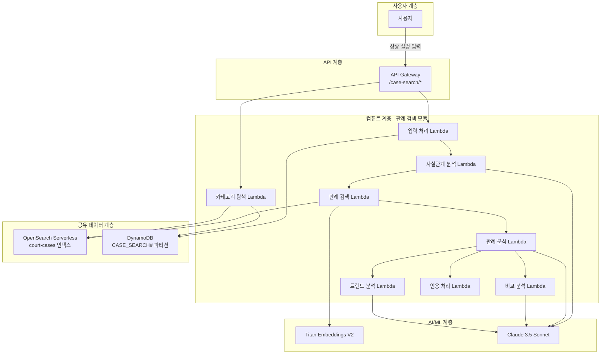
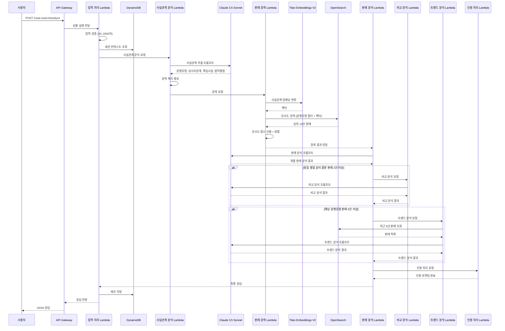
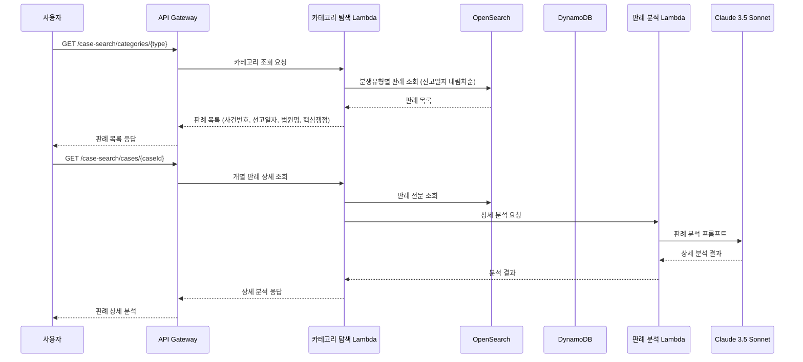
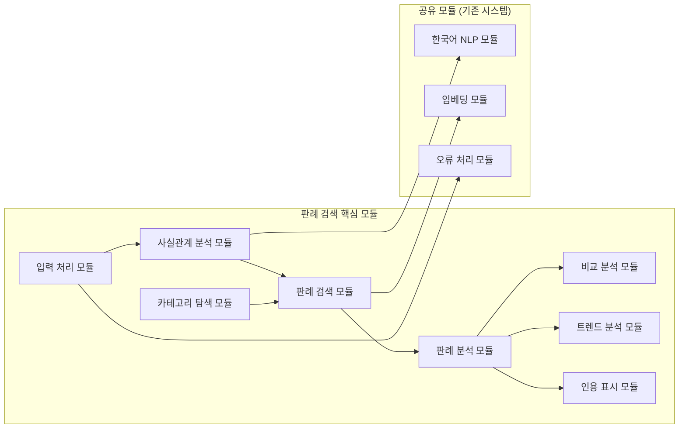
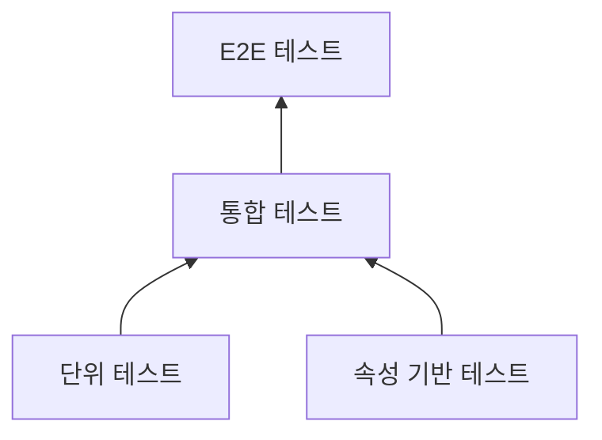

# Design Document: 부동산 판례 검색 및 분석 서비스

## Overview

부동산 판례 검색 및 분석 서비스는 사용자가 자신의 부동산 분쟁 상황을 자연어로 설명하면, RAG 기술을 활용하여 사실관계가 유사한 판례를 검색하고, 판결 요지·쟁점·판결 이유·실무 시사점을 체계적으로 분석한 응답을 제공하는 시스템이다.

기존 부동산 법률 AI 자문 서비스가 "법적으로 어떻게 해야 하나?"에 답한다면, 본 서비스는 "내 상황과 유사한 판례가 무엇이고, 법원은 어떤 판단을 했나?"에 초점을 맞춘다.

### 핵심 설계 원칙

1. **기존 인프라 공유**: court-cases OpenSearch 인덱스, DynamoDB, API Gateway를 기존 법률 자문 시스템과 공유하되 독립 모듈로 동작
2. **사실관계 기반 검색**: 단순 키워드 매칭이 아닌, 사용자 상황의 사실관계를 분석하여 의미적 유사도 기반으로 판례를 검색
3. **분석 중심 응답**: 판례 자체를 심층 분석(비교 분석, 트렌드 분석)하여 사용자가 법원의 판단 경향을 이해할 수 있도록 지원
4. **모듈 독립성**: 기존 법률 자문 모듈과 독립적으로 배포·확장 가능한 구조

### 기술 스택 요약

| 계층 | 기술 | 역할 |
|------|------|------|
| API | Amazon API Gateway | `/case-search/*` REST 엔드포인트 |
| 컴퓨트 | AWS Lambda (TypeScript/Node.js) | 서버리스 함수 실행 |
| LLM | Amazon Bedrock (Claude 3.5 Sonnet) | 판례 분석 및 응답 생성 |
| 임베딩 | Amazon Bedrock (Titan Text Embeddings V2) | 사실관계 벡터 변환 |
| 벡터 저장소 | Amazon OpenSearch Serverless | 기존 court-cases 인덱스 공유 |
| 데이터 저장소 | Amazon DynamoDB | 세션, 검색 이력 (`CASE_SEARCH#` 접두사) |
| 모니터링 | Amazon CloudWatch | 로그, 메트릭 |

## Architecture

### 전체 시스템 아키텍처



### 질문-응답 처리 흐름



### 카테고리 탐색 흐름



### 설계 결정 사항

| 결정 | 선택 | 근거 |
|------|------|------|
| 검색 대상 | 기존 court-cases 인덱스 공유 | 데이터 중복 방지, 수집 파이프라인 재사용, 인프라 비용 절감 |
| 사실관계 분석 | LLM 기반 추출 | 비정형 자연어에서 구조화된 법적 요소 추출에 LLM이 적합 |
| 검색 전략 | 하이브리드 (벡터 + 분쟁유형 필터) | 의미적 유사도와 카테고리 매칭을 결합하여 정밀도 향상 |
| 비교/트렌드 분석 | 조건부 실행 | 불필요한 LLM 호출 방지, 비용 최적화 |
| 세션 구분 | DynamoDB 파티션 키 접두사 | 기존 테이블 공유하면서 데이터 격리 |
| 세션 크기 | 최대 30개 Q&A 쌍 | 법률 자문(50개)보다 축소하여 판례 분석의 맥락 집중성 확보 |

## Components and Interfaces

### 모듈 구조



### 컴포넌트별 인터페이스

모든 모듈은 기존 법률 자문 시스템의 표준 `ServiceModule` 인터페이스를 준수한다.

#### 1. 입력 처리 모듈 (InputProcessorModule)

```typescript
interface CaseSearchInput {
  situationDescription: string;  // 사용자 상황 설명 (20~2000자)
  sessionId?: string;            // 기존 세션 ID (후속 질문 시)
}

interface CaseSearchOutput {
  sessionId: string;
  analysis: CaseAnalysisResponse;
  processingTimeMs: number;
}

interface InputValidationResult {
  isValid: boolean;
  errorMessage?: string;         // 검증 실패 시 안내 메시지
  sanitizedInput?: string;       // 정제된 입력
}
```

#### 2. 사실관계 분석 모듈 (FactAnalysisModule)

```typescript
interface FactAnalysisInput {
  situationDescription: string;
  sessionContext?: ConversationEntry[];
}

interface FactAnalysisOutput {
  disputeTypes: DisputeType[];         // 분류된 분쟁 유형 (1개 이상)
  parties: PartyRelation;              // 당사자 관계
  keyFacts: string[];                  // 핵심 사실관계 목록
  legalIssues: string[];               // 법적 쟁점 목록
  searchQueries: SearchQuery[];        // 생성된 검색 쿼리
  isRealEstateDispute: boolean;        // 부동산 분쟁 해당 여부
}

type DisputeType = 'lease' | 'sale' | 'registration' | 'brokerage' | 'redevelopment';

interface PartyRelation {
  parties: string[];                   // 당사자 목록
  relationship: string;                // 관계 설명
}

interface SearchQuery {
  queryText: string;                   // 검색 쿼리 텍스트
  emphasis: string[];                  // 강조 키워드
  disputeTypeFilter: DisputeType;     // 분쟁 유형 필터
}
```

#### 3. 판례 검색 모듈 (CaseSearchModule)

```typescript
interface CaseSearchModuleInput {
  searchQueries: SearchQuery[];
  maxResults?: number;                 // 최대 결과 수 (기본 10)
}

interface CaseSearchModuleOutput {
  cases: CaseSearchResult[];
  totalFound: number;
  isLowRelevance: boolean;            // 전체 결과 관련도 미달 여부
  searchTimeMs: number;
}

interface CaseSearchResult {
  caseId: string;
  caseNumber: string;                  // 사건번호
  courtName: string;                   // 법원명
  courtLevel: 'supreme' | 'lower';    // 대법원/하급심 구분
  judgmentDate: string;                // 선고일자
  caseType: DisputeType;              // 사건 유형
  summary: string;                     // 판결 요지
  fullText: string;                    // 판결 전문 (분석용)
  referencedLaws: string[];            // 참조 법령
  similarityScore: number;             // 사실관계 유사도 (0.0~1.0)
  matchedFacts: string[];              // 매칭된 사실관계 요소
}
```

#### 4. 판례 분석 모듈 (CaseAnalysisModule)

```typescript
interface CaseAnalysisInput {
  userSituation: FactAnalysisOutput;
  searchResults: CaseSearchModuleOutput;
  sessionContext?: ConversationEntry[];
}

interface CaseAnalysisResponse {
  situationSummary: string;            // 사용자 상황 요약
  caseAnalyses: IndividualCaseAnalysis[];  // 개별 판례 분석
  comparisonAnalysis?: ComparisonResult;   // 비교 분석 (조건부)
  trendAnalysis?: TrendResult;             // 트렌드 분석 (조건부)
  overallImplication: string;          // 종합 시사점
  citations: CaseCitation[];           // 인용 목록
  disclaimer: string;                  // 면책 고지
}

interface IndividualCaseAnalysis {
  caseNumber: string;
  judgmentSummary: string;             // 판결 요지
  keyIssues: string[];                 // 핵심 쟁점
  judgmentReason: string;              // 판결 이유
  practicalImplication: string;        // 실무 시사점
  similarityToUser: SimilarityDetail;  // 사용자 상황과의 유사점/차이점
}

interface SimilarityDetail {
  similarities: string[];              // 유사점
  differences: string[];               // 차이점
}
```

#### 5. 비교 분석 모듈 (ComparisonModule)

```typescript
interface ComparisonInput {
  cases: CaseSearchResult[];           // 비교 대상 판례
  commonIssue: string;                 // 공통 쟁점
}

interface ComparisonResult {
  commonIssue: string;                 // 공통 쟁점
  comparedCases: ComparedCase[];       // 비교된 판례 목록
  differentiatingFactors: string[];    // 결론이 달라진 핵심 요인
  courtHierarchyNote?: string;         // 상급심 우선 안내 (해당 시)
}

interface ComparedCase {
  caseNumber: string;
  courtName: string;
  courtLevel: 'supreme' | 'lower';
  judgmentDate: string;
  conclusion: string;                  // 결론 요약
  reasoningBasis: string;              // 판단 근거
  factualDifference: string;           // 사실관계 차이점
}
```

#### 6. 트렌드 분석 모듈 (TrendAnalysisModule)

```typescript
interface TrendInput {
  disputeType: DisputeType;
  relatedIssue: string;                // 관련 쟁점
  periodYears?: number;                // 분석 기간 (기본 5년)
}

interface TrendResult {
  disputeType: DisputeType;
  analysisPeriod: { from: string; to: string };
  totalCasesAnalyzed: number;          // 분석 대상 판례 수
  trendDescription: string;            // 판결 경향 설명
  timelineChanges: TrendChange[];      // 시간순 변화 양상
  relatedLawChanges?: LawChange[];     // 관련 법령 개정 (해당 시)
  insufficientData: boolean;           // 데이터 부족 여부
}

interface TrendChange {
  period: string;                      // 기간
  direction: string;                   // 판결 방향
  representativeCases: string[];       // 대표 사건번호
}

interface LawChange {
  lawName: string;
  changeDate: string;
  description: string;
  impactOnTrend: string;
}
```

#### 7. 인용 표시 모듈 (CitationModule)

```typescript
interface CaseCitation {
  footnoteNumber: number;              // 각주 번호
  caseNumber: string;                  // 사건번호
  courtName: string;                   // 법원명
  courtLevel: 'supreme' | 'lower';    // 대법원/하급심 구분
  judgmentDate: string;                // 선고일자
  summary: string;                     // 200자 이내 판결 요지
  originalUrl?: string;                // 대법원 종합법률정보 URL
}
```

#### 8. 카테고리 탐색 모듈 (CategoryBrowseModule)

```typescript
interface CategoryListInput {
  disputeType: DisputeType;
  page?: number;                       // 페이지 번호 (기본 1)
  pageSize?: number;                   // 페이지 크기 (기본 20)
}

interface CategoryListOutput {
  disputeType: DisputeType;
  subCategories: SubCategory[];        // 하위 세부 분류
  cases: CategoryCaseItem[];           // 판례 목록
  totalCount: number;
  page: number;
  pageSize: number;
}

interface SubCategory {
  id: string;
  name: string;                        // 세부 분류명
  caseCount: number;                   // 해당 분류 판례 수
}

interface CategoryCaseItem {
  caseId: string;
  caseNumber: string;                  // 사건번호
  courtName: string;                   // 법원명
  judgmentDate: string;                // 선고일자
  keyIssueSummary: string;             // 핵심 쟁점 요약
}

interface CaseDetailInput {
  caseId: string;
}

interface CaseDetailOutput {
  caseNumber: string;
  courtName: string;
  judgmentDate: string;
  caseType: DisputeType;
  analysis: IndividualCaseAnalysis;    // 상세 분석
  citations: CaseCitation[];
}
```

## Data Models

### DynamoDB 테이블 설계 (기존 테이블 공유)

기존 DynamoDB 테이블을 공유하되, `CASE_SEARCH#` 파티션 키 접두사로 데이터를 격리한다.

#### 세션 레코드

| 속성 | 타입 | 키 | 설명 |
|------|------|-----|------|
| PK | String | PK | `CASE_SEARCH#SESSION#{sessionId}` |
| SK | String | SK | `CREATED#{timestamp}` |
| conversations | List | - | 질문-응답 쌍 목록 (최대 30) |
| lastActivityAt | String | - | 마지막 활동 일시 |
| ttl | Number | - | TTL (24시간 후 자동 삭제) |

```typescript
interface CaseSearchSessionRecord {
  PK: string;                          // CASE_SEARCH#SESSION#{sessionId}
  SK: string;                          // CREATED#{ISO timestamp}
  conversations: CaseSearchConversation[];
  lastActivityAt: string;
  ttl: number;
}

interface CaseSearchConversation {
  questionId: string;
  situationDescription: string;        // 사용자 상황 설명
  factAnalysis: FactAnalysisOutput;    // 사실관계 분석 결과
  analysisResponse: CaseAnalysisResponse;  // 분석 응답
  timestamp: string;
  feedback?: 'helpful' | 'not_helpful';
}
```

#### 검색 이력 레코드

| 속성 | 타입 | 키 | 설명 |
|------|------|-----|------|
| PK | String | PK | `CASE_SEARCH#HISTORY#{date}` |
| SK | String | SK | `#{timestamp}#{requestId}` |
| sessionId | String | - | 세션 ID |
| disputeTypes | List | - | 분류된 분쟁 유형 |
| searchQuery | String | - | 원본 상황 설명 |
| resultCount | Number | - | 검색 결과 수 |
| topSimilarityScore | Number | - | 최고 유사도 점수 |

```typescript
interface CaseSearchHistoryRecord {
  PK: string;                          // CASE_SEARCH#HISTORY#{YYYY-MM-DD}
  SK: string;                          // #{ISO timestamp}#{requestId}
  sessionId: string;
  disputeTypes: DisputeType[];
  searchQuery: string;
  resultCount: number;
  topSimilarityScore: number;
  processingTimeMs: number;
}
```

#### 피드백 레코드

| 속성 | 타입 | 키 | 설명 |
|------|------|-----|------|
| PK | String | PK | `CASE_SEARCH#FEEDBACK#{sessionId}` |
| SK | String | SK | `#{timestamp}` |
| questionId | String | - | 질문 ID |
| rating | String | - | 유용성 평가 |
| disputeType | String | - | 분쟁 유형 |

### OpenSearch 인덱스 (기존 court-cases 인덱스 공유)

기존 법률 자문 시스템의 `court-cases` 인덱스를 그대로 공유한다. 인덱스 스키마는 다음과 같다:

```json
{
  "mappings": {
    "properties": {
      "case_number": { "type": "keyword" },
      "court_name": { "type": "keyword" },
      "court_level": { "type": "keyword" },
      "judgment_date": { "type": "date" },
      "case_type": { "type": "keyword" },
      "chunk_content": { "type": "text", "analyzer": "nori" },
      "chunk_index": { "type": "integer" },
      "total_chunks": { "type": "integer" },
      "referenced_laws": { "type": "keyword" },
      "embedding_vector": {
        "type": "knn_vector",
        "dimension": 1024,
        "method": {
          "name": "hnsw",
          "engine": "nmslib",
          "parameters": { "ef_construction": 512, "m": 16 }
        }
      },
      "metadata": {
        "type": "object",
        "properties": {
          "case_id": { "type": "keyword" },
          "source": { "type": "keyword" },
          "collected_at": { "type": "date" },
          "full_text_s3_key": { "type": "keyword" }
        }
      }
    }
  }
}
```

판례 검색 서비스에서의 검색 전략:

1. **벡터 유사도 검색**: 사실관계 임베딩과 판례 청크 임베딩 간 코사인 유사도
2. **분쟁 유형 필터**: `case_type` 필드로 필터링하여 관련 카테고리 우선
3. **법원 등급 부스팅**: `court_level: supreme`에 가중치를 부여하여 대법원 판례 우선
4. **시간 기반 부스팅**: 최근 판결에 약간의 가중치를 부여

### 동의어 사전 (기존 시스템 공유)

기존 법률 자문 시스템의 DynamoDB SynonymDictionary 테이블을 공유하며, 판례 검색에 특화된 용어를 추가한다.

추가 매핑 예시:
| 일상 표현 | 법률 용어 |
|-----------|-----------|
| 집주인이 보증금 안 돌려줘 | 임대차보증금 반환 청구 |
| 전세 사기 | 임차권 보호, 대항력 |
| 복비 너무 많이 냄 | 중개보수 초과 청구 |
| 재건축 부담금 | 재건축초과이익 환수 |
| 등기 안 해줌 | 소유권이전등기 청구 |

### API 엔드포인트 설계

| Method | Path | 설명 |
|--------|------|------|
| POST | `/case-search/analyze` | 상황 설명 기반 판례 검색 및 분석 |
| POST | `/case-search/follow-up` | 후속 질문 처리 |
| GET | `/case-search/categories` | 분쟁 유형 카테고리 목록 |
| GET | `/case-search/categories/{type}` | 카테고리별 판례 목록 |
| GET | `/case-search/categories/{type}/subcategories` | 하위 세부 분류 |
| GET | `/case-search/cases/{caseId}` | 개별 판례 상세 분석 |
| POST | `/case-search/feedback` | 사용자 피드백 제출 |

## Correctness Properties

*속성(Property)이란 시스템의 모든 유효한 실행에서 참이어야 하는 특성 또는 동작을 의미한다. 즉, 시스템이 무엇을 해야 하는지에 대한 형식적 선언이다. 속성은 사람이 읽을 수 있는 명세와 기계로 검증 가능한 정확성 보장 사이의 다리 역할을 한다.*

### Property 1: 입력 길이 검증

*For any* 사용자 입력 문자열에 대해, 길이가 20자 미만이거나 2000자를 초과하면 거부되어야 하며, 20자 이상 2000자 이하인 입력만 정상 처리되어야 한다. 거부 시에는 최소 입력 요건을 안내하는 메시지가 반환되어야 한다.

**Validates: Requirements 1.1, 1.5**

### Property 2: 사실관계 분석 출력 구조 완전성

*For any* 사실관계 분석 결과에 대해, disputeTypes 배열은 1개 이상의 유효한 분쟁 유형('lease' | 'sale' | 'registration' | 'brokerage' | 'redevelopment')을 포함해야 하며, keyFacts와 legalIssues는 각각 1개 이상의 항목을 포함하고, searchQueries는 1개 이상의 비어있지 않은 검색 쿼리를 포함해야 한다.

**Validates: Requirements 1.2, 1.3, 1.4**

### Property 3: 검색 결과 정렬 및 제한

*For any* 판례 검색 결과에 대해, 반환되는 판례 수는 최대 10건을 초과하지 않아야 하며, 각 판례의 사실관계 유사도 점수는 0.0 이상 1.0 이하여야 하고, 결과는 유사도 점수 내림차순으로 정렬되어야 하며, 동일 유사도에서는 대법원 판례가 하급심 판례보다 앞에 위치해야 한다.

**Validates: Requirements 2.1, 2.3, 2.4, 2.5**

### Property 4: 저관련도 감지

*For any* 검색 결과 목록에 대해, 모든 판례의 사실관계 유사도 점수가 0.3 미만인 경우 isLowRelevance 플래그가 true여야 하고, 0.3 이상인 판례가 1건이라도 존재하면 false여야 한다.

**Validates: Requirements 2.6**

### Property 5: 검색 쿼리 분쟁유형 필터 적용

*For any* 사실관계 분석에서 생성된 검색 쿼리에 대해, 해당 쿼리로 구성된 OpenSearch 요청에는 반드시 case_type 필터가 포함되어야 하며, 필터 값은 사실관계 분석기가 분류한 분쟁 유형과 일치해야 한다.

**Validates: Requirements 2.2, 1.4**

### Property 6: 분석 응답 구조 완전성

*For any* 판례 분석 응답에 대해, situationSummary는 비어있지 않은 문자열이어야 하고, caseAnalyses 내 각 항목은 judgmentSummary, keyIssues(1개 이상), judgmentReason, practicalImplication, similarityToUser(similarities 1개 이상, differences 1개 이상)를 모두 포함해야 하며, overallImplication과 disclaimer는 비어있지 않은 문자열이어야 한다.

**Validates: Requirements 3.1, 3.2, 3.5, 3.6**

### Property 7: 비교 분석 트리거 및 구조

*For any* 검색된 판례 목록에 대해, 동일 쟁점에서 상이한 결론을 가진 판례가 2건 이상이면 비교 분석이 수행되어야 하고, 2건 미만이면 비교 분석이 생략되어야 한다. 비교 분석 수행 시 각 ComparedCase에는 caseNumber, judgmentDate, courtName, conclusion, reasoningBasis, factualDifference가 모두 존재해야 하며, 대법원과 하급심 간 결론이 다른 경우 courtHierarchyNote가 포함되어야 한다.

**Validates: Requirements 4.1, 4.2, 4.3, 4.4, 4.5**

### Property 8: 트렌드 분석 조건 및 구조

*For any* 분쟁 유형에 대한 트렌드 분석 요청에서, 해당 유형의 판례가 5건 미만이면 insufficientData가 true이고 분석이 생략되어야 하며, 5건 이상이면 정상 분석이 수행되어야 한다. 정상 분석 시 analysisPeriod는 최근 5년 이내이어야 하고, totalCasesAnalyzed는 1 이상이며, timelineChanges는 시간순(기간 오름차순)으로 정렬되어야 한다.

**Validates: Requirements 5.1, 5.2, 5.4, 5.5**

### Property 9: 인용 각주 일관성

*For any* 분석 응답의 인용에 대해, 응답 본문의 각주 번호 [N]은 citations 배열의 N번째 항목과 1:1 대응해야 하며, 각 CaseCitation은 caseNumber, courtName, courtLevel('supreme' | 'lower'), judgmentDate를 포함하고 summary는 200자 이하여야 한다.

**Validates: Requirements 6.1, 6.2, 6.4**

### Property 10: 세션 크기 제한

*For any* 세션에 대해, 질문-응답 쌍의 수는 30개를 초과하지 않아야 하며, 30개를 초과하는 삽입 시 가장 오래된 항목부터 제거되어야 한다.

**Validates: Requirements 8.1**

### Property 11: 동의어 검색 확장

*For any* 동의어 사전에 등록된 용어가 사용자 입력에 포함된 경우, 해당 용어의 모든 등록된 동의어(법률 용어)가 최종 검색 쿼리에 포함되어야 한다.

**Validates: Requirements 9.2, 9.3**

### Property 12: 카테고리 판례 목록 정렬 및 완전성

*For any* 분쟁 유형 카테고리의 판례 목록에 대해, 판례는 선고일자 내림차순으로 정렬되어야 하며, 각 항목에는 caseNumber, judgmentDate, courtName, keyIssueSummary가 모두 비어있지 않은 값으로 포함되어야 한다.

**Validates: Requirements 7.2, 7.3**

### Property 13: 후속 질문 컨텍스트 포함

*For any* 세션 컨텍스트가 존재하는 후속 질문에 대해, LLM에 전달되는 프롬프트에는 이전 대화 내용(검색된 판례 정보, 분석 결과)이 포함되어야 한다.

**Validates: Requirements 8.2**

## Error Handling

### 오류 분류 체계

| 등급 | 유형 | 처리 방식 | 예시 |
|------|------|-----------|------|
| Critical | 시스템 장애 | 즉시 알림 + 서비스 중단 방지 (오류 격리) | OpenSearch 연결 불가, DynamoDB 접근 불가 |
| High | LLM 호출 실패 | 재시도 + 사용자 안내 | Bedrock 타임아웃 (60초), 모델 가용성 오류 |
| Medium | 부분 실패 | 로깅 + 가용한 결과 반환 | 트렌드 분석 실패 (메인 분석은 제공) |
| Low | 입력 오류 | 사용자 안내 메시지 | 입력 길이 미달/초과, 비부동산 질문 |

### 사용자 대면 오류 메시지

| 상황 | 사용자 메시지 | 동작 |
|------|-------------|------|
| 입력 길이 미달 (20자 미만) | "분쟁 상황을 20자 이상으로 구체적으로 설명해 주세요." | 입력 안내 + 예시 제공 |
| 입력 길이 초과 (2000자 초과) | "입력은 2000자 이내로 제한됩니다. 핵심 사실관계를 요약해 주세요." | 입력 요건 안내 |
| 비부동산 분쟁 질문 | "부동산 관련 판례 검색만 지원합니다. 임대차, 매매, 등기, 중개, 재건축/재개발 분쟁 상황을 입력해 주세요." | 카테고리 안내 + 예시 |
| 저관련도 결과 (유사도 0.3 미만) | "입력하신 상황과 직접적으로 유사한 판례를 찾기 어렵습니다. 상황을 더 구체적으로 설명하거나 분쟁 유형을 명시해 주세요." | 검색 조건 변경 제안 |
| LLM 호출 실패/타임아웃 | "분석 중 일시적 오류가 발생했습니다. 잠시 후 다시 시도해 주세요." | 재시도 옵션 제공, 입력 보존 |
| OpenSearch 검색 실패 | "검색 중 오류가 발생했습니다. 입력하신 내용은 보존되어 있으니 다시 시도해 주세요." | 입력 보존 + 재시도 |
| 트렌드 분석 데이터 부족 | "해당 분쟁 유형의 판례가 충분하지 않아 트렌드 분석을 제공할 수 없습니다." | 트렌드 생략, 나머지 분석 제공 |
| 전체 응답 타임아웃 (60초) | "응답 생성에 시간이 초과되었습니다. 다시 시도해 주세요." | 재시도 옵션 |

### 오류 격리 전략

판례 검색 서비스의 오류가 기존 법률 자문 시스템에 전파되지 않도록 다음 전략을 적용한다:

1. **독립 Lambda 배포**: 모든 Lambda 함수는 별도 배포 단위로 운영
2. **DynamoDB 파티션 격리**: `CASE_SEARCH#` 접두사로 데이터 격리, 잘못된 쿼리가 기존 데이터에 영향 불가
3. **OpenSearch 읽기 전용 접근**: 판례 검색 모듈은 court-cases 인덱스에 대해 읽기 전용으로 접근 (쓰기는 별도 수집 Lambda)
4. **API Gateway 경로 분리**: `/case-search/*` 경로 독립 설정, Rate Limiting 별도 적용

### 부분 실패 대응

비교 분석 또는 트렌드 분석이 실패해도 핵심 판례 분석은 제공한다:

```typescript
interface GracefulDegradation {
  coreAnalysis: 'required';        // 필수 - 실패 시 전체 오류 반환
  comparisonAnalysis: 'optional';  // 선택 - 실패 시 생략하고 핵심 분석만 반환
  trendAnalysis: 'optional';       // 선택 - 실패 시 생략하고 핵심 분석만 반환
  citation: 'required';            // 필수 - 실패 시 인용 없이 본문만 반환
}
```

## Testing Strategy

### 테스트 계층 구조



### 단위 테스트

각 모듈의 핵심 로직을 검증하는 구체적 예시 기반 테스트.

| 대상 | 테스트 항목 | 도구 |
|------|-----------|------|
| 입력 검증기 | 길이 제한, 빈 문자열, 특수문자 | Jest |
| 사실관계 파서 | LLM 응답 파싱, 필수 필드 추출 | Jest |
| 검색 쿼리 빌더 | 필터 적용, 분쟁유형 매핑 | Jest |
| 결과 정렬기 | 유사도 정렬, 법원등급 우선 | Jest |
| 저관련도 감지 | 임계값 판별 로직 | Jest |
| 비교 분석 트리거 | 조건 판별 (동일 쟁점 상이 결론 2건 이상) | Jest |
| 트렌드 분석 트리거 | 판례 수 임계값 (5건) | Jest |
| 인용 포맷터 | 각주 번호 매핑, 요지 길이 제한 | Jest |
| 세션 관리자 | 크기 제한, FIFO 삭제 | Jest |
| 동의어 확장기 | 사전 매칭, 검색 쿼리 확장 | Jest |
| 카테고리 정렬기 | 선고일자 내림차순, 필수 필드 | Jest |
| 프롬프트 빌더 | 컨텍스트 포함 여부 | Jest |

### 속성 기반 테스트 (Property-Based Testing)

[fast-check](https://github.com/dubzzz/fast-check) 라이브러리를 사용하여 정의된 정확성 속성을 검증한다.

**설정:**
- 최소 100회 반복 실행
- 각 테스트에 설계 문서의 Property 번호를 태그로 포함

**태그 형식:** `Feature: real-estate-case-search, Property {number}: {property_text}`

| Property | 테스트 대상 | 생성기 전략 |
|----------|-----------|-----------|
| Property 1 | 입력 길이 검증 | 0~3000자 범위의 랜덤 유니코드 문자열 생성, 한국어 포함 |
| Property 2 | 사실관계 분석 출력 구조 | 다양한 FactAnalysisOutput 생성, 필드 존재/유효성 검증 |
| Property 3 | 검색 결과 정렬 및 제한 | 랜덤 CaseSearchResult 목록 (1~30건, 랜덤 유사도, 랜덤 법원등급) |
| Property 4 | 저관련도 감지 | 0.0~1.0 범위의 랜덤 유사도 점수 목록 생성 |
| Property 5 | 검색 쿼리 필터 | 랜덤 DisputeType 조합 + SearchQuery 생성 |
| Property 6 | 분석 응답 구조 | 다양한 CaseAnalysisResponse 생성 (1~10건 분석) |
| Property 7 | 비교 분석 트리거 | 랜덤 판례 목록 (쟁점 일치/불일치, 결론 동일/상이 조합) |
| Property 8 | 트렌드 분석 조건 | 1~20건의 랜덤 판례 수 + 랜덤 기간 |
| Property 9 | 인용 각주 일관성 | 1~10개의 랜덤 CaseCitation, 다양한 요지 길이 |
| Property 10 | 세션 크기 제한 | 1~60개의 랜덤 대화 항목 삽입 시퀀스 |
| Property 11 | 동의어 확장 | 랜덤 동의어 사전 (1~30개 엔트리) + 랜덤 입력 텍스트 |
| Property 12 | 카테고리 정렬 | 다양한 선고일자의 CategoryCaseItem 목록 |
| Property 13 | 후속 질문 컨텍스트 | 0~30개의 랜덤 세션 컨텍스트 + 후속 질문 |

### 통합 테스트

| 대상 | 검증 항목 |
|------|-----------|
| API Gateway → Lambda | /case-search/* 경로 라우팅, 에러 응답 형식 |
| Lambda → OpenSearch | 벡터 검색, 분쟁유형 필터, court_level 부스팅 |
| Lambda → Bedrock | 사실관계 추출, 판례 분석, 비교/트렌드 분석 |
| Lambda → DynamoDB | 세션 CRUD, CASE_SEARCH# 파티션 격리, TTL |
| 오류 격리 | 판례 검색 모듈 장애 시 법률 자문 모듈 정상 동작 |

### E2E 테스트

전체 판례 검색-분석 흐름을 검증하는 시나리오 기반 테스트:

1. 사용자가 임대차 분쟁 상황을 설명하고 60초 내 유사 판례 분석 결과를 수신
2. 분석 결과에 비교 분석이 포함되고 인용 각주가 올바르게 매핑됨을 확인
3. 후속 질문에서 이전 검색 맥락이 유지되어 연관 응답이 생성됨을 확인
4. 부동산 외 분쟁 상황 입력 시 적절한 안내 메시지 반환
5. 카테고리 탐색에서 분쟁유형별 판례 목록이 선고일자 순으로 정렬됨을 확인
6. 저관련도(유사도 0.3 미만) 결과 시 사용자에게 적절한 안내가 제공됨을 확인

