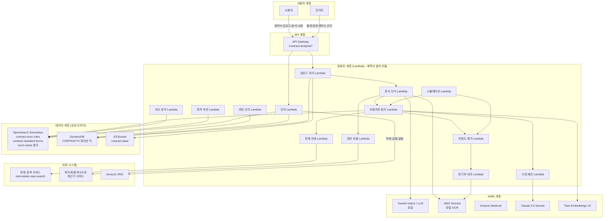
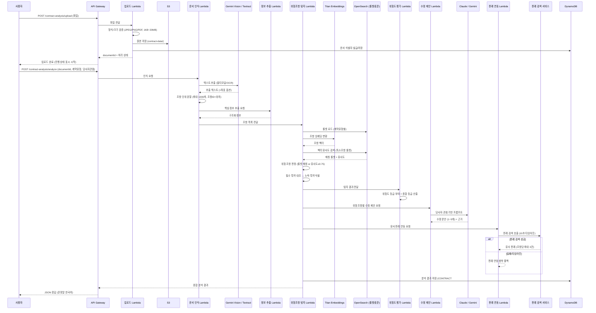
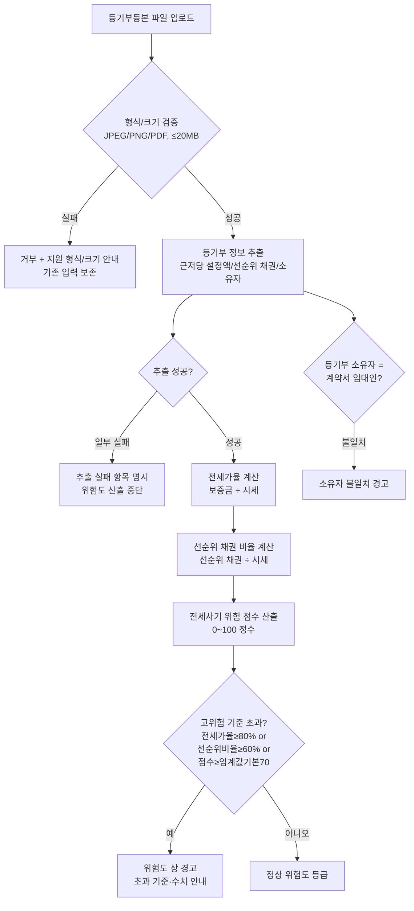
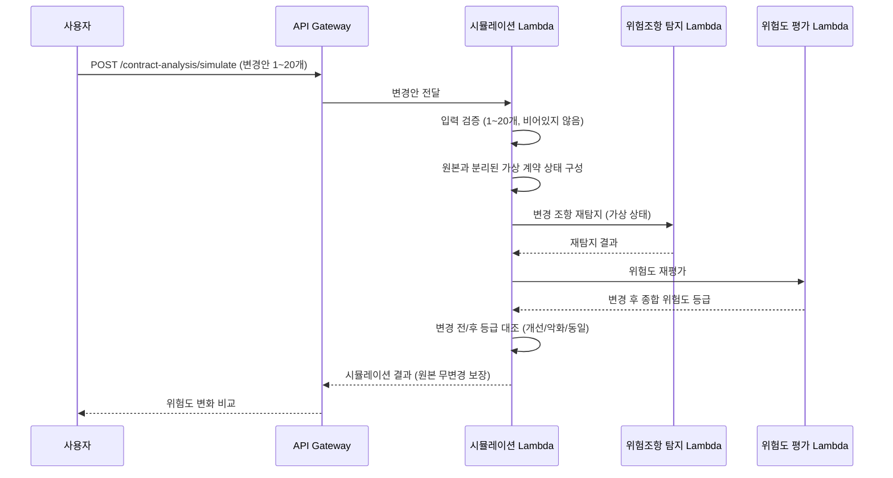
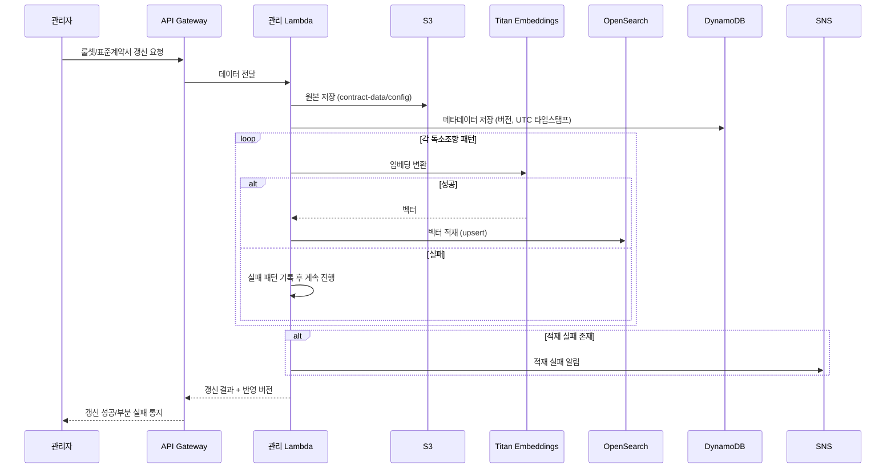
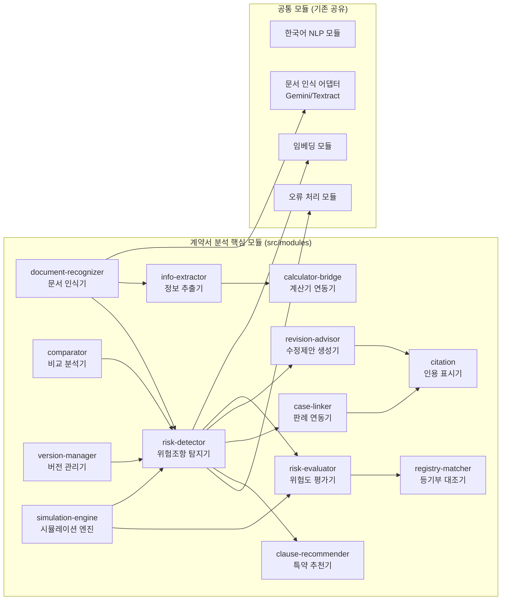
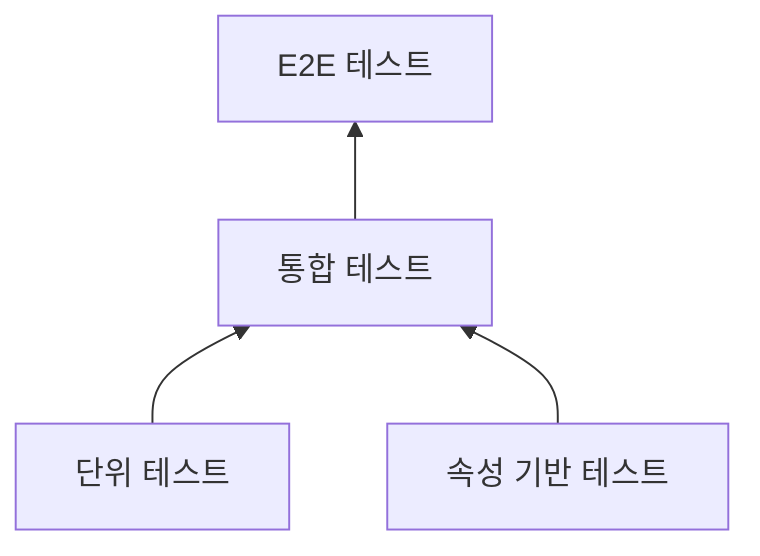

# Design Document: 부동산 계약서 AI 분석 시스템

## Overview

부동산 계약서 AI 분석 시스템은 사용자가 사진 또는 PDF 형태의 계약서를 업로드하면 멀티모달 문서 인식으로 텍스트를 추출하고, 계약 유형별(매매/전세/월세/상가임대차) 독소조항 룰셋과 RAG(Retrieval-Augmented Generation) 기술을 결합하여 위험 조항·독소조항·누락 특약을 탐지하고, 수정 제안·표준계약서 대비 비교·전세사기 위험도 스코어링·근거 법조항 및 판례 각주를 제공하는 서비스이다.

기존 부동산 법률 AI 자문 서비스(real-estate-legal-ai-advisor), 세무 AI 자문 서비스(real-estate-tax-ai-advisor), 판례 검색 서비스(real-estate-case-search)와 동일한 서버리스 RAG + LLM 아키텍처를 기반으로 하며, OpenSearch, DynamoDB, S3, API Gateway 등 공유 인프라를 활용하되 데이터를 격리한다. 탐지된 위험 조항에 대한 유사 분쟁 판례는 기존 판례 검색 서비스를 호출하여 연동한다.

### 핵심 설계 원칙

1. **서버리스 우선**: AWS Lambda와 관리형 서비스를 활용하여 운영 부담 최소화
2. **인프라 공유, 데이터 격리**: 기존 시스템과 동일 OpenSearch 클러스터/DynamoDB 테이블/S3 버킷을 사용하되 인덱스 접두사·파티션 키 접두사(`CONTRACT#`)·객체 접두사로 격리
3. **모듈 독립성**: 각 기능을 독립 배포 가능한 Lambda 모듈로 분리하여 기존 서비스와 장애 격리 보장
4. **멀티모달 문서 인식**: 로컬 개발은 Gemini Vision(무료 API), 배포는 Amazon Bedrock + AWS Textract 정밀 OCR 옵션
5. **당사자 관점 중심 분석**: 매수인/매도인/임대인/임차인 관점에 따라 유불리 판정과 수정 제안을 차별화
6. **원본 무변경 보존**: 버전 관리·시뮬레이션 등 모든 파생 작업은 원본 계약서와 분리된 상태에서 수행
7. **한국어 최적화 및 존댓말 응답**: 분석 결과를 존댓말(해요체/합쇼체) 한국어로 제공

### 기술 스택 요약

| 계층 | 기술 | 역할 |
|------|------|------|
| API | Amazon API Gateway | REST API 엔드포인트 (`/contract-analysis/*`) |
| 컴퓨트 | AWS Lambda (TypeScript/Node.js) | 서버리스 함수 실행 |
| 문서 인식 | Gemini Vision (로컬, gemini-3.6-flash) / AWS Textract (배포, 정밀 OCR 옵션) | 이미지·PDF 텍스트 추출 |
| LLM | Amazon Bedrock (Claude 3.5 Sonnet) / Gemini (로컬) | 위험 조항 분석, 수정 제안, 조항 판단 생성 |
| 임베딩 | Amazon Bedrock (Titan Text Embeddings V2) | 벡터 변환 (1024차원) |
| 벡터 저장소 | Amazon OpenSearch Serverless | 독소조항 룰셋·표준계약서 유사도 검색 (계약서 전용 인덱스) |
| 데이터 저장소 | Amazon DynamoDB | 계약서 버전, 세션, 메타데이터 (`CONTRACT#` 파티션 키) |
| 오브젝트 저장소 | Amazon S3 | 계약서·등기부등본 원본 (계약서 전용 접두사) |
| 알림 | Amazon SNS | 데이터 적재 실패 알림 |
| 모니터링 | Amazon CloudWatch | 로그, 메트릭 |

### 기존 서비스와의 관계

| 항목 | 판례 검색 (case-search) | 세무 자문 (tax) | 계약서 분석 (contract) |
|------|-------------------------|-----------------|------------------------|
| OpenSearch 인덱스 | court-cases (공유) | tax-laws, tax-rulings | contract-toxic-rules, contract-standard-forms (신규) + court-cases(연동 참조) |
| DynamoDB 파티션 키 접두사 | CASE_SEARCH# | TAX# | CONTRACT# |
| API 경로 | /case-search/* | /tax-advisor/* | /contract-analysis/* |
| 문서 인식 | 없음 | 없음 | Gemini Vision / AWS Textract |
| 외부 서비스 연동 | - | - | real-estate-case-search(판례), 취득세/중개수수료 계산기 |

### 로컬/배포 환경 이중화 전략

| 구분 | 로컬 개발 | 배포 (AWS) |
|------|-----------|------------|
| 문서 인식 | Gemini Vision 멀티모달 (좌표 없음) | Gemini Vision 기본 + AWS Textract 정밀 OCR 옵션(좌표 포함) |
| LLM | Gemini (gemini-3.6-flash) | Amazon Bedrock (Claude 3.5 Sonnet) |
| 임베딩 | Gemini 임베딩 / 로컬 스텁 | Titan Text Embeddings V2 |
| 하이라이트 | 텍스트 매칭 기반 (mark 태그) | 텍스트 매칭 기본 + Textract 좌표 존재 시 이미지 박스 |

LLM/임베딩/문서 인식 제공자는 공통 어댑터 인터페이스 뒤에 두어 환경 변수(`LLM_PROVIDER`, `OCR_PROVIDER`)로 교체 가능하도록 한다.

## Architecture

### 전체 시스템 아키텍처



### 계약서 분석 처리 흐름



### 등기부 대조 및 전세사기 스코어링 흐름



### 협상 시나리오 시뮬레이션 흐름



### 룰셋/표준계약서 데이터 적재 파이프라인



### 설계 결정 사항

| 결정 | 선택 | 근거 |
|------|------|------|
| 문서 인식 | Gemini Vision(로컬) / Textract(배포 정밀) | 로컬 무료 개발 + 배포 시 좌표 기반 정밀 하이라이트 |
| 하이라이트 | 텍스트 매칭 기본 + 좌표 보조 | 좌표 없는 멀티모달 인식에도 항상 하이라이트 가능, Textract 있으면 정밀화 |
| 벡터 저장소 | 기존 OpenSearch 공유 (신규 전용 인덱스) | 인프라 비용 절감, 인덱스 접두사로 데이터 격리 |
| 판례 연동 | 기존 case-search 서비스 호출 (10초 타임아웃) | 판례 데이터/로직 중복 방지, 실패 시 폴백으로 분석 지속 |
| 계산기 연동 | 표준 인터페이스 전달만 수행 | 취득세/중개수수료 계산은 별도 서비스 책임, 결합도 최소화 |
| 버전 저장 | DynamoDB (CONTRACT#{docId} 파티션 키) | 버전별 정렬 조회 용이, 최대 50개 유지 정책 적용 |
| 시뮬레이션 격리 | 원본과 분리된 가상 상태 | 원본 계약서 데이터 무변경 보장 |
| 데이터 분리 | 파티션 키/인덱스/객체 접두사 (CONTRACT#) | 기존 인프라 재활용 + 논리적 격리 |

## Components and Interfaces

### 모듈 구조



모든 서비스 모듈은 `src/common/interfaces/service-module.ts`의 표준 `ServiceModule` 인터페이스(`initialize`, `execute`, `healthCheck`, `getName`, `getVersion`)와 공통 `ModuleInput`/`ModuleOutput`/`ErrorResponse` 타입을 준수한다. 각 모듈은 입력 스키마, 출력 스키마, 표준 오류 응답 형식을 정의하며, 입력이 스키마와 불일치하면 스키마 불일치 표준 오류 응답을 반환한다.

### 공통 타입

```typescript
// 계약 유형
type ContractType = 'sale' | 'jeonse' | 'wolse' | 'commercial_lease';
// 매매 | 전세 | 월세 | 상가임대차

// 당사자 관점
type PartyPerspective = 'buyer' | 'seller' | 'landlord' | 'tenant';
// 매수인 | 매도인 | 임대인 | 임차인

// 위험도 등급
type RiskGrade = 'high' | 'medium' | 'low';   // 상(빨강) | 중(노랑) | 하(초록)

// 당사자 관점 기준 유불리
type PartyImpact = 'disadvantageous' | 'neutral' | 'advantageous'; // 불리 | 중립 | 유리

// 위험 조항 원문 매칭 (텍스트 매칭 하이라이트용)
interface ClauseSpan {
  clauseId: string;           // 문서 내 고유 조항 식별자
  matchedText: string;        // 원문 매칭 문구 (100자 미만이면 조항 전체, 5000자 초과 시 절단)
  startOffset?: number;       // 추출 텍스트 내 시작 위치
  endOffset?: number;         // 추출 텍스트 내 끝 위치
  boundingBox?: BoundingBox;  // Textract 좌표 (존재 시)
}

interface BoundingBox {
  page: number;
  left: number;
  top: number;
  width: number;
  height: number;
}
```

### 컴포넌트별 인터페이스

#### 1. 문서 인식기 (document-recognizer)

```typescript
interface DocumentRecognizerInput {
  documentId: string;
  s3Key: string;
  mimeType: 'image/jpeg' | 'image/png' | 'application/pdf';
  ocrMode: 'multimodal' | 'textract_precise'; // 로컬:multimodal / 배포 옵션:textract_precise
}

interface DocumentRecognizerOutput {
  documentId: string;
  fullText: string;
  clauses: RecognizedClause[];      // 최대 1000개
  hasCoordinates: boolean;          // Textract 좌표 존재 여부
  recognitionStatus: 'success' | 'low_quality' | 'failed';
  processingTimeMs: number;
}

interface RecognizedClause {
  clauseId: string;                 // 문서 내 중복되지 않는 식별자
  text: string;                     // 조항 원문
  order: number;                    // 원문 내 순서
  startOffset: number;              // 원문 내 시작 위치
  endOffset: number;                // 원문 내 끝 위치
  boundingBox?: BoundingBox;        // Textract 좌표 (옵션)
}
```

문서 인식 어댑터는 제공자 교체 가능한 인터페이스를 둔다:

```typescript
interface OcrProvider {
  extractText(input: OcrRequest): Promise<OcrResult>;
}

interface OcrResult {
  text: string;
  blocks?: OcrBlock[];              // 좌표 포함 블록 (Textract만)
}

interface OcrBlock {
  text: string;
  boundingBox: BoundingBox;
}
```

#### 2. 위험조항 탐지기 (risk-detector)

```typescript
interface RiskDetectorInput {
  documentId: string;
  contractType: ContractType;
  perspective: PartyPerspective;
  clauses: RecognizedClause[];
}

interface RiskDetectorOutput {
  riskClauses: RiskClause[];
  missingClauses: MissingClause[];   // 누락 필수 특약 (항상 별도 항목으로 제시)
  totalRiskCount: number;
  ruleSetVersion: number;
}

interface RiskClause {
  clauseId: string;
  span: ClauseSpan;                  // 원문 매칭 (하이라이트용)
  riskType: string;                  // 위험 유형
  riskReason: string;                // 위험 사유
  partyImpact: PartyImpact;          // 당사자 관점 기준 유불리
  matchSource: 'ruleset' | 'vector'; // 룰셋 매칭 or 벡터 유사도
  similarityScore?: number;          // 벡터 유사도 (matchSource=vector 시)
  isDisadvantageous: boolean;        // 선택 관점 기준 불리 여부 (별도 구분 표시)
}

interface MissingClause {
  clauseName: string;                // 누락된 특약명
  description: string;               // 필요성 설명
  perspective: PartyPerspective;
}
```

위험 판정 규칙: 계약 유형별 독소조항 룰셋에 매칭되거나 벡터 유사도가 0.75 이상이면 위험 조항으로 판정한다.

#### 3. 위험도 평가기 (risk-evaluator)

```typescript
interface RiskEvaluatorInput {
  riskClauses: RiskClause[];
  registryResult?: RegistryMatchResult; // 등기부 대조 결과 (전세사기 점수 반영)
}

interface RiskEvaluatorOutput {
  gradedClauses: GradedRiskClause[];
  overallGrade: RiskGrade;           // 개별 등급 중 최고 등급
  fraudScore?: FraudRiskScore;       // 전세사기 위험 점수 (등기부 대조 시)
}

interface GradedRiskClause {
  clauseId: string;
  grade: RiskGrade;
  gradeCriteria: string;             // 등급 산출에 적용한 판정 기준
  isGradeUndetermined: boolean;      // 등급 미확정 시 상으로 처리
  colorMapping: 'red' | 'yellow' | 'green'; // 상=red, 중=yellow, 하=green
}

interface FraudRiskScore {
  score: number;                     // 0~100 정수
  jeonseRatio: number;               // 전세가율 (%)
  seniorClaimRatio: number;          // 선순위 채권 비율 (%)
  exceededCriteria: ExceededCriterion[]; // 초과된 고위험 기준
  ownerMismatch: boolean;            // 소유자 불일치 경고
}

interface ExceededCriterion {
  name: 'jeonse_ratio' | 'senior_claim_ratio' | 'fraud_score';
  threshold: number;                 // 기준값 (전세가율 80, 선순위 60, 점수 70)
  actual: number;                    // 실제 수치
}
```

#### 4. 등기부 대조기 (registry-matcher)

```typescript
interface RegistryMatcherInput {
  documentId: string;
  registryS3Key: string;
  mimeType: 'image/jpeg' | 'image/png' | 'application/pdf';
  contractDeposit: number;           // 계약서상 보증금 (원)
  marketPrice: number;               // 주택 시세 (원)
  contractLandlordName: string;      // 계약서상 임대인
}

interface RegistryMatchResult {
  extractedInfo: RegistryInfo;
  jeonseRatio: number;               // 전세가율 (%)
  seniorClaimRatio: number;          // 선순위 채권 비율 (%)
  ownerMismatch: boolean;            // 소유자 불일치 여부
  extractionFailures: string[];      // 추출 실패 항목 (있으면 위험도 산출 중단)
}

interface RegistryInfo {
  mortgageAmount: number;            // 근저당권 설정 금액 (원)
  seniorClaims: number;              // 선순위 채권 총액 (원)
  ownerName: string;                 // 등기부상 소유자
}
```

#### 5. 수정제안 생성기 (revision-advisor)

```typescript
interface RevisionAdvisorInput {
  mode: 'suggest' | 'judge';         // 위험 조항 수정 제안 | 사용자 문의 조항 판단
  perspective: PartyPerspective;
  riskClause?: RiskClause;           // mode=suggest 시
  queryClause?: string;              // mode=judge 시 (1~2000자)
  contractType: ContractType;
}

interface RevisionAdvisorOutput {
  mode: 'suggest' | 'judge';
  suggestions?: RevisionSuggestion[]; // mode=suggest: 1~5개
  judgment?: ClauseJudgment;          // mode=judge
  isOutOfScope: boolean;              // 부동산 계약 범위 외 여부
  disclaimer: string;                 // 면책 고지 (참고용, 전문가 상담 권장)
}

interface RevisionSuggestion {
  revisedText: string;                // 수정 문안 (존댓말)
  rationale: string;                  // 제안 사유
  legalBasis: LegalReference[];       // 근거 법조항/판례 (최소 1건, 없으면 표시)
  hasExplicitBasis: boolean;
}

interface ClauseJudgment {
  legalValidity: string;              // 법적 유효성 판단
  partyImpactJudgment: PartyImpact;   // 당사자 관점 유불리
  cautions: string;                   // 주의사항
  legalBasis: LegalReference[];
  hasExplicitBasis: boolean;
}

interface LegalReference {
  type: 'law_article' | 'precedent';
  lawName?: string;                   // 법령명
  articleNumber?: string;             // 조항 번호
  caseNumber?: string;                // 사건번호
  summary: string;
}
```

#### 6. 특약 추천기 (clause-recommender)

```typescript
interface ClauseRecommenderInput {
  contractType: ContractType;
  perspective: PartyPerspective;
  missingClauses?: MissingClause[];  // 누락 특약 (상단 우선 배치)
}

interface ClauseRecommenderOutput {
  recommendations: RecommendedClause[]; // 1개 이상 or 빈 목록 안내
  hasRecommendations: boolean;
}

interface RecommendedClause {
  clauseText: string;                 // 특약 문안
  reason: string;                     // 추천 사유
  benefit: string;                    // 당사자 관점 기준 이점
  priority: number;                   // 누락 특약이 상위
  legalBasis: LegalReference[];       // 1건 이상
  isBasisVerified: boolean;           // 근거 미확인 시 false
}
```

#### 7. 정보 추출기 (info-extractor)

```typescript
interface InfoExtractorInput {
  documentId: string;
  fullText: string;
  contractType: ContractType;
}

interface InfoExtractorOutput {
  extractedFields: ExtractedField[];
  extractionStatus: 'success' | 'partial' | 'failed';
}

interface ExtractedField {
  fieldName: string;                  // 보증금/월세/매매가/관리비/계약기간/당사자/소재지/면적
  value: string | number | null;
  unit?: 'KRW' | 'sqm' | 'month';     // 금액=원, 면적=제곱미터, 기간=개월
  isConfirmable: boolean;             // 확인 불가 시 false → "확인 불가" 표시
}
```

#### 8. 비교 분석기 (comparator)

```typescript
interface ComparatorInput {
  contractType: ContractType;
  uploadedClauses: RecognizedClause[];
}

interface ComparatorOutput {
  comparisons: ClauseComparison[];
  standardFormExists: boolean;        // 표준양식 없으면 비교 생략 안내
  standardFormVersion?: number;
}

interface ClauseComparison {
  diffType: 'missing' | 'changed' | 'added'; // 누락 | 변경 | 추가
  standardClause?: string;            // 표준조항 내용
  uploadedClause?: string;            // 업로드조항 내용
}
```

#### 9. 판례 연동기 (case-linker)

```typescript
interface CaseLinkerInput {
  riskClauses: RiskClause[];
}

interface CaseLinkerOutput {
  linkedCases: ClauseLinkedCases[];
  caseLinkAvailable: boolean;         // 판례 서비스 실패 시 false + 안내
}

interface ClauseLinkedCases {
  clauseId: string;
  cases: LinkedCase[];                // 조항당 최대 3건
}

interface LinkedCase {
  caseNumber: string;                 // 사건번호
  courtName: string;                  // 법원명
  judgmentSummary: string;            // 판결 요지
  originalUrl: string;                // 판례 원문 링크 (유효성 확인)
  urlVerified: boolean;
}
```

판례 검색 서비스 호출은 내부 Lambda 호출 또는 `/case-search/analyze` API 호출로 수행하며, 10초 이내 응답하지 않거나 오류를 반환하면 판례 연동 없이 분석 결과를 반환한다.

#### 10. 버전 관리기 (version-manager)

```typescript
interface VersionManagerInput {
  action: 'save' | 'compare';
  documentId: string;
  revisedContent?: string;            // action=save
  versionA?: number;                  // action=compare
  versionB?: number;                  // action=compare
}

interface VersionManagerOutput {
  action: 'save' | 'compare';
  savedVersion?: ContractVersion;     // action=save
  comparison?: VersionComparison;     // action=compare
}

interface ContractVersion {
  versionNumber: number;              // 1부터 1씩 증가
  savedAt: string;                    // YYYY-MM-DD HH:mm:ss
  overallGrade: RiskGrade;
}

interface VersionComparison {
  added: string[];                    // 추가된 조항
  removed: string[];                  // 삭제된 조항
  changed: ClauseChange[];            // 변경된 조항
  gradeA: RiskGrade;
  gradeB: RiskGrade;
  gradeShift: 'up' | 'down' | 'same'; // 상승/하락/동일
}

interface ClauseChange {
  before: string;
  after: string;
}
```

버전 유지 정책: 최소 10개 유지, 최대 50개 제한. 50개 초과 시 버전 번호가 가장 낮은 오래된 버전부터 삭제한다.

#### 11. 시뮬레이션 엔진 (simulation-engine)

```typescript
interface SimulationEngineInput {
  documentId: string;
  clauseChanges: ClauseChangeRequest[]; // 1~20개
}

interface ClauseChangeRequest {
  clauseId: string;
  newText: string;
}

interface SimulationEngineOutput {
  beforeGrade: RiskGrade;
  afterGrade: RiskGrade;
  comparison: 'improved' | 'worsened' | 'same'; // 개선/악화/동일
  changedClauseResults: GradedRiskClause[];
}
```

시뮬레이션은 원본과 분리된 가상 계약 상태에서 위험조항 탐지기·위험도 평가기를 재실행하며, 원본 계약서 데이터를 변경하지 않는다.

#### 12. 인용 표시기 (citation)

```typescript
interface CitationInput {
  riskClauses: RiskClause[];
  legalReferences: Record<string, LegalReference[]>; // clauseId → 근거 목록
}

interface CitationOutput {
  annotatedClauses: AnnotatedClause[];
}

interface AnnotatedClause {
  clauseId: string;
  footnotes: Footnote[];              // 조항당 최대 5개
  noBasisFound: boolean;              // 근거 미발견 시 표시
}

interface Footnote {
  number: number;                     // 본문 등장 순서대로 1부터 연속
  reference: LegalReference;
}
```

#### 13. 계산기 연동기 (calculator-bridge)

```typescript
// 취득세/중개수수료 계산기 서비스로 전달할 표준 인터페이스 (계산은 수행하지 않음)
interface CalculatorBridgeOutput {
  schemaVersion: string;
  input: CalculatorInputSchema;
}

interface CalculatorInputSchema {
  contractType: ContractType;
  deposit?: { value: number; unit: 'KRW' };        // 보증금
  monthlyRent?: { value: number; unit: 'KRW' };    // 월세
  salePrice?: { value: number; unit: 'KRW' };      // 매매가
  managementFee?: { value: number; unit: 'KRW' };  // 관리비
  contractPeriod?: { value: number; unit: 'month' }; // 계약 기간
  area?: { value: number; unit: 'sqm' };           // 면적
}

// 계산기 서비스 출력 스키마 (참조 정의 - 본 서비스는 소비하지 않음)
interface CalculatorOutputSchema {
  acquisitionTax?: { value: number; unit: 'KRW' };
  brokerageFee?: { value: number; unit: 'KRW' };
}
```

## Data Models

### DynamoDB 테이블 설계

기존 시스템의 DynamoDB 테이블을 공유하며, 파티션 키에 `CONTRACT#` 접두사를 사용하여 데이터를 논리적으로 분리한다.

#### 1. 계약서 문서 레코드

| 속성 | 타입 | 키 | 설명 |
|------|------|-----|------|
| PK | String | PK | `CONTRACT#DOC#{documentId}` |
| SK | String | SK | `METADATA` |
| s3Key | String | - | 원본 S3 키 |
| contractType | String | - | 계약 유형 |
| perspective | String | - | 당사자 관점 |
| status | String | - | 처리 상태 |
| ttl | Number | - | TTL (오류 시 24시간 보존) |

```typescript
interface ContractDocumentRecord {
  PK: string;                         // CONTRACT#DOC#{documentId}
  SK: string;                         // METADATA
  documentId: string;
  s3Key: string;
  contractType?: ContractType;
  perspective?: PartyPerspective;
  status: 'uploaded' | 'recognizing' | 'analyzing' | 'completed' | 'error';
  createdAt: string;
  ttl: number;
}
```

#### 2. 계약서 버전 레코드

버전 관리는 `CONTRACT#{documentId}` 파티션 키로 저장하며, 정렬 키의 버전 번호로 조회한다.

| 속성 | 타입 | 키 | 설명 |
|------|------|-----|------|
| PK | String | PK | `CONTRACT#{documentId}` |
| SK | String | SK | `VERSION#{zeroPaddedVersion}` |
| versionNumber | Number | - | 1부터 1씩 증가 |
| savedAt | String | - | YYYY-MM-DD HH:mm:ss |
| content | String | - | 버전 계약서 내용 |
| overallGrade | String | - | 종합 위험도 등급 |

```typescript
interface ContractVersionRecord {
  PK: string;                         // CONTRACT#{documentId}
  SK: string;                         // VERSION#000001
  versionNumber: number;
  savedAt: string;                    // YYYY-MM-DD HH:mm:ss
  content: string;
  overallGrade: RiskGrade;
}
```

#### 3. 분석 결과 레코드

| 속성 | 타입 | 키 | 설명 |
|------|------|-----|------|
| PK | String | PK | `CONTRACT#DOC#{documentId}` |
| SK | String | SK | `ANALYSIS#{timestamp}` |
| overallGrade | String | - | 종합 위험도 등급 |
| riskClauseCount | Number | - | 위험 조항 수 |
| fraudScore | Number | - | 전세사기 위험 점수 (해당 시) |

#### 4. 룰셋/표준계약서 메타데이터 레코드

| 속성 | 타입 | 키 | 설명 |
|------|------|-----|------|
| PK | String | PK | `CONTRACT#RULESET#{contractType}` / `CONTRACT#STANDARD#{contractType}` |
| SK | String | SK | `version#{n}` |
| version | Number | - | 단조 증가 버전 번호 |
| updatedAt | String | - | 갱신 시각 (UTC 타임스탬프) |
| vectorStatus | String | - | 벡터 적재 상태 |

```typescript
interface RuleSetMetadataRecord {
  PK: string;                         // CONTRACT#RULESET#jeonse 등
  SK: string;                         // version#3
  version: number;
  updatedAt: string;                  // UTC ISO 8601
  vectorStatus: 'completed' | 'partial' | 'failed';
  failedPatterns: string[];
}
```

#### 5. 시스템 설정 레코드

| 속성 | 타입 | 키 | 설명 |
|------|------|-----|------|
| PK | String | PK | `CONTRACT#CONFIG` |
| SK | String | SK | `fraud_threshold` |
| fraudScoreThreshold | Number | - | 전세사기 위험 점수 임계값 (기본 70) |

### OpenSearch Serverless 인덱스 설계

기존 OpenSearch 클러스터에 계약서 분석 전용 인덱스를 신규 생성하며, 인덱스명에 `contract-` 접두사를 부여하여 격리한다. 판례 연동 시 기존 `court-cases` 인덱스는 판례 검색 서비스를 통해 간접 참조한다.

#### 독소조항 룰셋 인덱스 (contract-toxic-rules)

```json
{
  "mappings": {
    "properties": {
      "contract_type": { "type": "keyword" },
      "rule_id": { "type": "keyword" },
      "rule_category": { "type": "keyword" },
      "pattern_text": { "type": "text", "analyzer": "nori" },
      "risk_type": { "type": "keyword" },
      "risk_reason": { "type": "text", "analyzer": "nori" },
      "is_required_clause": { "type": "boolean" },
      "applicable_perspective": { "type": "keyword" },
      "legal_basis": { "type": "keyword" },
      "embedding_vector": {
        "type": "knn_vector",
        "dimension": 1024,
        "method": {
          "name": "hnsw",
          "engine": "nmslib",
          "parameters": { "ef_construction": 512, "m": 16 }
        }
      },
      "metadata": {
        "type": "object",
        "properties": {
          "version": { "type": "integer" },
          "updated_at": { "type": "date" },
          "service_id": { "type": "keyword", "index": true }
        }
      }
    }
  }
}
```

#### 표준계약서 인덱스 (contract-standard-forms)

```json
{
  "mappings": {
    "properties": {
      "contract_type": { "type": "keyword" },
      "clause_id": { "type": "keyword" },
      "clause_title": { "type": "keyword" },
      "clause_content": { "type": "text", "analyzer": "nori" },
      "clause_order": { "type": "integer" },
      "embedding_vector": {
        "type": "knn_vector",
        "dimension": 1024,
        "method": {
          "name": "hnsw",
          "engine": "nmslib",
          "parameters": { "ef_construction": 512, "m": 16 }
        }
      },
      "metadata": {
        "type": "object",
        "properties": {
          "version": { "type": "integer" },
          "updated_at": { "type": "date" },
          "service_id": { "type": "keyword", "index": true }
        }
      }
    }
  }
}
```

### S3 버킷 구조

기존 S3 버킷 내에 계약서 분석 전용 접두사(`contract-data/`)를 사용하여 객체를 격리한다.

```
s3://real-estate-data-{env}/
├── contract-data/
│   ├── uploads/
│   │   ├── {documentId}/original.{ext}        # 업로드 계약서 원본
│   │   └── {documentId}/registry.{ext}        # 등기부등본 원본
│   ├── recognized/
│   │   └── {documentId}/text.json             # 인식 텍스트 + 조항 분할
│   ├── config/
│   │   ├── toxic-rules/{contractType}.json    # 독소조항 룰셋 원본
│   │   ├── standard-forms/{contractType}.json # 표준계약서 원본
│   │   ├── required-clauses/{contractType}.json # 필수 특약 목록
│   │   └── checklists/{contractType}.json     # 첨부서류 체크리스트
│   └── processed/
│       └── {contractType}/embeddings.json
├── tax-data/        # 세무 자문 데이터
└── legal-data/      # 법률 자문 데이터
```

### 첨부서류 체크리스트 데이터 모델

계약 유형별 필수 첨부서류 체크리스트는 S3 config에 정의하고 로드한다.

```typescript
interface ChecklistItem {
  documentName: string;               // 서류명
  purpose: string;                    // 확인 목적 설명
  preparedBy: PartyPerspective;       // 준비 주체 (당사자 관점별 구분)
  status?: 'pending' | 'completed' | 'mismatch'; // 등기부 대조 시 갱신
}

interface ContractChecklist {
  contractType: ContractType;
  items: ChecklistItem[];             // 1개 이상
}
```

## Correctness Properties

*속성(Property)이란 시스템의 모든 유효한 실행에서 참이어야 하는 특성 또는 동작을 의미한다. 즉, 시스템이 무엇을 해야 하는지에 대한 형식적 선언이다. 속성은 사람이 읽을 수 있는 명세와 기계로 검증 가능한 정확성 보장 사이의 다리 역할을 한다.*

### Property 1: 문서 식별자 유일성

*For any* N회(N≥1)의 계약서 업로드에 대해, 발급된 문서 식별자 집합의 크기는 정확히 N이어야 한다(모든 식별자가 서로 중복되지 않는다).

**Validates: Requirements 1.2**

### Property 2: 조항 분할 정합성

*For any* 인식된 계약서 텍스트에 대해, 분할된 조항 수는 1000개를 초과하지 않아야 하고, 각 조항의 clauseId는 문서 내에서 유일해야 하며, 각 조항의 위치 정보(startOffset, endOffset)로 원문을 잘라낸 결과가 해당 조항 텍스트와 일치해야 한다.

**Validates: Requirements 1.4**

### Property 3: 업로드 파일 형식 검증

*For any* 업로드 파일의 MIME 타입에 대해, 타입이 image/jpeg, image/png, application/pdf 중 하나이면 통과하고 그 외의 모든 타입은 거부되어야 한다.

**Validates: Requirements 1.6, 5.2**

### Property 4: 업로드 파일 크기 경계 검증

*For any* 업로드 파일 크기에 대해, 크기가 1KB 이상 20MB 이하이면 통과하고, 1KB 미만이거나 20MB를 초과하면 거부되어야 한다.

**Validates: Requirements 1.1, 1.7, 5.1**

### Property 5: 문서 인식 최소 길이 판정

*For any* 문서 인식 결과 텍스트에 대해, 인식 텍스트 길이가 20자 미만이면 recognitionStatus가 실패(failed)로 판정되어야 하고, 20자 이상이면 실패로 판정되지 않아야 한다.

**Validates: Requirements 1.10**

### Property 6: 계약 유형 추정 신뢰도 임계값

*For any* 계약 유형 추정 신뢰도값에 대해, 신뢰도가 0.7 이상이면 사용자 확인 요청 상태가 되어야 하고, 0.7 미만이면 자동 확정하지 않고 직접 선택 요청 상태가 되어야 한다.

**Validates: Requirements 2.3, 2.4**

### Property 7: 계약 유형별 당사자 관점 제한

*For any* 확정된 계약 유형에 대해, 계약 유형이 매매이면 허용 당사자 관점은 정확히 {매수인, 매도인}이어야 하고, 전세·월세·상가임대차이면 허용 당사자 관점은 정확히 {임차인, 임대인}이어야 한다.

**Validates: Requirements 2.6, 2.7**

### Property 8: 위험 조항 판정 규칙

*For any* 계약서 조항과 그 룰셋 매칭 여부 및 벡터 유사도값에 대해, 룰셋 매칭이 존재하거나 유사도가 0.75 이상이면 위험 조항으로 판정되어야 하고, 룰셋 매칭이 없고 유사도가 0.75 미만이면 위험 조항으로 판정되지 않아야 한다.

**Validates: Requirements 3.1**

### Property 9: 위험 조항 결과 구조 완전성

*For any* 탐지된 위험 조항에 대해, 조항 원문(span), 위험 유형(riskType), 위험 사유(riskReason)는 비어있지 않아야 하며, partyImpact는 {불리, 중립, 유리} 중 정확히 하나의 값이어야 한다.

**Validates: Requirements 3.2, 3.4**

### Property 10: 누락 특약 점검 항상 제시

*For any* 위험 조항 탐지 결과에 대해(위험 조항 수가 0건인 경우를 포함하여), 누락 특약 점검 결과(missingClauses)는 항상 결과에 별도 항목으로 존재해야 한다.

**Validates: Requirements 3.3, 3.5**

### Property 11: 원문 매칭 길이 절단 규칙

*For any* 위험 조항의 원문 매칭에 대해, 매칭 원문 길이가 100자 미만이면 matchedText는 해당 조항 전체 원문이어야 하고, 매칭 길이가 5000자를 초과하면 matchedText 길이는 정확히 5000자여야 한다.

**Validates: Requirements 3.6**

### Property 12: 위험도 등급 부여 및 미확정 처리

*For any* 위험 조항에 대해, 부여된 위험도 등급은 {상, 중, 하} 중 정확히 하나여야 하며, 등급이 부여되지 않거나 {상, 중, 하} 이외의 값이 산출되면 해당 조항은 등급 "상"으로 처리되고 등급 미확정 상태가 표시되어야 한다.

**Validates: Requirements 4.1, 4.2**

### Property 13: 종합 위험도 등급 산출

*For any* 위험 조항 등급 목록에 대해, 목록이 비어있으면(위험 조항 0건) 종합 위험도 등급은 "하"여야 하고, 비어있지 않으면 종합 위험도 등급은 개별 조항 등급 중 가장 높은 등급(상>중>하)이어야 한다.

**Validates: Requirements 4.3, 4.4**

### Property 14: 위험도 등급-색상 매핑

*For any* 위험도 등급에 대해, 상은 빨강, 중은 노랑, 하는 초록으로 1:1(전단사) 매핑되어야 한다.

**Validates: Requirements 4.5**

### Property 15: 전세가율 및 선순위 채권 비율 계산 정확성

*For any* 보증금, 선순위 채권 총액, 주택 시세(시세>0) 조합에 대해, 전세가율은 (보증금 ÷ 시세 × 100)과 일치하고, 선순위 채권 비율은 (선순위 채권 총액 ÷ 시세 × 100)과 일치해야 한다.

**Validates: Requirements 5.5**

### Property 16: 전세사기 위험 점수 범위

*For any* 유효한 등기부 대조 입력에 대해, 산출된 전세사기 위험 점수는 0 이상 100 이하의 정수여야 한다.

**Validates: Requirements 5.6**

### Property 17: 고위험 기준 초과 판정

*For any* 전세가율, 선순위 채권 비율, 위험 점수 조합에 대해, 전세가율이 80% 이상이거나 선순위 채권 비율이 60% 이상이거나 위험 점수가 관리 설정 임계값(기본 70) 이상이면 위험도 상 경고가 표시되고 초과된 기준 항목이 exceededCriteria에 정확히 포함되어야 하며, 세 조건이 모두 미달이면 상 경고가 표시되지 않아야 한다.

**Validates: Requirements 5.7**

### Property 18: 소유자 불일치 감지

*For any* 등기부상 소유자명과 계약서상 임대인명 쌍에 대해, 두 값이 일치하지 않으면 ownerMismatch가 true이고, 일치하면 false여야 한다.

**Validates: Requirements 5.8**

### Property 19: 수정 제안 개수 범위

*For any* 위험 조항에 대해 생성된 수정 제안의 수는 1개 이상 5개 이하여야 한다.

**Validates: Requirements 6.1**

### Property 20: 근거 부재 시 표시

*For any* 수정 제안 또는 조항 판단 결과에 대해, 근거 법조항/판례가 1건도 확보되지 않으면 hasExplicitBasis가 false로 표시되고 확정적 판단 대신 일반 주의사항만 제공되어야 하며, 1건 이상이면 hasExplicitBasis가 true여야 한다.

**Validates: Requirements 6.3, 6.4**

### Property 21: 면책 고지 포함

*For any* 생성된 수정 제안 또는 조항 판단 결과에 대해, disclaimer(면책 고지)는 비어있지 않아야 한다.

**Validates: Requirements 6.5, 6.6**

### Property 22: 범위 외 문의 거부

*For any* 부동산 계약 범위에 해당하지 않는 조항 문의에 대해, 시스템은 isOutOfScope=true를 반환하고 judgment 판단 결과를 생성하지 않아야 한다.

**Validates: Requirements 6.7**

### Property 23: 인용 각주 일관성 및 개수 제한

*For any* 위험 조항의 각주 목록에 대해, 각주 수는 5개를 초과하지 않아야 하며, 본문 내 각주 번호 [N]은 본문 등장 순서대로 1부터 연속 부여되고 하단 근거 목록의 N번째 항목과 1:1 대응해야 한다.

**Validates: Requirements 7.1, 7.2**

### Property 24: 유사 판례 개수 제한 및 링크 유효성

*For any* 위험 조항에 연동된 판례 목록에 대해, 조항당 판례 수는 3건을 초과하지 않아야 하며, 각 판례 원문 링크가 유효한 전체 URL 형식이면 urlVerified=true, 그렇지 않으면 urlVerified=false로 표시되어야 한다.

**Validates: Requirements 7.3, 7.4, 7.7**

### Property 25: 비교 차이유형 분류

*For any* 표준계약서 조항과 업로드 계약서 조항의 대조 결과에 대해, 차이유형은 {누락, 변경, 추가} 중 정확히 하나여야 한다: 표준에는 있으나 업로드에 없으면 "누락", 양쪽 모두 존재하나 내용이 상이하면 "변경", 업로드에만 존재하면 "추가".

**Validates: Requirements 8.2, 8.3, 8.4**

### Property 26: 정보 추출 필드 단위 정확성

*For any* 정보 추출 결과의 각 필드에 대해, 금액 필드(보증금/월세/매매가/관리비)의 단위는 'KRW', 면적 필드의 단위는 'sqm', 계약 기간 필드의 단위는 'month'여야 한다.

**Validates: Requirements 9.1, 9.3**

### Property 27: 미확인 항목 처리

*For any* 정보 추출 대상 필드 집합에서 일부 항목의 값을 확인할 수 없는 경우, 해당 항목은 isConfirmable=false("확인 불가")로 표시되고 나머지 확인 가능한 항목은 정상적으로 추출되어야 한다.

**Validates: Requirements 9.4**

### Property 28: 특약 추천 및 누락 특약 우선 배치

*For any* 확정된 계약 유형과 당사자 관점 조건에 대해, 권장 특약이 존재하면 추천 목록은 1개 이상이고 hasRecommendations=true여야 하며, 누락된 특약이 존재하면 해당 특약들은 그 외 특약보다 높은 우선순위(priority)로 목록 상단에 배치되어야 한다.

**Validates: Requirements 11.1, 11.4**

### Property 29: 버전 저장 단조 증가 및 기존 보존

*For any* 동일 계약서에 대한 N회의 순차 버전 저장에 대해, 부여된 버전 번호는 1부터 1씩 증가하는 연속된 정수여야 하며, 각 저장은 기존 버전 데이터를 변경하지 않아야 한다.

**Validates: Requirements 12.1**

### Property 30: 버전 유지 상한 및 FIFO 삭제

*For any* 동일 계약서에 대한 임의 횟수의 버전 저장에 대해, 저장소에 유지되는 버전 수는 50개를 초과하지 않아야 하며, 50개를 초과하는 경우 버전 번호가 가장 낮은 오래된 버전부터 순서대로 삭제되어야 한다.

**Validates: Requirements 12.3, 12.4**

### Property 31: 버전 비교 등급 변화 판정

*For any* 두 계약서 버전의 종합 위험도 등급 쌍에 대해, 두 번째 버전 등급이 첫 번째보다 낮으면(위험 감소) gradeShift는 "하락", 높으면 "상승", 같으면 "동일"로 판정되어야 한다.

**Validates: Requirements 12.6**

### Property 32: 시뮬레이션 입력 개수 제한

*For any* 시뮬레이션 조항 변경안 목록에 대해, 변경 조항 수가 1개 이상 20개 이하이면 처리되어야 하고, 비어있거나 20개를 초과하면 거부되어야 한다.

**Validates: Requirements 13.1, 13.6**

### Property 33: 시뮬레이션 원본 무변경

*For any* 시뮬레이션 조항 변경안에 대해, 시뮬레이션 실행 후 원본 계약서 데이터 상태는 실행 전 상태와 동일해야 한다.

**Validates: Requirements 13.2**

### Property 34: 시뮬레이션 등급 대조 판정

*For any* 시뮬레이션 변경 전 종합 등급과 변경 후 종합 등급 쌍에 대해, 변경 후 등급이 한 단계 이상 낮아지면 "개선", 한 단계 이상 높아지면 "악화", 등급 변화가 없으면 "동일"로 판정되어야 한다.

**Validates: Requirements 13.4, 13.5**

### Property 35: 분석 결과 구조 순서

*For any* 완료된 계약서 분석 결과에 대해, 결과는 종합 위험도 → 위험 조항 목록 → 누락 특약 → 수정 제안 → 근거 각주 → 추출 정보 요약 → 첨부서류 체크리스트 순서로 구조화되어야 한다.

**Validates: Requirements 14.3**

### Property 36: 부분 임베딩 실패 시 계속 처리

*For any* 독소조항 패턴 목록에서 일부 패턴의 임베딩 변환 또는 벡터 적재가 실패하더라도, 실패하지 않은 모든 패턴은 정상적으로 벡터 적재가 완료되어야 하며 실패한 패턴은 failedPatterns에 기록되어야 한다.

**Validates: Requirements 15.3**

### Property 37: 룰셋/표준계약서 버전 단조 증가

*For any* 룰셋 또는 표준계약서 갱신에 대해, 새로운 버전 번호는 이전 버전 번호보다 커야 하며(단조 증가), 각 버전은 UTC 타임스탬프 메타데이터를 가져야 한다.

**Validates: Requirements 15.5**

### Property 38: OpenSearch 인덱스 접두사 격리

*For any* 계약서 분석 시스템이 생성하는 OpenSearch 인덱스명에 대해, 인덱스명은 반드시 "contract-" 접두사로 시작해야 한다.

**Validates: Requirements 16.1**

### Property 39: DynamoDB 파티션 키 서비스 격리

*For any* 계약서 분석 시스템이 DynamoDB에 생성하는 항목에 대해, 파티션 키(PK)는 반드시 "CONTRACT#" 접두사로 시작해야 한다.

**Validates: Requirements 16.2**

### Property 40: 모듈 입력 스키마 검증

*For any* 모듈에 전달된 입력에 대해, 입력이 해당 모듈의 정의된 입력 스키마와 일치하지 않으면 입력이 거부되고 스키마 불일치를 나타내는 표준 오류 응답(ErrorResponse)이 반환되어야 한다.

**Validates: Requirements 16.7, 16.8**

## Error Handling

### 오류 분류 체계

| 등급 | 유형 | 처리 방식 | 예시 |
|------|------|-----------|------|
| Critical | 시스템 장애 | 즉시 알림 + 서비스 중단 방지 (오류 격리) | OpenSearch 연결 불가, DynamoDB 접근 불가 |
| High | 외부 의존성 실패 | 재시도 + 폴백/알림 | 문서 인식 타임아웃, 룰셋 로드 실패, LLM 호출 실패 |
| Medium | 부분 실패 | 로깅 + 가용 결과 반환 | 개별 임베딩 적재 실패, 판례 연동 실패, 개별 정보 추출 실패 |
| Low | 입력 오류 | 사용자 안내 | 파일 형식/크기 초과, 범위 외 문의, 시뮬레이션 개수 초과 |

### 재시도 전략

```typescript
interface RetryPolicy {
  maxRetries: number;
  strategy: 'exponential_backoff' | 'fixed_interval';
  initialIntervalMs: number;
  maxIntervalMs: number;
  backoffMultiplier?: number;
}

// 문서 인식/임베딩/LLM 호출: 지수 백오프 (1초 초기, 최대 2회)
const inferenceRetry: RetryPolicy = {
  maxRetries: 2,
  strategy: 'exponential_backoff',
  initialIntervalMs: 1000,
  maxIntervalMs: 4000,
  backoffMultiplier: 2,
};

// 조항 분석 전체 처리: 90초 초과 시 최대 1회 자동 재시도 (요구사항 14.5)
const analysisRetry: RetryPolicy = {
  maxRetries: 1,
  strategy: 'fixed_interval',
  initialIntervalMs: 0,
  maxIntervalMs: 0,
};
```

### 처리 시간 제약 및 타임아웃

| 처리 | 제한 시간 | 초과 시 동작 |
|------|-----------|-------------|
| 문서 인식(텍스트 추출) | 120초 | 시간 초과 안내 + 재시도 옵션 (요구사항 1.9) |
| 룰셋 로드 | 5초 | 로드 실패 오류 상태 반환 + 재시도 요청 (요구사항 2.9) |
| 조항당 위험 탐지+누락 점검 | 30초 | 오류 반환 (요구사항 3.8) |
| 수정 제안/조항 판단 | 30초 | 생성 실패 안내 (요구사항 6.8) |
| 판례 서비스 호출 | 10초 | 판례 연동 생략 폴백 (요구사항 7.5) |
| 표준계약서 로드 | 5초 | 로드 실패 오류 메시지 (요구사항 8.6) |
| 첨부서류 체크리스트 제공 | 3초 | - (요구사항 10.1) |
| 특약 추천 | 3초 | - (요구사항 11.1) |
| 버전 비교 | 5초 | 비교 실패 오류 + 재시도 (요구사항 12.8) |
| 시뮬레이션 재실행 | 30초 | 시뮬레이션 실패 오류 + 재시도 (요구사항 13.7) |
| 조항 분석 전체(인식 제외) | 90초 | 시간 초과 안내 + 최대 1회 자동 재시도 (요구사항 14.4, 14.5) |

### 모듈별 오류 격리

각 모듈은 Circuit Breaker 패턴을 적용하여 오류가 다른 모듈이나 기존 서비스(법률/세무/판례)로 전파되지 않도록 한다. 판례 검색 서비스 장애 시 판례 연동을 제외한 계약서 분석 기능은 정상 제공하며, 결과에 판례 연동 불가 주석을 포함한다.

```typescript
interface CircuitBreakerConfig {
  failureThreshold: number;     // 실패 임계값 (기본 5)
  resetTimeoutMs: number;       // 리셋 대기 시간 (기본 60초)
  halfOpenMaxCalls: number;     // Half-Open 상태 최대 호출 수
}

const defaultCircuitBreaker: CircuitBreakerConfig = {
  failureThreshold: 5,
  resetTimeoutMs: 60000,
  halfOpenMaxCalls: 3,
};
```

### 부분 실패 대응 (Graceful Degradation)

```typescript
interface GracefulDegradation {
  documentRecognition: 'required';   // 필수 - 실패 시 재업로드/직접입력 안내
  riskDetection: 'required';         // 필수 - 실패 시 전체 오류
  riskEvaluation: 'required';        // 필수
  revisionAdvice: 'optional';        // 선택 - 실패 시 생략, 나머지 결과 제공
  caseLinking: 'optional';           // 선택 - 실패 시 연동 불가 안내 후 지속
  registryMatching: 'optional';      // 선택 - 미업로드 시 전세사기 산출 생략 안내
  comparison: 'optional';            // 선택 - 표준양식 없으면 비교 생략 안내
}
```

### 사용자 대면 오류 처리

| 상황 | 사용자 메시지 | 동작 |
|------|-------------|------|
| 지원하지 않는 파일 형식 | "JPEG, PNG, PDF 형식만 지원합니다." | 저장 중단 |
| 파일 크기 범위 초과 | "파일 크기는 1KB 이상 20MB 이하로 업로드해 주세요." | 저장 중단 |
| 손상된 파일 | "파일이 손상되어 읽을 수 없습니다. 다시 업로드해 주세요." | 부분 결과 미저장 + 재업로드 옵션 |
| 문서 인식 타임아웃 (120초) | "문서 인식 처리 시간이 초과되었습니다. 다시 시도해 주세요." | 중간 결과 미저장 + 재시도 |
| 인식 텍스트 부족 (20자 미만) | "계약서 인식에 실패했습니다. 다시 업로드하거나 직접 입력해 주세요." | 재업로드/직접입력 옵션 |
| 룰셋 로드 실패 | "분석 준비 중 오류가 발생했습니다. 다시 시도해 주세요." | 분석 중단 + 재시도 요청 |
| 등기부 추출 실패 | "등기부등본에서 [항목]을 확인할 수 없습니다." | 위험도 산출 미진행 + 입력 보존 |
| 소유자 불일치 | "등기부상 소유자와 계약서상 임대인이 일치하지 않습니다." | 경고 표시 |
| 범위 외 조항 문의 | "부동산 계약 관련 문의만 지원합니다." | 판단 미생성 |
| 판례 연동 실패 | "현재 유사 판례 연동을 제공할 수 없습니다." | 분석 결과 유지 + 주석 |
| 표준양식 없음 | "해당 계약 유형의 표준양식이 없어 비교를 생략했습니다." | 비교 생략 |
| 시뮬레이션 입력 오류 | "변경할 조항은 1개 이상 20개 이하로 입력해 주세요." | 시뮬레이션 미수행 |
| 분석 시간 초과 (90초) | "분석에 시간이 걸리고 있습니다. 자동으로 다시 시도합니다." | 최대 1회 자동 재시도 후 수동 재시도 옵션 |
| 분석 처리 오류 | "일시적 오류가 발생했습니다." | 문서 식별자 24시간 보존 |

## Testing Strategy

### 테스트 계층 구조



### 단위 테스트

각 모듈의 핵심 로직을 검증하는 구체적 예시 기반 테스트.

| 대상 | 테스트 항목 | 도구 |
|------|-----------|------|
| 업로드 검증기 | 형식/크기 경계, 손상 파일, 빈 파일 | Jest |
| 조항 분할기 | 분할 경계, 조항 식별자 부여, 위치 정보 정합 | Jest |
| 위험조항 탐지기 | 룰셋 매칭, 유사도 임계값, 누락 특약 대조 | Jest |
| 위험도 평가기 | 등급 부여, 미확정 상 처리, 종합 등급 산출 | Jest |
| 전세사기 스코어러 | 전세가율/선순위 비율 계산, 점수 범위, 임계값 판정 | Jest |
| 등기부 대조기 | 소유자 불일치, 추출 실패 항목 처리 | Jest |
| 수정제안 생성기 | 제안 개수, 근거 부재 표시, 면책 고지, 범위 외 거부 | Jest |
| 특약 추천기 | 추천 개수, 누락 특약 우선 배치 | Jest |
| 정보 추출기 | 필드 단위, 미확인 항목 처리 | Jest |
| 비교 분석기 | 누락/변경/추가 분류 | Jest |
| 판례 연동기 | 개수 제한, 링크 유효성, 폴백 | Jest |
| 인용 표시기 | 각주 번호 매핑, 개수 제한 | Jest |
| 버전 관리기 | 버전 번호 증가, 50개 유지 FIFO, 등급 변화 판정 | Jest |
| 시뮬레이션 엔진 | 입력 개수 제한, 원본 무변경, 등급 대조 | Jest |
| 계산기 연동기 | 스키마 단위, 필드 매핑 | Jest |

### 속성 기반 테스트 (Property-Based Testing)

[fast-check](https://github.com/dubzzz/fast-check) 라이브러리를 사용하여 정의된 정확성 속성을 검증한다. 속성 기반 테스트는 처음부터 직접 구현하지 않고 fast-check 제너레이터/러너를 활용한다.

**설정:**
- 각 속성당 최소 100회 반복 실행
- 각 테스트에 설계 문서의 Property 번호를 태그로 포함
- 각 정확성 속성은 단일 속성 기반 테스트로 구현

**태그 형식:** `Feature: real-estate-contract-analysis, Property {number}: {property_text}`

| Property | 테스트 대상 | 생성기 전략 |
|----------|-----------|-----------|
| Property 1 | 문서 식별자 유일성 | 1~100회 업로드 시뮬레이션, 식별자 집합 크기 검증 |
| Property 2 | 조항 분할 정합성 | 랜덤 한국어 텍스트(0~50000자), 분할 후 위치 정보 정합/유일성 검증 |
| Property 3 | 파일 형식 검증 | 랜덤 MIME 문자열(허용/비허용 혼합), 판정 검증 |
| Property 4 | 파일 크기 경계 | 0~30MB 랜덤 크기, 허용/거부 판정 |
| Property 5 | 인식 최소 길이 | 0~100자 랜덤 텍스트, recognitionStatus 판정 |
| Property 6 | 유형 추정 신뢰도 | 0.0~1.0 랜덤 신뢰도, 확인요청/직접선택 분기 |
| Property 7 | 당사자 관점 제한 | 랜덤 ContractType, 허용 관점 집합 검증 |
| Property 8 | 위험 조항 판정 | 랜덤 매칭여부 + 0.0~1.0 유사도, 판정 검증 |
| Property 9 | 위험 조항 구조 | 랜덤 위험 조항, 필수 필드 + partyImpact 유효값 검증 |
| Property 10 | 누락 특약 항상 제시 | 위험 조항 0~N건 랜덤, missingClauses 존재 검증 |
| Property 11 | 원문 매칭 절단 | 0~10000자 랜덤 조항, 길이 규칙 검증 |
| Property 12 | 등급 부여/미확정 | 랜덤 등급값(이상값 포함), 상 처리 검증 |
| Property 13 | 종합 등급 산출 | 0~50개 랜덤 등급 목록, 최고 등급/0건→하 검증 |
| Property 14 | 등급-색상 매핑 | 랜덤 등급, 전단사 매핑 검증 |
| Property 15 | 비율 계산 정확성 | 랜덤 금액(시세>0), 비율 계산식 검증 |
| Property 16 | 위험 점수 범위 | 랜덤 등기부 입력, 0~100 정수 검증 |
| Property 17 | 고위험 기준 초과 | 랜덤 수치, 초과 판정 + exceededCriteria 검증 |
| Property 18 | 소유자 불일치 | 랜덤 이름 쌍, mismatch == (a!=b) |
| Property 19 | 수정 제안 개수 | 랜덤 위험 조항, 1~5개 검증 |
| Property 20 | 근거 부재 표시 | 근거 0~N건, hasExplicitBasis 검증 |
| Property 21 | 면책 고지 포함 | 랜덤 결과, disclaimer 비어있지 않음 |
| Property 22 | 범위 외 거부 | 비부동산 문의 랜덤, isOutOfScope 검증 |
| Property 23 | 각주 일관성/개수 | 1~10개 랜덤 근거, 번호 연속성/매핑/개수 검증 |
| Property 24 | 판례 개수/링크 | 랜덤 판례 목록 + URL/비URL, 개수/urlVerified 검증 |
| Property 25 | 비교 차이유형 | 랜덤 표준/업로드 조항 조합, diffType 분류 검증 |
| Property 26 | 필드 단위 | 랜덤 추출 결과, 필드별 unit 검증 |
| Property 27 | 미확인 항목 | 일부 필드 누락 랜덤, 미확인 표시 + 나머지 진행 |
| Property 28 | 특약 추천/우선 배치 | 누락+일반 특약 혼합, 개수/우선순위 검증 |
| Property 29 | 버전 증가/보존 | 1~N회 저장, 번호 연속/기존 보존 검증 |
| Property 30 | 버전 유지 FIFO | 1~80회 저장, 유지 수≤50/오래된 것 삭제 |
| Property 31 | 버전 등급 변화 | 랜덤 등급 쌍, gradeShift 검증 |
| Property 32 | 시뮬레이션 개수 제한 | 0~30개 변경안, 허용/거부 판정 |
| Property 33 | 시뮬레이션 원본 무변경 | 랜덤 변경안, 원본 상태 불변 검증 |
| Property 34 | 시뮬레이션 등급 대조 | 랜덤 전후 등급, comparison 판정 |
| Property 35 | 결과 구조 순서 | 랜덤 분석 결과, 섹션 순서 검증 |
| Property 36 | 부분 임베딩 실패 | 1~20개 패턴 + 랜덤 실패 위치, 비실패 적재 검증 |
| Property 37 | 룰셋 버전 단조 증가 | 연속 갱신 시뮬레이션, 버전 증가/타임스탬프 검증 |
| Property 38 | 인덱스 접두사 격리 | 랜덤 인덱스 생성, contract- 접두사 검증 |
| Property 39 | 파티션 키 격리 | 랜덤 CRUD, CONTRACT# 접두사 검증 |
| Property 40 | 입력 스키마 검증 | 스키마 위반 랜덤 입력, 표준 오류 응답 검증 |

### 통합 테스트

| 대상 | 검증 항목 |
|------|-----------|
| API Gateway → Lambda | /contract-analysis/* 라우팅, 인증, 에러 응답 형식 |
| Lambda → 문서 인식 | Gemini Vision 멀티모달 추출, Textract 좌표 추출 |
| Lambda → OpenSearch | contract-toxic-rules/contract-standard-forms CRUD, 벡터 검색 |
| Lambda → DynamoDB | CONTRACT# 파티션 키 CRUD, 버전 관리, TTL |
| Lambda → S3 | contract-data/ 접두사 저장/조회 |
| Lambda → 판례 검색 서비스 | 판례 연동 호출, 10초 타임아웃, 실패 폴백 |
| Lambda → 계산기 연동 | 표준 인터페이스 스키마 전달 |
| 서비스 격리 | 판례/법률/세무 서비스 장애 시 계약서 분석 정상 동작 |

### E2E 테스트

전체 계약서 분석 흐름을 검증하는 시나리오 기반 테스트:

1. 사용자가 전세 계약서(이미지)를 업로드하고 임차인 관점으로 분석 요청 → 90초 내 종합 위험도·위험 조항·누락 특약·수정 제안·각주·추출 정보·체크리스트를 순서대로 수신
2. 등기부등본을 추가 업로드하여 전세가율·선순위 채권 비율·전세사기 위험 점수와 고위험 경고를 수신
3. 소유자 불일치 등기부 입력 시 소유자 불일치 경고 수신
4. 위험 조항에 대한 유사 판례 각주가 연동되고, 판례 서비스 장애 시 연동 불가 안내와 함께 분석 결과가 유지됨을 확인
5. 계약서 수정본을 저장하여 버전이 생성되고, 두 버전 비교 시 조항 차이와 종합 위험도 등급 변화를 확인
6. 조항 변경안으로 시뮬레이션을 실행하여 변경 전후 위험도 대조(개선/악화/동일) 결과를 수신하고 원본이 변경되지 않음을 확인
7. 매매 계약서 업로드 시 당사자 관점이 매수인/매도인으로 제한되고, 추출 정보가 계산기 연동 표준 인터페이스로 전달됨을 확인
8. 부동산 계약 범위 외 조항 문의 시 적절한 안내 메시지 반환
9. 관리자가 룰셋을 갱신하면 벡터 저장소에 반영되고, 일부 패턴 적재 실패 시 나머지가 정상 반영되며 실패 알림이 전송됨을 확인
