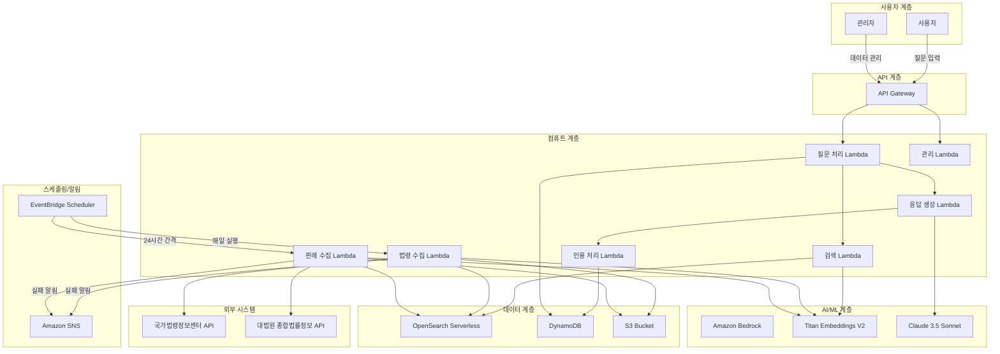
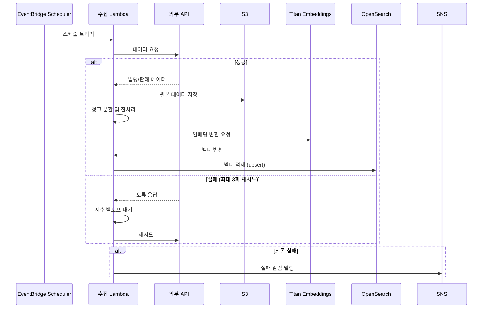
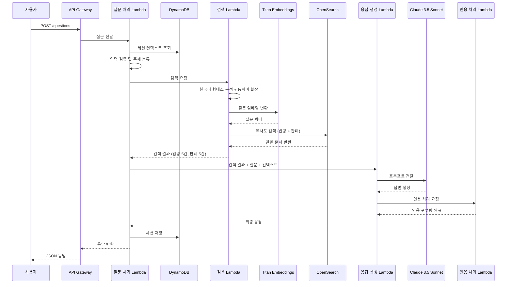
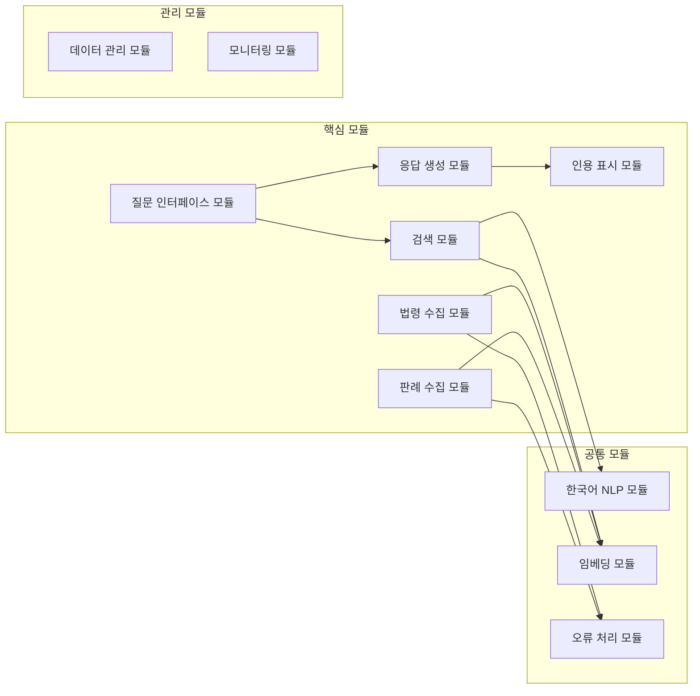
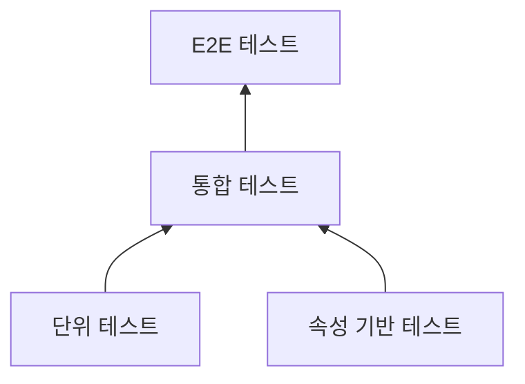

# Design Document: 부동산 법률 AI 자문 시스템

## Overview

부동산 법률 AI 자문 시스템은 RAG(Retrieval-Augmented Generation) 기술을 활용하여 사용자의 부동산 법률 질문에 대해 법령과 판례를 근거로 한 정확한 한국어 답변을 생성하는 서비스이다.

### 핵심 설계 원칙

1. **서버리스 우선**: AWS Lambda와 관리형 서비스를 활용하여 운영 부담 최소화
2. **모듈 독립성**: 각 기능을 독립 배포 가능한 모듈로 분리하여 확장성 확보
3. **데이터 신선도**: 법령/판례 데이터의 자동 갱신 파이프라인으로 최신성 유지
4. **한국어 최적화**: 한국어 형태소 분석과 다국어 임베딩 모델을 통한 검색 품질 향상

### 기술 스택 요약

| 계층 | 기술 | 역할 |
|------|------|------|
| API | Amazon API Gateway | REST API 엔드포인트 |
| 컴퓨트 | AWS Lambda | 서버리스 함수 실행 |
| LLM | Amazon Bedrock (Claude 3.5 Sonnet) | 응답 생성 |
| 임베딩 | Amazon Bedrock (Titan Text Embeddings V2) | 벡터 변환 |
| 벡터 저장소 | Amazon OpenSearch Serverless | 유사도 검색 |
| 데이터 저장소 | Amazon DynamoDB | 메타데이터, 세션 |
| 오브젝트 저장소 | Amazon S3 | 원본 법령/판례 데이터 |
| 스케줄러 | Amazon EventBridge Scheduler | 데이터 수집 스케줄링 |
| 알림 | Amazon SNS | 실패 알림 |
| 모니터링 | Amazon CloudWatch | 로그, 메트릭 |

## Architecture

### 전체 시스템 아키텍처



### 데이터 수집 파이프라인



### 질문-응답 처리 흐름



### 설계 결정 사항

| 결정 | 선택 | 근거 |
|------|------|------|
| 벡터 저장소 | OpenSearch Serverless | 하이브리드 검색(벡터+키워드) 지원, 서버리스 운영, 네임스페이스 분리 용이 |
| LLM | Claude 3.5 Sonnet | 한국어 성능 우수, Bedrock 통합, 긴 컨텍스트 윈도우(200K) |
| 임베딩 모델 | Titan Text Embeddings V2 | 다국어(한국어 포함) 지원, 1024차원, 8192토큰 입력, Bedrock 네이티브 통합 |
| 컴퓨트 | Lambda | 서버리스, 비용 효율적, 자동 스케일링, 모듈별 독립 배포 |
| 세션 저장소 | DynamoDB | 밀리초 지연시간, TTL 기반 자동 만료, 서버리스 |
| 스케줄링 | EventBridge Scheduler | cron/rate 표현식, Lambda 직접 호출, 재시도 설정 내장 |

## Components and Interfaces

### 모듈 구조



### 표준 모듈 인터페이스

모든 서비스 모듈은 다음 표준 인터페이스를 구현한다:

```typescript
// 모듈 표준 인터페이스
interface ServiceModule {
  moduleId: string;
  moduleName: string;
  version: string;

  // 모듈 초기화
  initialize(config: ModuleConfig): Promise<void>;

  // 모듈 헬스체크
  healthCheck(): Promise<HealthStatus>;

  // 모듈 실행
  execute(input: ModuleInput): Promise<ModuleOutput>;
}

interface ModuleConfig {
  region: string;
  environment: 'dev' | 'staging' | 'prod';
  dependencies: Record<string, string>; // 의존 서비스 엔드포인트
  parameters: Record<string, unknown>;  // 모듈별 설정
}

interface ModuleInput {
  requestId: string;
  timestamp: string;
  payload: unknown;
  metadata?: Record<string, string>;
}

interface ModuleOutput {
  requestId: string;
  status: 'success' | 'partial' | 'error';
  data?: unknown;
  error?: ErrorResponse;
  metadata?: Record<string, string>;
}

interface ErrorResponse {
  code: string;
  message: string;
  details?: unknown;
  retryable: boolean;
}

interface HealthStatus {
  status: 'healthy' | 'degraded' | 'unhealthy';
  timestamp: string;
  details?: Record<string, unknown>;
}
```

### 컴포넌트별 인터페이스

#### 1. 법령 수집기 (LawCollectorModule)

```typescript
interface LawCollectorInput {
  targetLaws: string[];        // 수집 대상 법령 목록
  forceUpdate?: boolean;       // 강제 갱신 여부
}

interface LawCollectorOutput {
  collectedCount: number;
  updatedCount: number;
  failedItems: FailedItem[];
  lastSyncTimestamp: string;
}

interface LawArticle {
  lawName: string;             // 법령명
  articleNumber: string;       // 조항 번호
  articleContent: string;      // 조항 내용
  effectiveDate: string;       // 시행일자
  revisionHistory: RevisionEntry[];  // 개정 이력
  metadata: {
    lawId: string;
    category: string;
    source: string;
    collectedAt: string;
  };
}

interface RevisionEntry {
  date: string;
  type: 'enacted' | 'amended' | 'repealed';
  description: string;
}
```

#### 2. 판례 수집기 (CaseCollectorModule)

```typescript
interface CaseCollectorInput {
  categories: CaseCategory[];  // 수집 대상 카테고리
  dateFrom?: string;           // 수집 시작일
}

type CaseCategory = 'lease' | 'sale' | 'registration' | 'brokerage' | 'redevelopment';

interface CaseCollectorOutput {
  collectedCount: number;
  duplicateCount: number;
  failedItems: FailedItem[];
  lastSyncTimestamp: string;
}

interface CourtCase {
  caseNumber: string;          // 사건번호
  courtName: string;           // 법원명
  judgmentDate: string;        // 선고일자
  caseType: CaseCategory;     // 사건 유형
  summary: string;             // 판결 요지
  fullText: string;            // 판결 전문
  referencedLaws: string[];    // 참조 법령
  metadata: {
    caseId: string;
    source: string;
    collectedAt: string;
  };
}
```

#### 3. 검색기 (SearchModule)

```typescript
interface SearchInput {
  query: string;               // 사용자 질문
  sessionContext?: string[];   // 이전 대화 컨텍스트
  maxResults?: number;         // 최대 결과 수 (기본 5)
}

interface SearchOutput {
  lawDocuments: SearchResult[];
  caseDocuments: SearchResult[];
  decomposedTopics?: string[]; // 분해된 주제 목록
}

interface SearchResult {
  documentId: string;
  documentType: 'law' | 'case';
  content: string;
  similarityScore: number;
  isLowRelevance: boolean;     // 관련도 기준 미달 여부
  metadata: {
    title: string;
    source: string;
    date: string;
    [key: string]: unknown;
  };
}
```

#### 4. 응답 생성기 (ResponseGeneratorModule)

```typescript
interface ResponseGeneratorInput {
  question: string;
  searchResults: SearchOutput;
  sessionContext?: ConversationEntry[];
}

interface ResponseGeneratorOutput {
  answer: FormattedAnswer;
  citations: Citation[];
  isOutOfScope: boolean;       // 부동산 법률 범위 외 여부
  disclaimer: string;
}

interface FormattedAnswer {
  questionSummary: string;     // 질문 요약
  lawExplanation: string;      // 관련 법령 설명
  caseExplanation: string;     // 관련 판례 설명
  opinion: string;             // 종합 의견
  references: Reference[];     // 참고 자료 목록
  totalLength: number;         // 답변 총 길이
}

interface Citation {
  footnoteNumber: number;      // 각주 번호
  type: 'law' | 'case';
  source: LawCitation | CaseCitation;
  originalUrl?: string;        // 원문 URL
  isAmended?: boolean;         // 개정 여부
  currentLawInfo?: string;     // 현행 법령 정보
}

interface LawCitation {
  lawName: string;
  articleNumber: string;
  contentSummary: string;      // 100자 이내 요약
}

interface CaseCitation {
  caseNumber: string;
  judgmentDate: string;
  summary: string;             // 200자 이내 요지
}
```

#### 5. 한국어 NLP 모듈 (KoreanNLPModule)

```typescript
interface NLPInput {
  text: string;
  operations: NLPOperation[];
}

type NLPOperation = 'morpheme_analysis' | 'keyword_extraction' | 'synonym_expansion' | 'topic_classification';

interface NLPOutput {
  keywords: string[];          // 추출된 키워드 (1~10개)
  expandedTerms: string[];     // 동의어 확장된 용어
  topics: string[];            // 분류된 주제
  isRealEstateLegal: boolean;  // 부동산 법률 관련 여부
  language: 'ko' | 'mixed' | 'unknown';
}

interface SynonymDictionary {
  entries: SynonymEntry[];
  lastUpdated: string;
  version: string;
}

interface SynonymEntry {
  term: string;
  synonyms: string[];
  category: string;
}
```

#### 6. 플러그인 레지스트리

```typescript
interface PluginRegistry {
  // 모듈 등록
  register(module: ServiceModule): Promise<void>;

  // 모듈 해제
  deregister(moduleId: string): Promise<void>;

  // 모듈 조회
  getModule(moduleId: string): Promise<ServiceModule | null>;

  // 전체 모듈 목록
  listModules(): Promise<ModuleInfo[]>;
}

interface ModuleInfo {
  moduleId: string;
  moduleName: string;
  version: string;
  status: 'active' | 'inactive' | 'error';
  healthStatus: HealthStatus;
  registeredAt: string;
}
```

## Data Models

### DynamoDB 테이블 설계

#### 1. Sessions 테이블

세션 기반 대화 관리를 위한 테이블.

| 속성 | 타입 | 키 | 설명 |
|------|------|-----|------|
| sessionId | String | PK | 세션 고유 ID |
| createdAt | String | SK | 생성 일시 (ISO 8601) |
| conversations | List | - | 질문-답변 쌍 목록 (최대 50) |
| lastActivityAt | String | - | 마지막 활동 일시 |
| ttl | Number | - | TTL (24시간 후 자동 삭제) |

```typescript
interface SessionRecord {
  sessionId: string;
  createdAt: string;
  conversations: ConversationEntry[];
  lastActivityAt: string;
  ttl: number;
}

interface ConversationEntry {
  questionId: string;
  question: string;
  answer: string;
  citations: Citation[];
  timestamp: string;
  feedback?: 'helpful' | 'not_helpful';
}
```

#### 2. DataManagement 테이블

법령/판례 데이터 수집 상태 관리를 위한 테이블.

| 속성 | 타입 | 키 | 설명 |
|------|------|-----|------|
| dataType | String | PK | 데이터 유형 (law/case) |
| documentId | String | SK | 문서 고유 ID |
| lastUpdated | String | - | 최종 갱신 일시 |
| vectorStatus | String | - | 벡터 적재 상태 |
| version | Number | - | 문서 버전 |

```typescript
interface DataManagementRecord {
  dataType: 'law' | 'case';
  documentId: string;
  title: string;
  lastUpdated: string;
  vectorStatus: 'completed' | 'in_progress' | 'failed';
  version: number;
  metadata: Record<string, unknown>;
}
```

#### 3. Feedback 테이블

사용자 피드백 및 검색 로그 저장.

| 속성 | 타입 | 키 | 설명 |
|------|------|-----|------|
| feedbackId | String | PK | 피드백 고유 ID |
| sessionId | String | GSI-PK | 세션 ID |
| timestamp | String | GSI-SK | 피드백 일시 |
| rating | String | - | 유용성 평가 |
| searchQuery | String | - | 원본 질문 |

#### 4. SynonymDictionary 테이블

한국어 법률 용어 동의어 사전.

| 속성 | 타입 | 키 | 설명 |
|------|------|-----|------|
| term | String | PK | 기준 용어 |
| category | String | SK | 법률 카테고리 |
| synonyms | List | - | 동의어 목록 |

### OpenSearch Serverless 인덱스 설계

#### 법령 인덱스 (law-articles)

```json
{
  "mappings": {
    "properties": {
      "law_name": { "type": "keyword" },
      "article_number": { "type": "keyword" },
      "article_content": { "type": "text", "analyzer": "nori" },
      "effective_date": { "type": "date" },
      "category": { "type": "keyword" },
      "embedding_vector": {
        "type": "knn_vector",
        "dimension": 1024,
        "method": {
          "name": "hnsw",
          "engine": "nmslib",
          "parameters": { "ef_construction": 512, "m": 16 }
        }
      },
      "metadata": {
        "type": "object",
        "properties": {
          "law_id": { "type": "keyword" },
          "source": { "type": "keyword" },
          "collected_at": { "type": "date" },
          "is_current": { "type": "boolean" }
        }
      }
    }
  }
}
```

#### 판례 인덱스 (court-cases)

```json
{
  "mappings": {
    "properties": {
      "case_number": { "type": "keyword" },
      "court_name": { "type": "keyword" },
      "judgment_date": { "type": "date" },
      "case_type": { "type": "keyword" },
      "chunk_content": { "type": "text", "analyzer": "nori" },
      "chunk_index": { "type": "integer" },
      "total_chunks": { "type": "integer" },
      "referenced_laws": { "type": "keyword" },
      "embedding_vector": {
        "type": "knn_vector",
        "dimension": 1024,
        "method": {
          "name": "hnsw",
          "engine": "nmslib",
          "parameters": { "ef_construction": 512, "m": 16 }
        }
      },
      "metadata": {
        "type": "object",
        "properties": {
          "case_id": { "type": "keyword" },
          "source": { "type": "keyword" },
          "collected_at": { "type": "date" }
        }
      }
    }
  }
}
```

### S3 버킷 구조

```
s3://real-estate-legal-data-{env}/
├── raw/
│   ├── laws/
│   │   ├── {law_id}/{version}/full.json
│   │   └── {law_id}/{version}/articles/
│   └── cases/
│       ├── {case_id}/full.json
│       └── {case_id}/chunks/
├── processed/
│   ├── laws/{law_id}/embeddings.json
│   └── cases/{case_id}/embeddings.json
└── config/
    ├── target_laws.json
    ├── synonym_dictionary.json
    └── relevance_threshold.json
```

## Correctness Properties

*속성(Property)이란 시스템의 모든 유효한 실행에서 참이어야 하는 특성 또는 동작을 의미한다. 즉, 시스템이 무엇을 해야 하는지에 대한 형식적 선언이다. 속성은 사람이 읽을 수 있는 명세와 기계로 검증 가능한 정확성 보장 사이의 다리 역할을 한다.*

### Property 1: 데이터 구조 완전성

*For any* 수집된 법령 또는 판례 데이터에 대해, 저장된 각 문서는 반드시 해당 유형의 필수 필드를 모두 포함해야 한다. 법령의 경우 법령명, 조항 번호, 조항 내용, 시행일자, 개정 이력이며, 판례의 경우 사건번호, 선고일자, 법원명, 사건 유형, 판결 요지, 판결 전문, 참조 법령이다.

**Validates: Requirements 1.3, 2.3**

### Property 2: 청크 분할 라운드트립

*For any* 판례 텍스트에 대해, 청크 분할 후 모든 청크를 순서대로 결합하면 원본 텍스트와 동일해야 하며, 각 청크의 토큰 수는 500 이상 1000 이하여야 한다.

**Validates: Requirements 2.7**

### Property 3: 중복 제거 멱등성

*For any* 동일한 문서 ID(법령 ID 또는 사건번호)를 가진 데이터가 N회 삽입되더라도, 저장소에는 정확히 1건(최신 버전)만 존재해야 한다.

**Validates: Requirements 2.8, 7.4**

### Property 4: 검색 결과 정렬 및 제한

*For any* 검색 결과 목록에 대해, 반환된 문서들은 유사도 점수 내림차순으로 정렬되어 있어야 하며, 법령과 판례 각각 최대 5건을 초과하지 않아야 한다.

**Validates: Requirements 3.3**

### Property 5: 질문 분해와 검색 독립성

*For any* 2개 이상의 서로 다른 법률 주제를 포함하는 질문에 대해, 분해된 주제 수만큼의 독립적인 검색 결과 집합이 반환되어야 하며, 모든 식별된 주제에 대한 결과가 포함되어야 한다.

**Validates: Requirements 3.5**

### Property 6: 응답 구조 완전성

*For any* 생성된 답변에 대해, 답변은 반드시 질문 요약, 관련 법령 설명, 관련 판례 설명, 종합 의견, 참고 자료 목록 순서의 섹션으로 구성되어야 하며, 총 길이는 200자 이상 5000자 이하이고, 말미에 면책 고지를 포함해야 한다.

**Validates: Requirements 4.4, 4.6**

### Property 7: 인용 각주 일관성

*For any* 답변 내 인용에 대해, 답변 본문의 각주 번호 [N]은 반드시 답변 하단 인용 목록의 N번째 항목과 1:1 대응해야 하며, 법령 인용은 법령명 + 조항 번호 + 100자 이내 요약, 판례 인용은 사건번호 + 선고일자 + 200자 이내 요지 형식을 따라야 한다.

**Validates: Requirements 5.1, 5.2, 5.3**

### Property 8: 입력 길이 검증

*For any* 사용자 입력 문자열에 대해, 길이가 10자 미만이거나 1000자를 초과하면 거부되어야 하며, 10자 이상 1000자 이하인 입력만 정상 처리되어야 한다.

**Validates: Requirements 6.1, 6.8**

### Property 9: 세션 크기 제한

*For any* 세션에 대해, 질문-답변 쌍의 수는 50개를 초과하지 않아야 하며, 50개를 초과하는 삽입 시 가장 오래된 항목부터 제거되어야 한다.

**Validates: Requirements 6.6**

### Property 10: 한국어 키워드 추출 범위

*For any* 한국어 질문 텍스트에 대해, 형태소 분석을 통해 추출되는 키워드 수는 1개 이상 10개 이하여야 한다.

**Validates: Requirements 9.2**

### Property 11: 동의어 검색 확장

*For any* 동의어 사전에 등록된 용어가 질문에 포함된 경우, 해당 용어의 모든 등록된 동의어가 최종 검색 쿼리에 포함되어야 한다.

**Validates: Requirements 9.3**

### Property 12: 재시도 정책 준수

*For any* 외부 API 호출 실패 시나리오에 대해, 재시도 횟수는 최대 3회를 초과하지 않아야 하며, 법령 수집기는 5초 초기 간격의 지수 백오프(배수 2)를, 판례 수집기는 30초 고정 간격을 준수해야 한다.

**Validates: Requirements 1.5, 2.5**

## Error Handling

### 오류 분류 체계

| 등급 | 유형 | 처리 방식 | 예시 |
|------|------|-----------|------|
| Critical | 시스템 장애 | 즉시 알림 + 서비스 중단 | OpenSearch 연결 불가 |
| High | 외부 API 실패 | 재시도 + 알림 | 법령정보센터 API 타임아웃 |
| Medium | 부분 실패 | 로깅 + 계속 진행 | 개별 임베딩 변환 실패 |
| Low | 입력 오류 | 사용자 안내 | 질문 길이 초과 |

### 재시도 전략

```typescript
interface RetryPolicy {
  maxRetries: number;
  strategy: 'exponential_backoff' | 'fixed_interval';
  initialIntervalMs: number;
  maxIntervalMs: number;
  backoffMultiplier?: number;
}

// 법령 수집기: 지수 백오프 (5초 초기, 최대 3회)
const lawCollectorRetry: RetryPolicy = {
  maxRetries: 3,
  strategy: 'exponential_backoff',
  initialIntervalMs: 5000,
  maxIntervalMs: 40000,
  backoffMultiplier: 2,
};

// 판례 수집기: 고정 간격 (30초, 최대 3회)
const caseCollectorRetry: RetryPolicy = {
  maxRetries: 3,
  strategy: 'fixed_interval',
  initialIntervalMs: 30000,
  maxIntervalMs: 30000,
};
```

### 모듈별 오류 격리

각 모듈은 Circuit Breaker 패턴을 적용하여 오류가 다른 모듈로 전파되지 않도록 한다.

```typescript
interface CircuitBreakerConfig {
  failureThreshold: number;    // 실패 임계값 (기본 5)
  resetTimeoutMs: number;      // 리셋 대기 시간 (기본 60초)
  halfOpenMaxCalls: number;    // Half-Open 상태 최대 호출 수
}
```

### 사용자 대면 오류 처리

| 상황 | 사용자 메시지 | 동작 |
|------|-------------|------|
| 임베딩 변환 실패 | "일시적 오류가 발생했습니다. 질문이 보존되어 있으니 다시 시도해 주세요." | 질문 텍스트 보존 |
| LLM 타임아웃 (60초) | "답변 생성에 시간이 걸리고 있습니다. 다시 시도해 주세요." | 재시도 옵션 제공 |
| 전체 응답 타임아웃 (30초) | "응답 시간이 초과되었습니다. 다시 시도해 주세요." | 재시도 옵션 제공 |
| 범위 외 질문 | "부동산 법률 관련 질문만 지원합니다." | 카테고리 안내 |
| 입력 검증 실패 | "질문은 10자 이상 1000자 이하로 입력해 주세요." | 입력 요건 안내 |
| 관련 문서 미발견 | "직접 관련된 법령/판례를 찾지 못했습니다. 다음 사항을 확인해 주세요..." | 범위 및 추가 안내 |

## Testing Strategy

### 테스트 계층 구조



### 단위 테스트

각 모듈의 핵심 로직을 검증하는 구체적 예시 기반 테스트.

| 대상 | 테스트 항목 | 도구 |
|------|-----------|------|
| 청크 분할기 | 토큰 경계 정확성, 빈 입력 처리 | Jest |
| 입력 검증기 | 길이 제한, 빈 문자열, 특수문자 | Jest |
| 인용 포맷터 | 각주 번호 매핑, 요약 길이 | Jest |
| 동의어 확장기 | 사전 매칭, 미등록 용어 | Jest |
| 주제 분류기 | 부동산 법률 범위 판별 | Jest |
| 재시도 로직 | 백오프 간격, 최대 횟수 | Jest |

### 속성 기반 테스트 (Property-Based Testing)

[fast-check](https://github.com/dubzzz/fast-check) 라이브러리를 사용하여 정의된 정확성 속성을 검증한다.

**설정:**
- 최소 100회 반복 실행
- 각 테스트에 설계 문서의 Property 번호를 태그로 포함

**태그 형식:** `Feature: real-estate-legal-ai-advisor, Property {number}: {property_text}`

| Property | 테스트 대상 | 생성기 전략 |
|----------|-----------|-----------|
| Property 1 | 데이터 구조 완전성 | 랜덤 법령/판례 데이터 생성, 필드 누락 변형으로 검증 실패 확인 |
| Property 2 | 청크 분할 라운드트립 | 다양한 길이(500~10000 토큰)의 한국어 텍스트 생성 |
| Property 3 | 중복 제거 멱등성 | 동일 문서 ID + 다양한 버전 번호 조합 반복 삽입 |
| Property 4 | 검색 결과 정렬 및 제한 | 랜덤 유사도 점수(0.0~1.0) 목록 생성, 다양한 결과 수 |
| Property 5 | 질문 분해 독립성 | 2~5개 주제를 포함하는 복합 질문 생성 |
| Property 6 | 응답 구조 완전성 | 다양한 검색 결과 조합 + 포맷터 출력 검증 |
| Property 7 | 인용 각주 일관성 | 1~10개의 랜덤 인용 데이터 생성, 본문-각주 매핑 검증 |
| Property 8 | 입력 길이 검증 | 0~2000자 범위의 랜덤 길이 유니코드 문자열 생성 |
| Property 9 | 세션 크기 제한 | 1~100개의 대화 항목을 가진 세션 생성 |
| Property 10 | 키워드 추출 범위 | 다양한 한국어 문장(형태소 복잡도 변동) 생성 |
| Property 11 | 동의어 검색 확장 | 랜덤 동의어 사전(1~50개 엔트리) + 랜덤 질문 조합 |
| Property 12 | 재시도 정책 준수 | 랜덤 실패 패턴(연속/간헐) 및 타이밍 검증 |

### 통합 테스트

| 대상 | 검증 항목 |
|------|-----------|
| API Gateway → Lambda | 요청 라우팅, 인증, 에러 응답 |
| Lambda → OpenSearch | 인덱스 CRUD, 벡터 검색 |
| Lambda → Bedrock | 임베딩 생성, LLM 응답 |
| Lambda → DynamoDB | 세션 CRUD, TTL 동작 |
| EventBridge → Lambda | 스케줄 트리거, 재시도 |

### E2E 테스트

전체 질문-응답 흐름을 검증하는 시나리오 기반 테스트:

1. 사용자가 임대차 관련 질문을 입력하고 법령/판례 기반 답변을 30초 내 수신
2. 후속 질문에서 이전 대화 컨텍스트가 유지됨을 확인
3. 부동산 법률 범위 외 질문 시 적절한 안내 메시지 반환
4. 데이터 수집 파이프라인 실행 후 새 법령이 검색 결과에 반영됨을 확인
