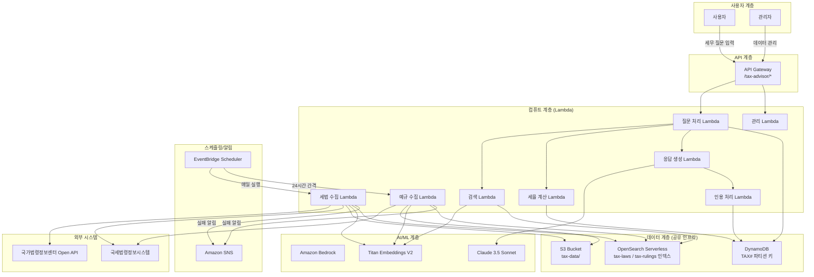
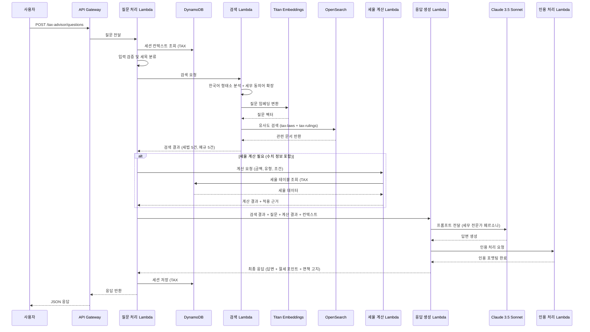
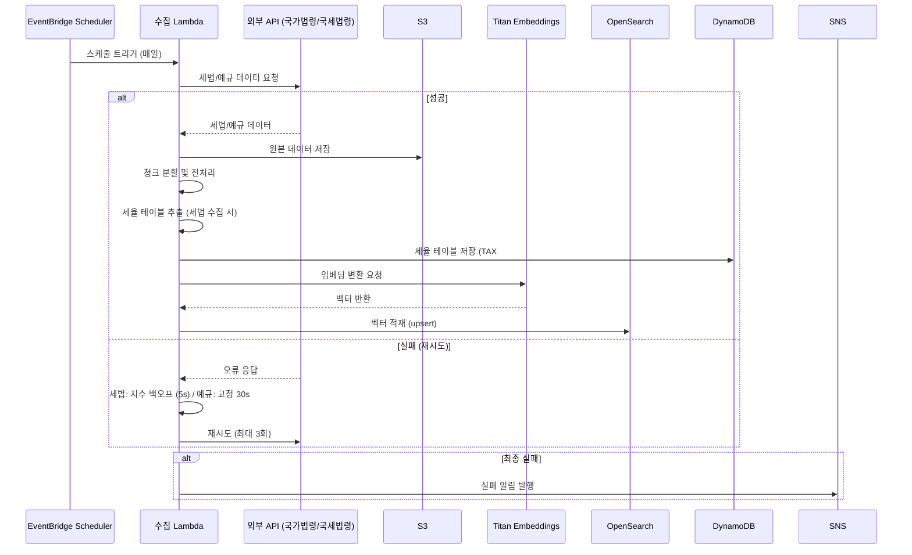
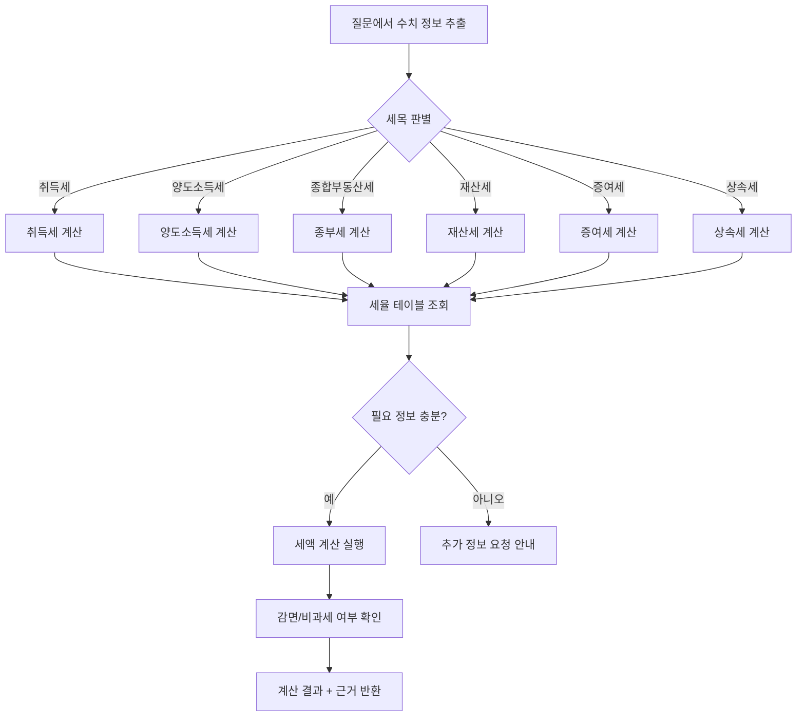
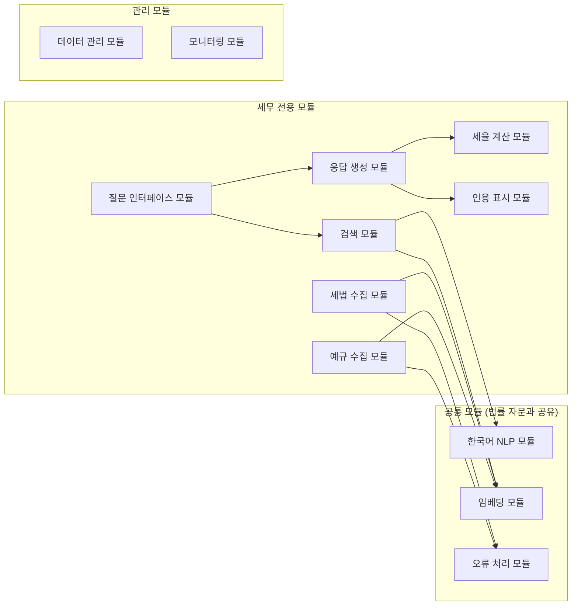
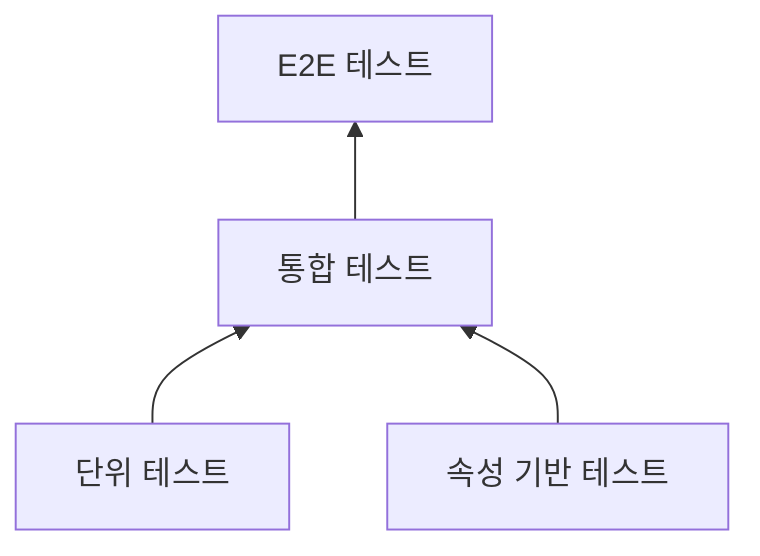

# Design Document: 부동산 세무 AI 자문 시스템

## Overview

부동산 세무 AI 자문 시스템은 RAG(Retrieval-Augmented Generation) 기술을 활용하여 사용자의 부동산 세무 질문에 대해 세법 조항과 국세청 유권해석/예규/심판례를 근거로 정확한 한국어 답변을 생성하는 서비스이다. 세율 계산 보조 및 절세 포인트 안내 기능을 포함한다.

기존 부동산 법률 AI 자문 서비스(real-estate-legal-ai-advisor)와 동일한 아키텍처(서버리스 RAG + LLM)를 기반으로 하며, OpenSearch, DynamoDB, API Gateway 등 공유 인프라를 활용한다.

### 핵심 설계 원칙

1. **서버리스 우선**: AWS Lambda와 관리형 서비스를 활용하여 운영 부담 최소화
2. **인프라 공유, 데이터 격리**: 기존 법률 자문 시스템과 동일 클러스터/테이블을 사용하되 인덱스·파티션 키로 격리
3. **모듈 독립성**: 각 기능을 독립 배포 가능한 Lambda 모듈로 분리하여 법률 자문 시스템과의 장애 격리 보장
4. **세무 도메인 특화**: 세율 계산기, 절세 포인트 엔진 등 세무 전용 컴포넌트 추가
5. **데이터 신선도**: 세법 개정과 신규 예규를 매일 자동 감지·반영
6. **한국어 최적화**: 한국어 형태소 분석과 세무 용어 동의어 사전을 통한 검색 품질 향상

### 기술 스택 요약

| 계층 | 기술 | 역할 |
|------|------|------|
| API | Amazon API Gateway | REST API 엔드포인트 (/tax-advisor/*) |
| 컴퓨트 | AWS Lambda (TypeScript/Node.js) | 서버리스 함수 실행 |
| LLM | Amazon Bedrock (Claude 3.5 Sonnet) / Gemini (로컬) | 응답 생성 |
| 임베딩 | Amazon Bedrock (Titan Text Embeddings V2) | 벡터 변환 (1024차원) |
| 벡터 저장소 | Amazon OpenSearch Serverless | 유사도 검색 (세무 전용 인덱스) |
| 데이터 저장소 | Amazon DynamoDB | 세션, 메타데이터, 세율 테이블 |
| 오브젝트 저장소 | Amazon S3 | 원본 세법/예규 데이터 |
| 스케줄러 | Amazon EventBridge Scheduler | 데이터 수집 스케줄링 |
| 알림 | Amazon SNS | 실패 알림 |
| 모니터링 | Amazon CloudWatch | 로그, 메트릭 |

### 기존 법률 자문 시스템과의 차이점

| 항목 | 법률 자문 (legal) | 세무 자문 (tax) |
|------|-------------------|-----------------|
| 데이터 소스 | 국가법령정보센터, 대법원 종합법률정보 | 국가법령정보센터, 국세법령정보시스템 |
| OpenSearch 인덱스 | law-articles, court-cases | tax-laws, tax-rulings |
| DynamoDB 파티션 키 접두사 | LEGAL# | TAX# |
| API 경로 | /legal-advisor/* | /tax-advisor/* |
| 추가 컴포넌트 | - | 세율_계산기, 절세 포인트 엔진 |
| 문서 유형 | 법령, 판례 | 세법, 유권해석/예규/심판례 |

## Architecture

### 전체 시스템 아키텍처



### 질문-응답 처리 흐름



### 데이터 수집 파이프라인



### 세율 계산 흐름



### 설계 결정 사항

| 결정 | 선택 | 근거 |
|------|------|------|
| 벡터 저장소 | 기존 OpenSearch Serverless 공유 (별도 인덱스) | 인프라 비용 절감, 네임스페이스 분리로 데이터 격리 |
| LLM | Claude 3.5 Sonnet (Bedrock) / Gemini (로컬) | 한국어 세무 응답 품질, 긴 컨텍스트 윈도우, 로컬 개발 유연성 |
| 임베딩 | Titan Text Embeddings V2 | 다국어(한국어) 지원, 1024차원, Bedrock 네이티브 |
| 세율 테이블 저장 | DynamoDB | 빠른 조회, 버전 관리 용이, TTL로 이력 관리 |
| 세율 계산 | 별도 Lambda 모듈 | 계산 로직 독립 배포·테스트, 세법 개정 시 이 모듈만 업데이트 |
| 데이터 분리 | 파티션 키 접두사 (TAX#) | 기존 테이블 재활용, 쿼리 격리, 비용 절감 |
| API 경로 | /tax-advisor/* | 기존 API Gateway 공유, 경로 기반 라우팅 |

## Components and Interfaces

### 모듈 구조



### 표준 모듈 인터페이스

모든 서비스 모듈은 기존 법률 자문 시스템과 동일한 표준 인터페이스를 구현한다:

```typescript
// 모듈 표준 인터페이스 (기존 공유)
interface ServiceModule {
  moduleId: string;
  moduleName: string;
  version: string;
  servicePrefix: 'TAX' | 'LEGAL'; // 서비스 구분자

  initialize(config: ModuleConfig): Promise<void>;
  healthCheck(): Promise<HealthStatus>;
  execute(input: ModuleInput): Promise<ModuleOutput>;
}

interface ModuleConfig {
  region: string;
  environment: 'dev' | 'staging' | 'prod';
  servicePrefix: string;
  dependencies: Record<string, string>;
  parameters: Record<string, unknown>;
}

interface ModuleInput {
  requestId: string;
  timestamp: string;
  payload: unknown;
  metadata?: Record<string, string>;
}

interface ModuleOutput {
  requestId: string;
  status: 'success' | 'partial' | 'error';
  data?: unknown;
  error?: ErrorResponse;
  metadata?: Record<string, string>;
}

interface ErrorResponse {
  code: string;
  message: string;
  details?: unknown;
  retryable: boolean;
}

interface HealthStatus {
  status: 'healthy' | 'degraded' | 'unhealthy';
  timestamp: string;
  details?: Record<string, unknown>;
}
```

### 컴포넌트별 인터페이스

#### 1. 세법 수집기 (TaxLawCollectorModule)

```typescript
interface TaxLawCollectorInput {
  targetLaws: string[];           // 수집 대상 세법 목록
  forceUpdate?: boolean;          // 강제 갱신 여부
}

interface TaxLawCollectorOutput {
  collectedCount: number;
  updatedCount: number;
  rateTablesExtracted: number;    // 추출된 세율 테이블 수
  failedItems: FailedItem[];
  lastSyncTimestamp: string;
}

interface TaxLawArticle {
  lawName: string;                // 법령명 (소득세법, 지방세법 등)
  articleNumber: string;          // 조항 번호
  articleContent: string;         // 조항 내용
  effectiveDate: string;          // 시행일자
  revisionHistory: RevisionEntry[];
  applicableTaxType: TaxType[];   // 적용 세목
  hasRateTable: boolean;          // 세율 테이블 포함 여부
  metadata: {
    lawId: string;
    category: string;
    source: 'MOLEG' | 'NTS';     // 국가법령정보센터 | 국세법령정보시스템
    collectedAt: string;
  };
}

type TaxType = 'acquisition' | 'capital_gains' | 'comprehensive_property' 
  | 'property' | 'gift' | 'inheritance';

interface RevisionEntry {
  date: string;
  type: 'enacted' | 'amended' | 'repealed';
  description: string;
}

interface RateTableData {
  taxType: TaxType;
  effectiveDate: string;          // 적용 기준일
  expiryDate?: string;            // 만료일 (개정 시)
  version: number;
  brackets: TaxBracket[];
  specialRates?: SpecialRate[];
  deductions?: Deduction[];
  sourceArticle: string;          // 근거 조항
}

interface TaxBracket {
  minAmount: number;
  maxAmount?: number;             // undefined = 초과
  rate: number;                   // 소수점 (0.06 = 6%)
  progressiveDeduction?: number;  // 누진 공제액
  conditions?: Record<string, unknown>;
}

interface SpecialRate {
  condition: string;              // 적용 조건 설명
  rate: number;
  description: string;
}

interface Deduction {
  name: string;
  amount?: number;
  formula?: string;
  conditions: string;
}
```

#### 2. 예규 수집기 (RulingCollectorModule)

```typescript
interface RulingCollectorInput {
  targetCategories: TaxType[];    // 수집 대상 세목 카테고리
  dateFrom?: string;
}

interface RulingCollectorOutput {
  collectedCount: number;
  duplicateCount: number;
  failedItems: FailedItem[];
  lastSyncTimestamp: string;
}

interface TaxRuling {
  documentNumber: string;         // 문서번호
  replyDate: string;              // 회신일자
  documentType: RulingType;       // 문서 유형
  taxCategory: TaxType;           // 세목 분류
  querySummary: string;           // 질의 요지
  replyContent: string;           // 회신 내용
  referencedLawArticles: string[];// 참조 세법 조항
  metadata: {
    rulingId: string;
    source: string;
    collectedAt: string;
  };
}

type RulingType = 'authoritative_interpretation' | 'ruling' | 'tribunal_decision';
// 유권해석 | 예규 | 심판례
```

#### 3. 검색기 (TaxSearchModule)

```typescript
interface TaxSearchInput {
  query: string;                  // 사용자 질문
  sessionContext?: string[];      // 이전 대화 컨텍스트
  maxResults?: number;            // 최대 결과 수 (기본 5)
}

interface TaxSearchOutput {
  taxLawDocuments: TaxSearchResult[];
  rulingDocuments: TaxSearchResult[];
  decomposedTaxTypes?: TaxType[]; // 분해된 세목 목록
  extractedNumerics?: ExtractedNumericInfo; // 추출된 수치 정보
}

interface TaxSearchResult {
  documentId: string;
  documentType: 'tax_law' | 'ruling';
  content: string;
  similarityScore: number;
  isLowRelevance: boolean;
  metadata: {
    title: string;
    source: string;
    date: string;
    taxType: TaxType;
    [key: string]: unknown;
  };
}

interface ExtractedNumericInfo {
  amount?: number;                // 금액 (매매가, 취득가 등)
  area?: number;                  // 면적 (㎡)
  holdingPeriod?: number;         // 보유기간 (년)
  propertyType?: string;          // 부동산 유형
  housingCount?: number;          // 주택 수
  officialPrice?: number;         // 공시가격
  acquisitionPrice?: number;      // 취득가액
  transferPrice?: number;         // 양도가액
}
```

#### 4. 응답 생성기 (TaxResponseGeneratorModule)

```typescript
interface TaxResponseGeneratorInput {
  question: string;
  searchResults: TaxSearchOutput;
  calculationResult?: TaxCalculationResult;
  sessionContext?: ConversationEntry[];
}

interface TaxResponseGeneratorOutput {
  answer: TaxFormattedAnswer;
  citations: TaxCitation[];
  taxSavingTips: TaxSavingTip[];
  isOutOfScope: boolean;
  disclaimer: string;
}

interface TaxFormattedAnswer {
  questionSummary: string;        // 질문 요약
  taxLawExplanation: string;      // 관련 세법 설명
  rulingExplanation: string;      // 관련 예규/심판례 설명
  calculationResult?: string;     // 세율 계산 결과 (해당 시)
  taxSavingPoints: string;        // 절세 포인트
  opinion: string;                // 종합 의견
  references: Reference[];        // 참고 자료 목록
  totalLength: number;
}

interface TaxSavingTip {
  title: string;                  // 절세 방법 제목
  description: string;            // 설명
  legalBasis: string;             // 근거 법 조항
  conditions: string;             // 적용 요건
  cautions: string;               // 주의사항
  isLegal: boolean;               // 합법적 절세 여부 (항상 true)
}

interface TaxCitation {
  footnoteNumber: number;
  type: 'tax_law' | 'ruling';
  source: TaxLawCitation | TaxRulingCitation;
  originalUrl?: string;
  isAmended?: boolean;
  currentLawInfo?: string;
}

interface TaxLawCitation {
  lawName: string;
  articleNumber: string;
  contentSummary: string;         // 100자 이내 요약
}

interface TaxRulingCitation {
  documentNumber: string;
  replyDate: string;
  summary: string;                // 200자 이내 요지
}
```

#### 5. 세율 계산기 (TaxCalculatorModule)

```typescript
interface TaxCalculatorInput {
  taxType: TaxType;
  parameters: TaxCalculationParams;
}

type TaxCalculationParams = 
  | AcquisitionTaxParams
  | CapitalGainsTaxParams
  | ComprehensivePropertyTaxParams
  | PropertyTaxParams
  | GiftTaxParams
  | InheritanceTaxParams;

interface AcquisitionTaxParams {
  purchasePrice: number;          // 매매가격
  propertyType: 'house' | 'land' | 'commercial'; // 부동산 유형
  housingCount: number;           // 보유 주택 수
  isFirstTime?: boolean;          // 생애 최초 여부
  area?: number;                  // 전용면적 (㎡)
}

interface CapitalGainsTaxParams {
  acquisitionPrice: number;       // 취득가액
  transferPrice: number;          // 양도가액
  holdingPeriod: number;          // 보유기간 (년)
  housingCount: number;           // 보유 주택 수
  isResident?: boolean;           // 거주 여부
  residencePeriod?: number;       // 거주기간 (년)
}

interface ComprehensivePropertyTaxParams {
  officialPrice: number;          // 공시가격
  housingCount: number;           // 보유 주택 수
  isJointOwnership?: boolean;     // 공동 소유 여부
}

interface PropertyTaxParams {
  officialPrice: number;          // 공시가격
  propertyType: 'house' | 'land' | 'building';
}

interface GiftTaxParams {
  giftAmount: number;             // 증여 금액
  relationship: 'spouse' | 'lineal_ascendant' | 'lineal_descendant' | 'other';
  previousGifts?: number;         // 10년 내 이전 증여액
}

interface InheritanceTaxParams {
  totalEstate: number;            // 상속재산 총액
  debtAmount?: number;            // 채무액
  heirs: number;                  // 상속인 수
}

interface TaxCalculationResult {
  taxType: TaxType;
  estimatedTax: number;           // 예상 세액
  effectiveRate: number;          // 실효세율
  calculationSteps: CalculationStep[];
  appliedArticle: string;         // 적용 세법 조항
  appliedDate: string;            // 적용 기준일
  possibleExemptions: Exemption[];// 감면/비과세 가능성
  disclaimer: string;             // 참고용 안내
  isComplete: boolean;            // 계산 완료 여부
  missingInfo?: string[];         // 부족한 정보 항목
}

interface CalculationStep {
  stepNumber: number;
  description: string;            // 계산 단계 설명
  formula: string;                // 계산식
  amount: number;                 // 계산 결과
}

interface Exemption {
  name: string;                   // 감면/비과세 명칭
  lawArticle: string;             // 근거 조항
  conditions: string;             // 적용 요건
  benefit: string;                // 감면 내용
  likelihood: 'high' | 'medium' | 'low'; // 적용 가능성
}
```

#### 6. 인용 표시기 (TaxCitationModule)

```typescript
interface TaxCitationInput {
  answer: string;
  referencedLaws: TaxLawArticle[];
  referencedRulings: TaxRuling[];
}

interface TaxCitationOutput {
  formattedAnswer: string;        // 각주 번호가 삽입된 답변
  footnotes: Footnote[];          // 각주 목록
}

interface Footnote {
  number: number;
  type: 'tax_law' | 'ruling';
  lawCitation?: {
    lawName: string;
    articleNumber: string;
    contentSummary: string;       // 100자 이내
  };
  rulingCitation?: {
    documentNumber: string;
    replyDate: string;
    summary: string;              // 200자 이내
  };
  originalUrl?: string;
  isAmended: boolean;
  currentInfo?: string;
}
```

#### 7. 한국어 NLP 모듈 (세무 특화 확장)

```typescript
interface TaxNLPInput {
  text: string;
  operations: TaxNLPOperation[];
}

type TaxNLPOperation = 
  | 'morpheme_analysis' 
  | 'keyword_extraction' 
  | 'synonym_expansion' 
  | 'tax_type_classification'
  | 'numeric_extraction'          // 세율 계산용 수치 추출
  | 'colloquial_mapping';         // 일상 용어→세무 용어 매핑

interface TaxNLPOutput {
  keywords: string[];             // 추출된 키워드 (1~10개)
  expandedTerms: string[];        // 동의어 확장된 용어
  taxTypes: TaxType[];            // 분류된 세목
  isTaxRelated: boolean;          // 부동산 세무 관련 여부
  extractedNumerics?: ExtractedNumericInfo;
  language: 'ko' | 'mixed' | 'unknown';
}

// 세무 동의어 사전 (일상 용어 → 세무 용어 매핑 포함)
interface TaxSynonymDictionary {
  entries: TaxSynonymEntry[];
  colloquialMappings: ColloquialMapping[];
  lastUpdated: string;
  version: string;
}

interface TaxSynonymEntry {
  term: string;                   // 세무 전문 용어
  synonyms: string[];             // 동의어
  taxType: TaxType;               // 관련 세목
}

interface ColloquialMapping {
  colloquial: string;             // 일상 용어 (예: "집 팔 때 세금")
  formal: string;                 // 세무 전문 용어 (예: "양도소득세")
  taxType: TaxType;
}
```

## Data Models

### DynamoDB 테이블 설계

기존 법률 자문 시스템의 DynamoDB 테이블을 공유하며, 파티션 키에 `TAX#` 접두사를 사용하여 데이터를 논리적으로 분리한다.

#### 1. Sessions 테이블 (기존 공유)

| 속성 | 타입 | 키 | 설명 |
|------|------|-----|------|
| PK | String | PK | TAX#SESSION#{sessionId} |
| SK | String | SK | createdAt (ISO 8601) |
| conversations | List | - | 질문-답변 쌍 목록 (최대 50) |
| lastActivityAt | String | - | 마지막 활동 일시 |
| ttl | Number | - | TTL (24시간 후 자동 삭제) |

```typescript
interface TaxSessionRecord {
  PK: string;                     // TAX#SESSION#{sessionId}
  SK: string;                     // createdAt
  conversations: TaxConversationEntry[];
  lastActivityAt: string;
  ttl: number;
}

interface TaxConversationEntry {
  questionId: string;
  question: string;
  answer: string;
  citations: TaxCitation[];
  calculationResult?: TaxCalculationResult;
  taxSavingTips?: TaxSavingTip[];
  timestamp: string;
  feedback?: 'helpful' | 'not_helpful';
}
```

#### 2. DataManagement 테이블 (기존 공유)

| 속성 | 타입 | 키 | 설명 |
|------|------|-----|------|
| PK | String | PK | TAX#DATA#{dataType} |
| SK | String | SK | documentId |
| lastUpdated | String | - | 최종 갱신 일시 |
| vectorStatus | String | - | 벡터 적재 상태 |
| version | Number | - | 문서 버전 |
| taxType | String | - | 세목 분류 |

```typescript
interface TaxDataManagementRecord {
  PK: string;                     // TAX#DATA#law | TAX#DATA#ruling
  SK: string;                     // documentId
  title: string;
  lastUpdated: string;
  vectorStatus: 'completed' | 'in_progress' | 'failed';
  version: number;
  taxType: TaxType;
  metadata: Record<string, unknown>;
}
```

#### 3. TaxRates 테이블 (신규)

세율 계산기가 참조하는 구조화된 세율 데이터 전용 테이블.

| 속성 | 타입 | 키 | 설명 |
|------|------|-----|------|
| PK | String | PK | TAX#RATE#{taxType} |
| SK | String | SK | effectiveDate |
| version | Number | - | 세율 테이블 버전 |
| brackets | List | - | 세율 구간 목록 |
| specialRates | List | - | 특수 세율 목록 |
| deductions | List | - | 공제 항목 목록 |
| sourceArticle | String | - | 근거 세법 조항 |
| expiryDate | String | - | 만료일 (개정 시) |

```typescript
interface TaxRateRecord {
  PK: string;                     // TAX#RATE#acquisition 등
  SK: string;                     // effectiveDate (ISO 8601)
  version: number;
  brackets: TaxBracket[];
  specialRates: SpecialRate[];
  deductions: Deduction[];
  sourceArticle: string;
  expiryDate?: string;
}
```

#### 4. Feedback 테이블 (기존 공유)

| 속성 | 타입 | 키 | 설명 |
|------|------|-----|------|
| PK | String | PK | TAX#FEEDBACK#{feedbackId} |
| SK | String | SK | timestamp |
| sessionId | String | GSI-PK | 세션 ID |
| rating | String | - | 유용성 평가 |
| searchQuery | String | - | 원본 질문 |

#### 5. SynonymDictionary 테이블 (세무 전용)

| 속성 | 타입 | 키 | 설명 |
|------|------|-----|------|
| PK | String | PK | TAX#SYNONYM#{term} |
| SK | String | SK | taxType |
| synonyms | List | - | 동의어 목록 |
| colloquialTerms | List | - | 일상 용어 매핑 |

### OpenSearch Serverless 인덱스 설계

기존 OpenSearch 클러스터에 세무 전용 인덱스를 생성한다.

#### 세법 인덱스 (tax-laws)

```json
{
  "mappings": {
    "properties": {
      "law_name": { "type": "keyword" },
      "article_number": { "type": "keyword" },
      "article_content": { "type": "text", "analyzer": "nori" },
      "effective_date": { "type": "date" },
      "tax_type": { "type": "keyword" },
      "has_rate_table": { "type": "boolean" },
      "revision_count": { "type": "integer" },
      "embedding_vector": {
        "type": "knn_vector",
        "dimension": 1024,
        "method": {
          "name": "hnsw",
          "engine": "nmslib",
          "parameters": { "ef_construction": 512, "m": 16 }
        }
      },
      "metadata": {
        "type": "object",
        "properties": {
          "law_id": { "type": "keyword" },
          "source": { "type": "keyword" },
          "collected_at": { "type": "date" },
          "is_current": { "type": "boolean" },
          "service_id": { "type": "keyword", "index": true }
        }
      }
    }
  }
}
```

#### 예규/심판례 인덱스 (tax-rulings)

```json
{
  "mappings": {
    "properties": {
      "document_number": { "type": "keyword" },
      "reply_date": { "type": "date" },
      "document_type": { "type": "keyword" },
      "tax_category": { "type": "keyword" },
      "chunk_content": { "type": "text", "analyzer": "nori" },
      "chunk_index": { "type": "integer" },
      "total_chunks": { "type": "integer" },
      "query_summary": { "type": "text", "analyzer": "nori" },
      "referenced_law_articles": { "type": "keyword" },
      "embedding_vector": {
        "type": "knn_vector",
        "dimension": 1024,
        "method": {
          "name": "hnsw",
          "engine": "nmslib",
          "parameters": { "ef_construction": 512, "m": 16 }
        }
      },
      "metadata": {
        "type": "object",
        "properties": {
          "ruling_id": { "type": "keyword" },
          "source": { "type": "keyword" },
          "collected_at": { "type": "date" },
          "service_id": { "type": "keyword", "index": true }
        }
      }
    }
  }
}
```

### S3 버킷 구조

기존 S3 버킷 내에 세무 전용 경로를 사용한다.

```
s3://real-estate-data-{env}/
├── tax-data/
│   ├── raw/
│   │   ├── tax-laws/
│   │   │   ├── {law_id}/{version}/full.json
│   │   │   └── {law_id}/{version}/articles/
│   │   └── rulings/
│   │       ├── {ruling_id}/full.json
│   │       └── {ruling_id}/chunks/
│   ├── processed/
│   │   ├── tax-laws/{law_id}/embeddings.json
│   │   └── rulings/{ruling_id}/embeddings.json
│   ├── rate-tables/
│   │   ├── acquisition/{effective_date}.json
│   │   ├── capital_gains/{effective_date}.json
│   │   ├── comprehensive_property/{effective_date}.json
│   │   ├── property/{effective_date}.json
│   │   ├── gift/{effective_date}.json
│   │   └── inheritance/{effective_date}.json
│   └── config/
│       ├── target_tax_laws.json
│       ├── tax_synonym_dictionary.json
│       ├── colloquial_mappings.json
│       └── relevance_threshold.json
└── legal-data/
    └── ... (기존 법률 자문 데이터)
```


## Correctness Properties

*속성(Property)이란 시스템의 모든 유효한 실행에서 참이어야 하는 특성 또는 동작을 의미한다. 즉, 시스템이 무엇을 해야 하는지에 대한 형식적 선언이다. 속성은 사람이 읽을 수 있는 명세와 기계로 검증 가능한 정확성 보장 사이의 다리 역할을 한다.*

### Property 1: 데이터 구조 완전성

*For any* 수집된 세법 또는 예규/심판례 데이터에 대해, 변환 후 저장된 각 문서는 해당 유형의 모든 필수 필드를 포함해야 한다. 세법의 경우 법령명, 조항 번호, 조항 내용, 시행일자, 개정 이력, 적용 세목이며, 예규의 경우 문서번호, 회신일자, 문서 유형, 세목 분류, 질의 요지, 회신 내용, 참조 세법 조항이다.

**Validates: Requirements 1.3, 2.3**

### Property 2: 청크 분할 라운드트립

*For any* 예규/심판례 텍스트에 대해, 청크 분할 후 모든 청크를 순서대로 결합하면 원본 텍스트와 동일해야 하며, 각 청크의 토큰 수는 500 이상 1000 이하여야 한다.

**Validates: Requirements 2.7**

### Property 3: 중복 제거 멱등성

*For any* 동일한 문서번호를 가진 예규/심판례가 N회(N≥1) 저장 시도되더라도, 저장소에는 해당 문서번호의 데이터가 정확히 1건만 존재해야 한다.

**Validates: Requirements 2.8, 9.4**

### Property 4: 재시도 정책 준수

*For any* 외부 API 호출 실패 시나리오에 대해, 재시도 횟수는 최대 3회를 초과하지 않아야 하며, 세법 수집기는 5초 초기 간격의 지수 백오프(배수 2)를, 예규 수집기는 30초 고정 간격을 준수해야 한다.

**Validates: Requirements 1.5, 2.5**

### Property 5: 부분 실패 시 계속 처리

*For any* 세법 조항 목록에서 일부 조항의 임베딩 변환이 실패하더라도, 실패하지 않은 모든 조항은 정상적으로 벡터 적재가 완료되어야 한다.

**Validates: Requirements 1.8**

### Property 6: 세율 테이블 추출 정확성

*For any* 세율 테이블 또는 계산식이 포함된 세법 조항에 대해, 추출된 RateTableData는 최소 1개 이상의 세율 구간(bracket)을 포함하고, 각 구간의 rate는 0 이상 1 이하이며, effectiveDate와 sourceArticle이 설정되어야 한다.

**Validates: Requirements 1.9**

### Property 7: 검색 결과 정렬 및 제한

*For any* 검색 결과에 대해, 반환된 세법 문서와 예규 문서는 각각 유사도 점수 내림차순으로 정렬되어 있어야 하며, 각 유형별 최대 5건을 초과하지 않아야 한다. 또한 시스템 관련도 기준 미달 문서에는 isLowRelevance=true가 설정되어야 한다.

**Validates: Requirements 3.3, 3.4**

### Property 8: 세목별 질문 분해 독립성

*For any* 2개 이상의 서로 다른 세목을 포함하는 질문에 대해, 분해된 세목 수만큼의 독립적인 검색 결과 집합이 반환되어야 하며, 식별된 모든 세목에 대한 결과가 포함되어야 한다.

**Validates: Requirements 3.5**

### Property 9: 수치 정보 추출 정확성

*For any* 금액(원, 만원, 억원), 면적(㎡, 평), 보유기간(년, 개월) 등 수치 패턴이 포함된 질문 텍스트에 대해, 검색기는 해당 수치를 ExtractedNumericInfo의 적절한 필드에 정확히 추출해야 한다.

**Validates: Requirements 3.7**

### Property 10: 응답 구조 및 면책 고지 완전성

*For any* 범위 내(in-scope) 생성된 답변에 대해, 답변은 질문 요약, 관련 세법 설명, 관련 예규/심판례 설명, 세율 계산 결과(해당 시), 절세 포인트, 종합 의견, 참고 자료 목록 순서의 구조를 가져야 하며, 총 길이는 200자 이상 5000자 이하이고, 말미에 면책 고지를 포함해야 한다.

**Validates: Requirements 4.4, 4.6**

### Property 11: 범위 외 질문 거부

*For any* 부동산 세무(취득세, 양도소득세, 종합부동산세, 재산세, 증여세, 상속세) 범위에 해당하지 않는 질문에 대해, 시스템은 isOutOfScope=true를 반환하고 답변을 생성하지 않아야 한다.

**Validates: Requirements 4.7**

### Property 12: 세율 계산 구간 적용 정확성

*For any* 유효한 세율 계산 파라미터(취득세, 양도소득세, 종합부동산세)에 대해, 계산기는 해당 금액이 속하는 세율 구간(bracket)의 rate를 정확히 적용해야 하며, 계산 결과(estimatedTax)는 적용 세율 × 과세표준(또는 누진세율 방식)과 일치해야 한다.

**Validates: Requirements 5.1, 5.2, 5.3**

### Property 13: 계산 결과 출력 완전성

*For any* 세율 계산 결과에 대해, calculationSteps는 비어있지 않아야 하고, 마지막 단계의 amount는 estimatedTax와 일치해야 하며, appliedArticle과 appliedDate는 비어있지 않아야 하고, disclaimer는 반드시 포함되어야 한다.

**Validates: Requirements 5.4, 5.5, 5.8**

### Property 14: 불완전 파라미터 감지

*For any* 세율 계산에 필요한 필수 필드 중 하나 이상이 누락된 파라미터 집합에 대해, 계산기는 isComplete=false를 반환하고, missingInfo에 누락된 필드명을 1개 이상 포함해야 한다.

**Validates: Requirements 5.6**

### Property 15: 절세 포인트 구조 완전성

*For any* 생성된 절세 포인트(TaxSavingTip)에 대해, legalBasis(근거 조항), conditions(적용 요건), cautions(주의사항)는 비어있지 않아야 하며, isLegal은 항상 true여야 한다.

**Validates: Requirements 6.1, 6.2, 6.3, 6.5**

### Property 16: 인용 각주 일관성

*For any* 답변 내 인용에 대해, 본문의 각주 번호 [N]은 하단 인용 목록의 N번째 항목과 1:1 대응해야 한다. 세법 인용은 법령명 + 조항 번호 + 100자 이내 요약, 예규 인용은 문서번호 + 회신일자 + 200자 이내 요지 형식을 따라야 한다. isAmended=true인 인용은 currentInfo가 비어있지 않아야 한다.

**Validates: Requirements 7.1, 7.2, 7.3, 7.5**

### Property 17: 입력 길이 검증

*For any* 사용자 입력 문자열에 대해, 길이가 10자 미만이거나 1000자를 초과하면 거부되어야 하며, 10자 이상 1000자 이하인 입력만 정상 처리되어야 한다.

**Validates: Requirements 8.1, 8.8**

### Property 18: 세션 크기 제한

*For any* 세션에 대해, 질문-답변 쌍의 수는 50개를 초과하지 않아야 하며, 50개를 초과하는 삽입 시 가장 오래된 항목부터 제거되어야 한다.

**Validates: Requirements 8.6**

### Property 19: 세율 테이블 버전 관리

*For any* 세율 테이블 갱신에 대해, 새로운 버전은 이전 버전보다 큰 version 번호를 가져야 하고, 이전 버전의 expiryDate가 설정되어야 하며, 새 버전의 effectiveDate는 이전 버전의 expiryDate 이후여야 한다.

**Validates: Requirements 9.8**

### Property 20: 파티션 키 서비스 격리

*For any* 세무 자문 시스템이 DynamoDB에 생성하는 항목에 대해, 파티션 키(PK)는 반드시 "TAX#" 접두사로 시작해야 한다.

**Validates: Requirements 10.2**

### Property 21: 한국어 키워드 추출 범위

*For any* 한국어 질문 텍스트에 대해, 형태소 분석을 통해 추출되는 키워드 수는 1개 이상 10개 이하여야 한다.

**Validates: Requirements 11.2**

### Property 22: 동의어 및 일상 용어 검색 확장

*For any* 동의어 사전에 등록된 세무 용어 또는 일상 용어 매핑 테이블에 등록된 용어가 질문에 포함된 경우, 해당 용어의 모든 동의어 또는 대응 전문 용어가 최종 검색 쿼리에 포함되어야 한다.

**Validates: Requirements 11.3, 11.6**

### Property 23: NLP 실패 시 원본 보존

*For any* 형태소 분석이 실패하거나 언어 인식이 불가능한 입력에 대해, 시스템은 원본 입력 텍스트를 변경 없이 그대로 검색 쿼리로 사용해야 한다.

**Validates: Requirements 11.7**

## Error Handling

### 오류 분류 체계

| 등급 | 유형 | 처리 방식 | 예시 |
|------|------|-----------|------|
| Critical | 시스템 장애 | 즉시 알림 + 서비스 중단 | OpenSearch 연결 불가, DynamoDB 접근 실패 |
| High | 외부 API 실패 | 재시도 + 알림 | 국가법령정보센터 API 타임아웃, 국세법령정보시스템 오류 |
| Medium | 부분 실패 | 로깅 + 계속 진행 | 개별 임베딩 변환 실패, 세율 테이블 추출 실패 |
| Low | 입력 오류 | 사용자 안내 | 질문 길이 초과, 범위 외 질문 |

### 재시도 전략

```typescript
interface RetryPolicy {
  maxRetries: number;
  strategy: 'exponential_backoff' | 'fixed_interval';
  initialIntervalMs: number;
  maxIntervalMs: number;
  backoffMultiplier?: number;
}

// 세법 수집기: 지수 백오프 (5초 초기, 최대 3회, 배수 2)
const taxLawCollectorRetry: RetryPolicy = {
  maxRetries: 3,
  strategy: 'exponential_backoff',
  initialIntervalMs: 5000,
  maxIntervalMs: 40000,
  backoffMultiplier: 2,
};

// 예규 수집기: 고정 간격 (30초, 최대 3회)
const rulingCollectorRetry: RetryPolicy = {
  maxRetries: 3,
  strategy: 'fixed_interval',
  initialIntervalMs: 30000,
  maxIntervalMs: 30000,
};

// 임베딩/LLM 호출: 지수 백오프 (1초 초기, 최대 2회)
const bedrockRetry: RetryPolicy = {
  maxRetries: 2,
  strategy: 'exponential_backoff',
  initialIntervalMs: 1000,
  maxIntervalMs: 4000,
  backoffMultiplier: 2,
};
```

### 모듈별 오류 격리

각 모듈은 Circuit Breaker 패턴을 적용하여 오류가 다른 모듈로 전파되지 않도록 한다. 특히 법률 자문 시스템의 장애가 세무 자문 시스템에 영향을 주지 않도록 인프라 수준에서 격리한다.

```typescript
interface CircuitBreakerConfig {
  failureThreshold: number;     // 실패 임계값 (기본 5)
  resetTimeoutMs: number;       // 리셋 대기 시간 (기본 60초)
  halfOpenMaxCalls: number;     // Half-Open 상태 최대 호출 수
}

const defaultCircuitBreaker: CircuitBreakerConfig = {
  failureThreshold: 5,
  resetTimeoutMs: 60000,
  halfOpenMaxCalls: 3,
};
```

### 사용자 대면 오류 처리

| 상황 | 사용자 메시지 | 동작 |
|------|-------------|------|
| 임베딩 변환 실패 | "일시적 오류가 발생했습니다. 질문이 보존되어 있으니 다시 시도해 주세요." | 질문 텍스트 보존 |
| LLM 타임아웃 (60초) | "답변 생성에 시간이 걸리고 있습니다. 다시 시도해 주세요." | 재시도 옵션 제공 |
| 전체 응답 타임아웃 (30초) | "응답 시간이 초과되었습니다. 다시 시도해 주세요." | 재시도 옵션 제공 |
| 범위 외 질문 | "부동산 세무(취득세, 양도소득세, 종합부동산세, 재산세, 증여세, 상속세) 관련 질문만 지원합니다." | 카테고리 안내 |
| 입력 검증 실패 | "질문은 10자 이상 1000자 이하로 입력해 주세요." | 입력 요건 안내 |
| 관련 문서 미발견 | "직접 관련된 세법/예규를 찾지 못했습니다. 질문을 더 구체적으로 입력해 주세요." | 범위 및 추가 안내 |
| 세율 계산 정보 부족 | "세율 계산에 다음 정보가 필요합니다: [누락 항목]" | 필요 정보 안내 |
| 세법 데이터 갱신 실패 | (관리자 알림) "세법 수집 실패: [오류 사유]" | SNS 알림 |

### 세율 계산 오류 처리

```typescript
interface TaxCalculationError {
  type: 'missing_params' | 'invalid_params' | 'rate_table_not_found' | 'calculation_error';
  missingFields?: string[];
  invalidFields?: { field: string; reason: string }[];
  message: string;
}

// 필수 파라미터 검증
function validateCalculationParams(taxType: TaxType, params: TaxCalculationParams): TaxCalculationError | null {
  const requiredFields = getRequiredFields(taxType);
  const missing = requiredFields.filter(f => params[f] === undefined || params[f] === null);
  
  if (missing.length > 0) {
    return {
      type: 'missing_params',
      missingFields: missing,
      message: `세율 계산에 다음 정보가 필요합니다: ${missing.join(', ')}`,
    };
  }
  return null;
}
```

## Testing Strategy

### 테스트 계층 구조



### 단위 테스트

각 모듈의 핵심 로직을 검증하는 구체적 예시 기반 테스트.

| 대상 | 테스트 항목 | 도구 |
|------|-----------|------|
| 세율 계산기 | 취득세/양도소득세/종부세 구간별 계산, 누진세율 적용 | Jest |
| 청크 분할기 | 토큰 경계 정확성, 빈 입력 처리, 한국어 문장 분리 | Jest |
| 입력 검증기 | 길이 제한, 빈 문자열, 특수문자, 범위 외 질문 | Jest |
| 인용 포맷터 | 각주 번호 매핑, 세법/예규 요약 길이, 개정 표시 | Jest |
| 동의어 확장기 | 세무 동의어 사전 매칭, 일상 용어 매핑, 미등록 용어 | Jest |
| 세목 분류기 | 세목 판별, 복합 세목 분해, 범위 외 판별 | Jest |
| 수치 추출기 | 금액 패턴(원/만원/억원), 면적(㎡/평), 기간(년/월) | Jest |
| 재시도 로직 | 지수 백오프 간격, 고정 간격, 최대 횟수 | Jest |
| 세율 테이블 파서 | 세법 본문에서 세율표 추출, 구조화 변환 | Jest |
| 세션 관리 | 50개 제한, FIFO 삭제, TTL 설정 | Jest |

### 속성 기반 테스트 (Property-Based Testing)

[fast-check](https://github.com/dubzzz/fast-check) 라이브러리를 사용하여 정의된 정확성 속성을 검증한다.

**설정:**
- 최소 100회 반복 실행
- 각 테스트에 설계 문서의 Property 번호를 태그로 포함

**태그 형식:** `Feature: real-estate-tax-ai-advisor, Property {number}: {property_text}`

| Property | 테스트 대상 | 생성기 전략 |
|----------|-----------|-----------|
| Property 1 | 데이터 구조 완전성 | 랜덤 세법/예규 원본 데이터 생성, 필드 존재 여부 검증 |
| Property 2 | 청크 분할 라운드트립 | 500~10000 토큰의 랜덤 한국어 텍스트 생성, 분할 후 결합 검증 |
| Property 3 | 중복 제거 멱등성 | 동일 문서번호 + 다양한 내용 조합 1~10회 반복 삽입 |
| Property 4 | 재시도 정책 준수 | 랜덤 실패 패턴(연속/간헐) 생성, 간격 및 횟수 검증 |
| Property 5 | 부분 실패 시 계속 처리 | 1~20개 조항 목록 + 랜덤 실패 위치 조합, 비실패 항목 처리 검증 |
| Property 6 | 세율 테이블 추출 | 세율표 포함 세법 조항 랜덤 생성, 추출 결과 구조 검증 |
| Property 7 | 검색 결과 정렬 및 제한 | 랜덤 유사도 점수(0.0~1.0) 1~20개 결과, 정렬/제한/플래그 검증 |
| Property 8 | 세목별 질문 분해 | 2~6개 세목 포함 복합 질문 생성, 분해 결과 독립성 검증 |
| Property 9 | 수치 정보 추출 | 다양한 수치 패턴(금액/면적/기간) 포함 문장 생성, 추출 정확도 |
| Property 10 | 응답 구조 완전성 | 다양한 검색 결과 + 계산 결과 조합, 출력 구조/길이/고지 검증 |
| Property 11 | 범위 외 질문 거부 | 비부동산세무 질문 랜덤 생성, isOutOfScope 검증 |
| Property 12 | 세율 계산 구간 적용 | 랜덤 금액 + 세율 테이블 조합, 올바른 구간 rate 적용 검증 |
| Property 13 | 계산 결과 출력 완전성 | 랜덤 유효 파라미터, 모든 필수 출력 필드 존재 및 일관성 |
| Property 14 | 불완전 파라미터 감지 | 필수 필드 랜덤 제거, isComplete/missingInfo 정확성 |
| Property 15 | 절세 포인트 구조 | 랜덤 거래 유형별 절세 팁 생성, 필수 필드 + isLegal 검증 |
| Property 16 | 인용 각주 일관성 | 1~10개 랜덤 인용 데이터, 본문-각주 매핑/길이/형식 검증 |
| Property 17 | 입력 길이 검증 | 0~2000자 랜덤 유니코드 문자열, 허용/거부 판정 검증 |
| Property 18 | 세션 크기 제한 | 1~100개 대화 항목 삽입, 50개 제한 및 FIFO 검증 |
| Property 19 | 세율 테이블 버전 관리 | 연속 갱신 시뮬레이션, 버전 번호 증가 및 날짜 일관성 |
| Property 20 | 파티션 키 서비스 격리 | 랜덤 CRUD 작업, PK 접두사 "TAX#" 검증 |
| Property 21 | 키워드 추출 범위 | 다양한 길이/복잡도 한국어 문장, 키워드 수 1~10 검증 |
| Property 22 | 동의어/일상 용어 확장 | 랜덤 동의어 사전(1~50 엔트리) + 일상 용어 매핑 + 질문 조합 |
| Property 23 | NLP 실패 시 원본 보존 | 비한국어/깨진 문자열 생성, 원본 텍스트 보존 검증 |

### 통합 테스트

| 대상 | 검증 항목 |
|------|-----------|
| API Gateway → Lambda | /tax-advisor/* 라우팅, 인증, 에러 응답 |
| Lambda → OpenSearch | tax-laws/tax-rulings 인덱스 CRUD, 벡터 검색 |
| Lambda → Bedrock | 임베딩 생성, LLM 응답, 타임아웃 |
| Lambda → DynamoDB | TAX# 파티션 키 CRUD, 세율 테이블 조회, TTL |
| EventBridge → Lambda | 매일 스케줄 트리거, 재시도 설정 |
| 세무/법률 격리 | 법률 서비스 장애 시 세무 서비스 정상 동작 |

### E2E 테스트

전체 질문-응답 흐름을 검증하는 시나리오 기반 테스트:

1. 사용자가 취득세 관련 질문(금액 포함)을 입력하고 세율 계산 결과 + 법령/예규 기반 답변을 30초 내 수신
2. 사용자가 양도소득세 질문을 하고 계산 단계별 설명 + 절세 포인트가 포함된 답변 수신
3. 후속 질문에서 이전 대화 컨텍스트(보유기간 등)가 유지됨을 확인
4. 부동산 세무 범위 외 질문(예: 법인세) 시 적절한 안내 메시지 반환
5. 일상 용어 질문("집 팔 때 세금 얼마나 내나요?")이 양도소득세로 정확히 매핑됨을 확인
6. 세법 데이터 수집 파이프라인 실행 후 새 세법이 검색 결과에 반영됨을 확인
7. 계산 정보 부족 시 필요 정보 안내 메시지 반환 확인
